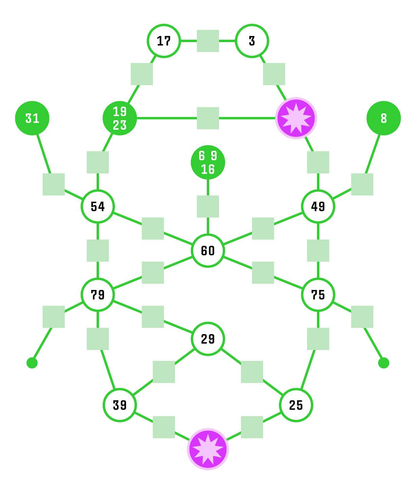

# What I Wish I Knew When Learning Picat: Introduction

July 2025

I have long been interested in constraint programming, which has been referred to as the "Holy Grail" of programming where the user states the problem and the computer solves it. https://dl.acm.org/doi/fullHtml/10.1145/242224.242304

While this is far from reality, constraint programming can reduce and scan the search space for NP dynamic programming problems without the user having to explictly code the backtracking/search algorithm. Examples include: shortest path, knapsack, n-queens, Soduko and so on. 

Picat is a great language for learning these concepts and also an interesting general purpose programming language. 

My background in programming is mostly procedural (Python) and pure functional (Haskell). So my challenge with Picat is multi-faceted: 1. Learn how constraint programming works in general, 2. Learn how constraint programming works in Picat, 3. Learn how Picat works.

Because Picat is a descendent of Prolog, it's core is a logic programming paradigm. And while the Picat manual is excellent, it moves along a quick clip and I had to read it very carefully to understand what I didn't understand. Think Calculus textbook. It's all documented, but makes sense sometimes only after you've learned it.

Also, because it's a niche language, there's a limited amount of online support. There's no StackExchange/Picat. (There are a few Picat questions there though!) I was lucky to get in contact with one of the key developers/users of the language, Håkan Kjellerstrand, who kindly helped me through many a head scratching moment. His website is invaluable: https://hakank.org/picat/.

He also made a customized ChatGPT with Picat's documentation that has helped me as well, although like all LLMs, it can hallucinate solutions that don't work and has a tiny training dataset compared with JavaScript. But it has been more useful than not as I bang my head against the wall of knowledge.

This document is my attempt to share what I learned and is intended for programmers who have similar experience to me: a reasonable grasp of a common language such as Python, C, JavaScript, etc or a background with a functional language such as Haskell or OCaml, but not much use of Prolog or other logic programming language, and possibly no idea what constraint programming is. 

Consider this a rough draft representing my personal learning curve. This document is not intended to be read top to bottom, but rather to help you if you get stuck where I did and hopefully give you the insight to move forward. As such, there's some redundancy between sections because I'm trying to make them self-contained as much as possible.

*Notes:*

 *I am much indebted to Advent of Code for providing a wealth of puzzles that have helped me learn Picat (and other languages). https://adventofcode.com*

 *Title inspired by What I Wish I Knew When I was Learning Haskell, which helped me learn that language. https://github.com/sdiehl/wiwinwlh*

## How This Document Is Organized

This document has the following primary sections:

- [Introduction](#what-i-wish-i-knew-when-learning-picat-introduction). (you are here!), which includes some high level information about Picat.
- [Constraint and Planner Programming](#constraint-programming-and-the-planner), these capabilities are the reason I wanted to learn Picat and are a central strength of the language. If you are familiar with Prolog then start here.
- [Picat is not Python](#picat-isnt-python). This is the section if you're unfamiliar with Prolog and logic programming concepts. I had always struggled with these, so I share what I found challenging and helpful. There's also some neat tricks here such as dynamic dispatch.
- [Resources](#resources). Links to more information about Picat and example code.
- [Appendix: Using Picat In Class](#appendix-using-picat-for-instruction). Some ideas for how to autograde Picat student assignments.
- [Appendix: My Errors](#errors-i-always-make-and-how-i-compensate). The things I always get wrong, altough I'm doing it less now that I've written this!
- [Appendix: Debugging](#appendix-debugging). Some ideas for debugging that I rely on.
- [Appendix: Stuff I Don't Know](#appendix--things-i-still-dont-fully-understand).Things that I don't fully understand about Picat.


## About Picat

Picat is:

1. A dynamically typed hybrid of imperative, logic, functional and constraint programming. 
2. A programming language with support for Boolean Satisfiability (SAT), Mixed-Integer Programming (MIP), Satisfiability Modulo Theories (SMT), and Finite Domain (FD) Constraint Programming (CP) solvers.
3. Combines some of the best ideas of Prolog, Python, Haskell, MiniZinc/z3, OR-Tools, COIN-OR.
3. A wonderful resource for learning logic and constraint programming.

Answer: all of the above.

## Picat vs. Other Languages


| Other Language      | Picat                 
| :----------   | :----                  
| Imperative: Python, JavaScript   | = Straightforward syntax <br> = Print from any statement to debug  <br> - Libraries are limited <br> - C ommunity is small
| Functional: Haskell, OCaml | = Functional concepts  <br> - No lambdas
| Solvers: Z3, MiniZinc  | + Full programming language vs. just a solver
| Logic: Prolog  | + Functions <br> = Unification, non-determinism, tabling
---
\+ Advantage, = Simliar, - Disadvantage

### Picat Has Common Programming Concepts

| Concept            |  Picat                        |
| :----------------  | :------                     |
| Comments          | `% percent sign for comments. no block comments |
| Variables          | `A=5, B=3.4, C=(1234 mod 7).` |
| Strings            | `println("Hello World.")` |
| Linked Lists       | `MyList =[3,4,6,1,56,123.65,"a string?",[a,sub,list]]` |
| Arrays (O(n) access)  | `My2DArray = {{1,2},{3,4}}, println(My2dArray[1,2]).` |
| List Comprehension |  `Xs = [X : X in 1..5, X != 2].`   |
| Pattern Matching   |  `head([H\|T])=H.`  |
| Loops              |  `foreach (X in MyList) Y=X*X,println(X) end.` |
| Recursion          | `fib(0)=1. fib(1)=1. fib(N)=fib(N-1)+fib(N-2).`|
| Output           |  `print()`, `println()`, `printf()`  |
| Input             | `read_file_lines("datafile.txt").`|
| Higher Order Functions| `map(reverse,MyStringList).` or `MyStringList.map(reverse).`|

Also: Hashmaps, Sets, Ordered Sets and Binary Heaps.

### Things Picat Has In Common With Logic Progmming (Prolog) 

- Variables start with a Capital Letter.
- Atoms
- Unification
- Finite Domain Variables
- Tabling (Automatic Memoization)
- Non-Determinism

### Things Picat Has Uniquely (I think)

- Planner
- Solver polymorphism
- Full programming language 

### Things Picat Doesn't Come With

- Classes, Objects   
- Lambdas/Anonymous Functions         
- Strong Typing, Type Hinting, Monads
- Monads 


More at: https://picat-lang.org/download/picat_compared_to_prolog_haskell_python.html

## Using the Manual

https://picat-lang.org/download/picat_guide.pdf
- The manual is the single most important document for learning Picat. It has everything, but can be very terse, and so must be read closely.
- The index at the back lists all the commands and hyperlinks to them. I use this more than any other method when programming in Piact.

## Note About Example Code 

Each clause in Picat ends with a `.`. In example code each line is fully distinct for variable scope.

`%` begins a comment.

For example:

```
A=5. % A=5. 
```
But `A` only equals `5` in this clause. After the `.`, `A` goes out of scope.

And if you prefer spaces around your operators, please go ahead.

```
A="A Wildebeest!". % A is a string. 
```
Again, `A` is in scope only until the `.` and doesn't exist after.
```
B=A+A. %** Error  : Free variable in expression: '+' 
```
 `A` hasn't been defined in this clause. 
 
 But using a `,` provides a continuous scope for `A`.
```
A=5,B=A+A. %A=5 and B=10.
```

# Constraint Programming and the Planner

Constraint programming let's you solve problems that require searching through possible solutions. How can you place queens on a chessboard so that no queen is able to take another? (N-queens) Can a knight on chessboard visit every square once and end by returning to its starting square? (Knights tour) The best route for a travelling salesman? (Travelling Salesman) The quickest way out of a maze? (Shortest Path) How best to choose items to fill a suitcase? (Knapsack) How to complete a partially filled Soduku puzzle? (Soduku)

All of these, and many many more can be found via the links in the references section. 

The main concept here is the minimization of a function defined by a set of rules aka constraints. The function has variables whose values are not known, but can be defined to be within a given range.

These variables can be real/floating point values or integers and, in general, real variable solutions are easier to find than integer ones. In most most cases, for integer or "mixed integer" where some of the values are integers, there's no closed form solution. Constraint progamming is NP-Hard. https://en.wikipedia.org/wiki/Integer_programming#Heuristic_methods

There are many applicable techniques you may have seen in a CS algorithms class: Dijkstra's algorithm, A*, recursion/induction, A/B pruning, branch-and-bound, fail first, breadth first search, depth first search, simplex, gradient descent, satisfiability solver, memoization/tabling or just brute force.

A solution is found through iteration and any efficiency over brute force is through careful selection of which potential solution to try next, when to give up and try a different one, and identification of when a given search location is the same as a previous one. This last item is also known as symmetry breaking, that is, if a state is identical/symmetrical to a previous one, don't do the calculations all over again.

These algorithms can reduce the time to find a solution from hours to fractions of a second, but learning all of them and implementing them for a specific problem can be challenging. Enter Picat!

Picat has multiple built-in solvers: Boolean Satisfiability (SAT), Mixed-Integer Programming (MIP), Satisfiability Modulo Theories (SMT), Finite Domain (FD) Constraint Programming (CP), and a Planner for shortest path/minimum cost. 

Incredibly, the interface to all of them is essentially the same. This lets you switch between CP and SAT, for example by just changing and `import` statement. 

## Fibonacci and Tabling

Let's take a the example every dynamic programming text begins with, Fibonacci numbers. $F_n = F_{n-1} + F_{n-2}$. In Picat:

```
fib(0) = 1.
fib(1) = 1.
fib(N) = fib(N-1)+fib(N-2).
```
Run this with and we quickly see a problem with compute time.
```
main =>
    time(println(fib(5))),
    time(println(fib(30))),
    time(println(fib(40))).
---------------------------------
8 CPU time 0.0 seconds.
1346269 CPU time 0.042 seconds.
165580141 CPU time 4.755 seconds.
---------------------------------
```
`fib` is recalculating every value of `N-1` and `N-2` for each `N`. At `fib(40)` that's 331,160,281 recursive calls. https://cboard.cprogramming.com/c-programming/168662-fibonacci-how-long-would-take.html

The solution is to memoize the values into a hash table after they are computed so that they can be looked up rather than brute forced on subsequent calls.

Picat (and Prolog) make this ridiculously easy. Here's the revised code.

```
main =>
    time(println(fib(5))),
    time(println(fib(30))),
    time(println(fib(40))),
    time(println(fib(4000))).

table
fib(0) = 1.
fib(1) = 1.
fib(N) = fib(N-1)+fib(N-2).
---------------------------------
8 CPU time 0.0 seconds.
1346269 CPU time 0.0 seconds.
165580141 CPU time 0.0 seconds.
64574884490948173531376949015369595644413900640151342708407577598177210359034088914449477807287241743760741523783818897499227009742183152482019062763550798743704275106856470216307593623057388506776767202069670477506088895294300509291166023947866841763853953813982281703936665369922709095308006821399524780721049955829191407029943622087779296459174012610148659520381170452591141331949336080577141708645783606636081941915217355115810993973945783493983844592749672661361548061615756595818944317619922097369917676974058206341892088144549337974422952140132621568340701016273422727827762726153066303093052982051757444742428033107522419466219655780413101759505231617222578292486081002391218785189299675757766920269402348733644662725774717740924068828300186439425921761082545463164628807702653752619616157324434040342057336683279284098590801501
CPU time 0.013 seconds.
---------------------------------

```
## Domain Variables and Constraints, `cp` `::`, `#=`

The core idea of constraint programming are domain variables, which are variables that have a range of potential values that are then solved by adding conditions/constraints they must meet.

Here's an example. Note that the module `cp` must be imported to use domain variables.
```
A :: 1..10 % A is a number between 1 and 10
```
If you type this into the interative Picat REPL, you get: 
```
A = DV_0104d8_1..10
```
Let's modify this so that `A` must be even. We do this by adding a constraint with `#=`.

```
A :: 1..10, A mod 2 #= 0.     
% REPL says: A = DV_010970_2_4_6_8_10
```
## Constraint Example: Some Numbers that Multiply

It's also easy to make a list or array of domain variables. Here's a contrived problem:
- 5 increasing numbers that differ by 1,2,3, and 4
- The product of the numbers is less than 100000
- The first number is as large as possible 
Let's say we want to find a sequence of 5 numbers between 1 and 100 where their product is less than 100000, but where the first number is as large as possible (but between 1 and 100).

```
% inspired by https://www.hakank.org/picat/arith.pi

import cp.

main => 
    N :: 1..100, 
    X = new_list(5),
    X :: 1..100,
    Y :: 0..100000,
    increasing_strict(X), % not really necessary
    foreach(I in 1..X.len-1)
        X[I+1] #= X[I]+I
    end,
    X[1] #> N,
    prod(X)#<Y,

    solve([$max(N)],X ++ [Y]), % find largest N

    println(y=Y),
    println(x=X),
    println(n=N).
```
Output is :
```
y = 72577
x = [6,7,9,12,16]
n = 5
```

## What Constraints are there?

There's lots of constraints that can be applied to via a constraint operator or to a list or expression of domain variables and global constraints. 

*Rabbit Hole: Picat has implemented a lot of constraints, but there are so, so, so many more. There's even a Global Constraint Catalog! Take a look at your own peril to your free time: https://sofdem.github.io/gccat/gccat/sec5.html*

### Constraint Operators

Numeric: `::`, `notin`, `#=`, `#!=`, `#<`, `#=<`, `#<=`, `#>`, `#>=`
Logical: `#~` (not),`#/\` (and),`#^` (XOR),`#\/` (or),`#=>` (left side implies right),`#<=>` (left and right are equivalent)

### Arithmetic on Lists and Expressions

- `cond`(*BoolConstr*,*ThenExp*,*ElseExp*): if the Boolean constraint is true, then the *ThenExp* else *ElseExp*
- `count`(*V*,*List*): The number of times *V* occurs in a list of variables
- `max`(*List*): The maximum a list of domain variables
- `max`(*Exp1*,*Exp2*): The maximum of *Exp1* and *Exp2*
- `min`(*List*): The minimum of a list of domain variables
- `min`(*Exp1*,*Exp2*): The minimum of *Exp1* and *Exp2*
- `prod`(*List*): The product of a list of domain variables
- sum(*List*): The sum of a list of domain variables

###  Global Constraints

I copied this list (and the majority of the text) from the Picat manual, but reduced to the high-level points. This means I removed some detail and for the more complex constraints, refer to the manual! https://picat-lang.org/download/picat_guide.pdf

Note: In all cases where there list *List* it can also be an *Array*. 

- `acyclic`(*Vs*,*Es*): The undirected graph represented by *Vs* and *Es* contains no cycles. [*see hcp for how the graph is defined*]

- `acyclic_d`(*Vs*,*Es*): The directed graph represented by *Vs* and *Es* contains no cycles.

- `all_different`(*List*): All variables in the list or array are different.

- `all_distinct`(*List*): The same as `all_different`, but for the `cp` module it maintains a higher level of consistency. For some problems, this is faster, and, for some other problems, it is slower.

- `all_different_except_0`(*List*): This constraint is true if all non-zero values in the *List* are different.

- `assignment`(*List 1*,*List 2*): This constraint ensures that the first *List* is a dual or the second. i.e., if the *ith* element of the first is *j*, then the *jth* element of the second is *i*.

- `at_least`(*N*,*L*,*V*): There are at least *N* elements in *L* that are equal to *V*, all must be integers.

- `at_most`(*N*,*L*,*V*): There are at most *N* elements in *L* that are equal to *V*, all must be integers.

- `circuit`(*List*): The *List* forms a Hamiltonian cycle. This constraint ensures that each variable has a different value, and that the graph formed by the assignment does not contain any sub-cycles. 

    For example, for the constraint `circuit([X1,X2,X3,X4])`, `[3,4,2,1]` is a solution, but `[2,1,4,3]` is not, because `1->2, 2->1, 3->4, 4->3` contains two sub-cycles.

- `count`(*V,*List*,*Rel*,*N*): The number of elements of *List* where *V Rel N* is true. Rel is one of `#=`, `#!=`, `#>`, `#>=`, `#<`, `#=<`, or `#<=`. This constraint can be defined as:

        count(V,L,Rel,N) =>
            sum([V #= E : E in L]) #= Count,
            call(Rel,Count,N).

- `count`(*V*,*List*,*N*): The same as `count`(*V*,*List*,*#=*,*N*).

- `cumulative`(*Starts*,*Durations*,*Resources*,*Limit*): This constraint is for describing and solving time-based scheduling problems. The arguments *Starts*, *Durations*, and *Resources*
are lists of integer-domain variables of the same length, and *Limit* is an integer-domain
variable. 

    Let *Starts* be *[S1 , S2 , . . ., Sn ]*, *Durations* be *[D1 , D2 , . . ., Dn ]*, and *Resources* be *[R1 , R2 , . . ., Rn ]*.

    For each job *i*, *Si* represents the start time, *Di* represents the duration, and *Ri* represents the units of *Resources* needed. *Limit* is the limit on the units of *Resources* available at any time. This constraint ensures that the limit cannot be exceeded at any time.

- `decreasing`(*List*): The *List* is in (non-strictly) decreasing order.

- `decreasing_strict`(*List*): The *List* is in strictly decreasing order.

- `diffn`(*RectangleList*): This constraint ensures that no two rectangles in *RectangleList*
overlap with each other. A rectangle in an n-dimensional space is represented by a list of
2 × n elements *[X1 , X2 , . . ., Xn , S1 , S2 , . . ., Sn ]*, where *Xi* is the starting
coordinate of the edge in the *ith* dimension, and *Si* is the size of the edge.

- `disjunctive_tasks`(*Tasks*): *Tasks* is a list of terms. Each term has the form
`disj_tasks(S1,D1,S2,D2)`, where `S1` and `S2` are  integer-domain variables, and `D1` and `D2` are positive integers. This constraint is equivalent to posting the disjunctive constraint `S1+D1 #=< S2 #\/ S2+D2 #=< S1` for each term in `Tasks`;  the
constraint converts the disjunctive tasks into global constraints.

- `element`(*I*,*List*,*V*): The *Ith* element of *List* is *V*, where all are integer-domain variables.

- `element0`(*I*,*List*,*V*): The same as element(I,List,V), except 0-based, rather than 1-based, indexing is used.

- `exactly`(*N*,*List*,*V*): This constraint succeeds if there are exactly *N* elements in *L* that
are equal to *V* , all must be
integer-domain variables.

- `global_cardinality`(*List*,*Pairs*): *List* is a list of integer-domain variables
*[X1 , . . ., Xd]*, and *Pairs* is a list of pairs *[K1 -V1 , . . ., Kn -Vn]*, where each key
*Ki* is a unique integer, and each *Vi* is an integer-domain variable. 

    The constraint is true if every element of L*ist is equal to some key, and, for each pair *Ki-Vi* , exactly *Vi* elements of *List* are equal to *Ki*. This constraint can be defined as follows:

        global_cardinality(List,Pairs) =>
            foreach ($Key-V in Pairs)
            sum([B : E in List, B#<=>(E#=Key)]) #= V
            end.

- `hcp`(*Vs*,*Es*): The directed graph represented by Vs and Es forms a Hamiltonian cycle. 

    *Vs* is a list of pairs of the form *{V,B}*, and *Es* is a list of triplets of the form *{V1,V2,B}*. 
    
    A pair *{V,B}* in *Vs*, where *V* is a ground term and *B* is a Boolean variable, denotes that *V* is in the graph if and only if *B = 1*. 
    
    A triplet *{V1,V2,B}* denotes that *V1* is connected to *V2* by an edge in the graph if and only if *B = 1*. 
    
    The circuit and subcircuit constraints can be implemented as follows by using `hcp`:

        circuit(L) =>
            N = len(L),
            L :: 1..N,
            Vs = [{I,1} : I in 1..N],
            Es = [{I,J,B} : I in 1..N,
            J in fd_dom(L[I]),
            J !== I,
            B #<=> L[I] #= J],
            hcp(Vs,Es).

        subcircuit(L) =>
            N = len(L),
            L :: 1..N,
            Vs = [{I,B} : I in 1..N,
            B #<=> L[I] #!= I],
            Es = [{I,J,B} : I in 1..N,
            J in fd_dom(L[I]),
            J !== I,
            95B #<=> L[I] #= J],
            hcp(Vs,Es).

- `hcp`(*Vs*,*Es*,*K*): The same as hcp(Vs,Es), except that it also constrains the number of vertices in the graph to be *K*.

- `hcp_grid`(*A*): This constraint ensures that the grid graph represented by *A*, which is
a two-dimensional array of Boolean (0/1) variables, forms a Hamiltonian cycle.

    In a grid graph, each cell is directly connected horizontally and vertically, but not diagonally, to its neighbors. Only cells labeled 1 are considered as vertices of the graph. This constraint is
    implemented as follows by using `hcp`:

        hcp_grid(A) =>
            NRows = len(A),
            NCols = len(A[1]),
            Vs = [{(R,C), A[R,C]} :
            R in 1..NRows,
            C in 1..NCols],
            Es = [{(R,C), (R1,C1), _} :
            R in 1..NRows,
            C in 1..NCols,
            (R1,C1) in neibs(A,NRows,NCols,R,C)],
            hcp(Vs,Es).

        neibs(A,NRows,NCols,R,C) =
            [(R1,C1) : (R1,C1) in [(R-1,C), (R+1,C),
            (R,C-1), (R,C+1)],
            R1 >= 1, R1 =< NRows,
            C1 >= 1, C1 =< NCols,
            A[R1,C1] !== 0].

- `hcp_grid`(*A*,*Es*): The same as `hcp_grid`(*A*), except that it also restricts the edges to *Es*, which consists of triplets of the form *{V1,V2,B}*. 

    In a triplet in *Es*, *V1* and *V2* take the form *(R,C)*, where *R* is a row number and *C* is a column number, and *B* is a Boolean variable, which denotes that *V1* is connected to *V2* by an edge in the graph if and only if *B = 1*. If *Es* is a variable, then it is bound to the edges of the grid graph.

- `hcp_grid`(*A*,*Es*,*K*): The same as
`hcp_grid`(*A*,*Es*), except that it also constrains the number of vertices in the graph to be *K*.

- `increasing`(*List*): The *List* is in (non-strictly) increasing order.

- `increasing_strict`(*List*): The *List* is in strictly increasing order.

- `lex_le`(*List 1*,*List 2*): List 1 is lexicographically less than or equal to List 2. 

- `lex_lt`(L1 ,L2 ): (*List 1*,*List 2*): List 1 is lexicographically less than to List 2. 

- `matrix_element`(*Matrix*,*I*,*J*,*V*): True if the entry at *<I,J>* in *Matrix* is *V*, where all are integer-domain variables.

- `matrix_element0`(*Matrix*,*I*,*J*,*V*): The same as `matrix_element`, except that it uses 0-based, rather than 1-based, indexing.

- `neqs`(*NeqList*): *NeqList* is a list of inequality constraints of the form `X #!= Y` , where `X` and `Y` are integer-domain variables. This constraint is equivalent to the conjunction of the inequality constraints in *NeqList*, but it extracts `all_distinct` constraints from the inequality constraints

- `nvalue`(*N*,*List*): The number of distinct values in *List* is *N*, where *List* is a list of integer-domain variables.

- `path`(Vs*,*Es*,*Src*,*Dest*): The undirected graph represented by *Vs* and *Es* has a path from *Src* to *Dest*. [*see hcp for how the graph is defined*]
    
    Note that the graph is assumed to be undirected. If there exists a triplet *{V1,V2,B}* in *Es*, then the triplet *{V2,V1,B}* will be added to *Es* if it is not specified.

- `path_d`(*Vs*,*Es*,*Src*,*Dest*): The same as
`path`(*Vs*,Es,*Src*,*Dest*), except that the graph is directed.

- `regular`(*List*,*Q*,*S*,*M*,*Q0*,*F*): Given a finite automaton (DFA or NFA) of *Q* states numbered *1, 2,...,Q* with input *1..S*, transition matrix *M* , initial state *Q0 (1 ≤ Q0 ≤ Q)*, and a list of accepting states *F*, True if the *List* is accepted by the automaton.

    The transition matrix M represents a mapping from 1..Q × 1..S to 0..Q, where 0 denotes
    the error state. For a DFA, every entry in M is an integer, and for an NFA, entries can be a
    list of integers.

    The `regular` constraint is covered in the [Constraint book](https://picat-lang.org/picatbook2015/constraint_solving_and_planning_with_picat.pdf)

- `scalar_product`(*A*,*X*,*Product*): The scalar product of A and X is *Product*, where
*A* and *X* are lists or arrays of integer-domain variables, and *Product* is an integer-domain variable. *A* and *X* must have the same length.

• `scalar_product`(*A*,*X*,*Rel*,*Product*): The scalar product of A and X has the relation *Rel* with *Product*, where *Rel* is one of the following operators: `#=`, `#!=`, `#>=`, `#>`,
`#=<` (or `#<=`), and `#<`.

- `scc`(*Vs*,*Es*):The undirected graph represented by *Vs* and
*Es* is strongly connected.
[*see hcp for how the graph is defined*]

    Note that the graph is assumed to be undirected. If there exists a triplet *{V1,V2,B}* in *Es*, then the triplet *{V2,V1,B}* will be added to *Es* if it is not specified

- `scc`(*Vs*,*Es*,*K*): The same as `scc`(*Vs*,*Es*), except that it also constrains the number of vertices in the graph to be *K*.

- scc_grid(A): This constraint ensures that the grid graph represented by A, which is a
two-dimensional array of Boolean variables, forms a strongly connected undirected graph.

    In a grid graph, each cell is directly connected horizontally and vertically, but not diagonally, to its neighbors. Only cells labeled 1 are considered as vertices of the graph. 
    
    This constraint
is implemented as follows by using `scc`:

        scc_grid(A) =>
            NRows = len(A),
            NCols = len(A[1]),
            Vs = [{(R,C), A[R,C]} :
            R in 1..NRows,
            C in 1..NCols],
            Es = [{(R,C), (R1,C1), _} :
            R in 1..NRows,
            C in 1..NCols,
            (R1,C1) in neibs(A,NRows,NCols,R,C),
            (R,C) @< (R1,C1)],
            scc(Vs,Es).

        neibs(A,NRows,NCols,R,C) =
            [(R1,C1) : (R1,C1) in [(R-1,C), (R+1,C),
            (R,C-1), (R,C+1)],
            R1 >= 1, R1 =< NRows,
            C1 >= 1, C1 =< NCols,
            A[R1,C1] !== 0].

Note that there is an edge between each pair of neighboring cells in the resulting graph as
long as the cells are in the graph.

- `scc_grid`(*A*,*K*): The same as `scc_grid`(*A*,*Es*), except that it also
constrains the number of vertices in the graph to be *K*.

- `scc_d`(*Vs*,*Es*): The directed graph represented by *Vs* and
*Es* is strongly connected, where *Vs* and *Es* are the same as those in scc(*Vs*,*Es*), except
that the graph is directed.

- `scc_d`(*Vs*,*Es*,*K*): The same as `scc_d`(*Vs*,*Es*), except that it also
constrains the number of vertices in the graph to be *K*.

- `serialized`(*Starts*,*Durations*): This constraint describes a set of non-overlapping
tasks, where *Starts* and *Durations* are lists of integer-domain variables, and the lists have
the same length. Let *Os* be a list of *1s* that has the same length as *Starts*. This constraint is
equivalent to cumulative(*Starts*,*Durations*,*Os*,*1*).

- `subcircuit`(*List*): This constraint is the same as circuit(*List*), except
that not all of the vertices are required to be in the circuit. If the *ith* element of *List* is *i*, then the vertex *i* is not part of the circuit.

- subcircuit_grid(A): This constraint ensures that the grid graph represented by A,
which is a two-dimensional array of Boolean (0/1) variables, forms a Hamiltonian cycle. In
a grid graph, each cell is directly connected horizontally and vertically, but not diagonally,
to its neighbors. Only non-zero cells are considered as vertices of the graph.

• subcircuit_grid(A,K): This constraint is the same as
subcircuit_grid(A), except that it also constrains the number of vertices in the graph
to be K,

- `tree`(Vs,Es): This constraint ensures that the undirected graph represented by Vs and
Es is a tree. [*see `hcp` for how the graph is defined*]

    Note that the graph to be constructed is assumed to be undirected. If there exists a triplet *{V1,V2,B}* in *Es*, then the triplet *{V2,V1,B}* will be added to *Es* if it is not specified

- `tree`(*Vs*,*Es*,*K*): The same as `tree`(*Vs*,*Es*), except that it also constrains the number of vertices in the tree to be *K*.

## Constraint Example: Advent of Code 2016 Day 15

https://adventofcode.com/2016/day/15

The problem from AOC:
>When a button is pressed, a capsule is dropped and tries to fall through slots in a set of rotating discs to finally go through a little hole at the bottom and come out of the sculpture. If any of the slots aren't aligned with the capsule as it passes, the capsule bounces off the disc and soars away. You feel compelled to get one of those capsules.
>
>The discs pause their motion each second and come in different sizes; they seem to each have a fixed number of positions at which they stop. You decide to call the position with the slot 0, and count up for each position it reaches next.
>
>Furthermore, the discs are spaced out so that after you push the button, one second elapses before the first disc is reached, and one second elapses as the capsule passes from one disc to the one below it. So, if you push the button at time=100, then the capsule reaches the top disc at time=101, the second disc at time=102, the third disc at time=103, and so on.
>
>The button will only drop a capsule at an integer time - no fractional seconds allowed.
>
>For example, at time=0, suppose you see the following arrangement:
>
>Disc #1 has 5 positions; at time=0, it is at position 4.
Disc #2 has 2 positions; at time=0, it is at position 1.
>
>If you press the button exactly at time=0, the capsule would start to fall; it would reach the first disc at time=1. Since the first disc was at position 4 at time=0, by time=1 it has ticked one position forward. As a five-position disc, the next position is 0, and the capsule falls through the slot.
>
>Then, at time=2, the capsule reaches the second disc. The second disc has ticked forward two positions at this point: it started at position 1, then continued to position 0, and finally ended up at position 1 again. Because there's only a slot at position 0, the capsule bounces away.
>
>If, however, you wait until time=5 to push the button, then when the capsule reaches each disc, the first disc will have ticked forward 5+1 = 6 times (to position 0), and the second disc will have ticked forward 5+2 = 7 times (also to position 0). In this case, the capsule would fall through the discs and come out of the machine.
>
>However, your situation has more than two discs; you've noted their positions in your puzzle input. What is the first time you can press the button to get a capsule?
>
>--- Part Two ---
>
>After getting the first capsule (it contained a star! what great fortune!), the machine detects your success and begins to rearrange itself.
>
>When it's done, the discs are back in their original configuration as if it were time=0 again, but a new disc with 11 positions and starting at position 0 has appeared exactly one second below the previously-bottom disc.
>
>With this new disc, and counting again starting from time=0 with the configuration in your puzzle input, what is the first time you can press the button to get another capsule?

This puzzle is perfect for Picat. Some things to notice:

- Look how long the description is versus the code!
- The use of parallel lists to encode the problem variables. This is a common approach.
- As the capsule falls, to solve for $T_{start}$ for a given $Disc$ the equation is $(T_{start}+ Distance + Disc_{time-zero}) \mod Disc_{num-positions} = 0$.
- We could code this as a `foreach` loop.
    ```
    foreach (D in 1..DPos.len)
        0 #= (T+D+DTZ[D]) mod DPos[D]
    end,
   ```
- But because each is zero, the sum is zero, and one line of code looks cooler than three. So we used `sum(...) #= 0`.
- Because we are looking to know the time to press the button, the variable `T` is set to a range of possible values. 
- The notation `::` means that the variable is within the set of values of the list on the right side of the expression.
- The notation `1..5` means "a list with items 1 to 5 i.e., [1,2,3,4,5]`
- We aren't given a range of times, so the program sets the range of the solution T to between 0 and `maxint_small()`, which is not very small. It's 72,057,594,037,927,935.
- `solve` is a predicate and unifies `T` with the solution.
- If you wanted all the solutions, `solve_all` is a function and looks like `Sols = solve_all(T).`
- On this problem the `cp` solver is the fastest, but that's not always the case.

    | Solver | Part1 | Part2 |
    |--------|-------|-------|
    | cp     | 0.04  | 0.25  |
    | sat    | DNF   | DNF   |
    | mip    | 0.4   | 2.4   |

```
import cp. 

main =>
    time(Part1 = go([17,3,19,13,7,5],
                    [15,2,4,2,2,0])), %0.04 sec
    printf("Answer Part 1: %w\n",Part1), % 400589

    time(Part2 = go([17,3,19,13,7,5,11],
                    [15,2,4,2,2,0,0])), % 0.25 sec
    printf("Answer Part 2: %w\n",Part2). % 3045959

go(DPos,DTZ) = T =>
    %(Time + Dist + T Zero Position) mod Disc Positions
    T :: 0..maxint_small(), % 72057594037927935
    sum([(T+D+DTZ[D]) mod DPos[D] : D in 1..DPos.len]) #=0,
    solve(T).
```


## Constraint Example: Jane Street Bug

https://www.janestreet.com/bug-byte/


> Bug Byte
> 
>Fill in the edge weights in the graph below with the numbers 1 through 24, using each number exactly once. Labeled nodes provide some additional constraints:
>
>The sum of all edges directly connected to this node is M.
>
>There exists a non-self-intersecting path starting from this node where N is the sum of the weights of the edges on that path. Multiple numbers indicate multiple paths that may overlap.
>
>Once the graph is filled, find the shortest (weighted) path from to and convert it to letters (1=A, 2=B, etc.) to find a secret message.



In Picat, here's a solution. The nodes and edges are defined and then the constraints about the known values of nodes and possibly values for the edge weights. Each constraint reduces the search space.

A constraint in this program are `all_distinct`, `#=`, `#^` and `#<=`.
`all_distinct` means that the values of the list of edges are all different from each other. When combined with the previous line that puts them in the range of 1 to 24, that means the edges will contain every possible value between 1 and 24. 

The `#=` constraint syntax means that a valid solution has the left and right side equal. This is different from unify, `=`, where the values have to be the same at the time of comparisson. The constraint tells the solver module (in this case `cp`) to try to find a set of values of left and right that can be unified.

`#<=` is less than or equal and `#^` is the logical XOR.

Some more notes:

`V :: 1..24` means that `V` is a variable that could be set to any number between 1 and 24, inclusive. Further constraints will limit this, but initially each V is open to all possible values in this range.

The line `EdgeVars = [(Edge, V) : Edge in Edges, V :: 1..24]` results initially in this:

```
[((A,B),_09b8::[1 ..24]),((A,D),_0a80::[1 ..24]),((B,S),_0b48::[1 ..24]),((C,H),_0c10::[1 ..24]),((D,S),_0cd8::[1 ..24]),((D,H),_0da0::[1 ..24]),((S,I),_0e68::[1 ..24]),((F,I),_0f30::[1 ..24]),((G,J),_0ff8::[1 ..24]),((H,J),_010c0::[1 ..24]),((H,K),_01188::[1 ..24]),((I,J),_01250::[1 ..24]),((I,L),_01318::[1 ..24]),((J,K),_013e0::[1 ..24]),((J,L),_014a8::[1 ..24]),((K,M),_01570::[1 ..24]),((K,P),_01638::[1 ..24]),((K,N),_01700::[1 ..24]),((L,O),_017c8::[1 ..24]),((M,N),_01890::[1 ..24]),((M,O),_01958::[1 ..24]),((N,E),_01a20::[1 ..24]),((O,E),_01ae8::[1 ..24]),((Q,L),_01bb0::[1 ..24])]
```

The `_xxxx` indicates the memory address of the individual `V` and the `::[1..24]` shows that the variable has a range of possible values that will have to be constrained.

If we added a `sum` constraint:

```
EdgeVars = [(Edge, V) : Edge in Edges, V :: 1..24],
sum([V : (_, V) in EdgeVars]) #= 30

```
The result would be:

```
[((A,B),_09b8::[1 ..7]),((A,D),_0a80::[1 ..7]),((B,S),_0b48::[1 ..7]),((C,H),_0c10::[1 ..7]),((D,S),_0cd8::[1 ..7]),((D,H),_0da0::[1 ..7]),((S,I),_0e68::[1 ..7]),((F,I),_0f30::[1 ..7]),((G,J),_0ff8::[1 ..7]),((H,J),_010c0::[1 ..7]),((H,K),_01188::[1 ..7]),((I,J),_01250::[1 ..7]),((I,L),_01318::[1 ..7]),((J,K),_013e0::[1 ..7]),((J,L),_014a8::[1 ..7]),((K,M),_01570::[1 ..7]),((K,P),_01638::[1 ..7]),((K,N),_01700::[1 ..7]),((L,O),_017c8::[1 ..7]),((M,N),_01890::[1 ..7]),((M,O),_01958::[1 ..7]),((N,E),_01a20::[1 ..7]),((O,E),_01ae8::[1 ..7]),((Q,L),_01bb0::[1 ..7])]
```

But we will need a different set of constraints to solve the bug byte, and here they are!

```
import cp.

main =>
    % Define the graph with nodes and edges
    Nodes = ['A', 'B', 'C', 'D', 'E', 'F', 'G', 'H', 'I', 'J', 'K', 'L', 'M', 'N', 'O', 'P', 'Q', 'S'],
    Edges = [('A', 'B'), ('A', 'D'),
             ('B', 'S'),
             ('C', 'H'),
             ('D', 'S'), ('D', 'H'),
             ('S', 'I'),
             ('F', 'I'),
             ('G', 'J'),
             ('H', 'J'), ('H', 'K'),
             ('I', 'J'), ('I', 'L'),
             ('J', 'K'), ('J', 'L'),
             ('K', 'M'), ('K', 'P'), ('K', 'N'),
             ('L', 'O'),
             ('M', 'N'), ('M', 'O'),
             ('N', 'E'),
             ('O', 'E'),
             ('Q', 'L')],

    % Edges are tuples of nodes and weights in range 1..24
    EdgeVars = [(Edge, V) : Edge in Edges, V :: 1..24],
    
    % Unique edge weights
    % Reduce search space to 24! = 6,204,484,903,168,028,160
    all_distinct([V : (_, V) in EdgeVars]),

    % Constraint to enforce known edge weights 
    % Reduce search space to 19! = 121,645,100,408,832,000
    KnownWeights = [(('D','S'), 12),
                    (('J', 'K'), 24),
                    (('K', 'N'), 7),
                    (('I', 'L'), 20)],
    foreach((Edge, Weight) in KnownWeights),
        member((Edge, Weight), EdgeVars)
    end,
    
    % Constraint to enforce known sum of weights for nodes
    % Reduce search space to 48
    KnownSums = [('A', 17), 
                 ('B', 3),
                 ('H', 54),
                 ('I', 49),
                 ('J', 60),
                 ('K', 79),
                 ('L', 75),
                 ('M', 29),
                 ('N', 39),
                 ('O', 25)],
    foreach((Node, Sum) in KnownSums),
        NodeEdges = [(N1, N2) : (N1, N2) in Edges, (N1 = Node ; N2 = Node)],
        NodeVars = [V : (Edge, V) in EdgeVars, Edge in NodeEdges],
        sum(NodeVars) #= Sum
    end,

    % Constraint that sum of weight on an edge = KnownPathSum OR 
    % sum of weight plus min edge on neighbor is <= to KnownPathSums
    % only need C, G, and F to reduce search space to 2
    KnownPathSums = [
                    ('C', 31),
                    %  ('D', 19), 
                    %  ('D', 23),
                     ('G', 6), 
                    %  ('G', 9), 
                    %  ('G', 16),
                     ('F', 8)],
    foreach((Node, Sum) in KnownPathSums),
        NodeEdges = [(N1, N2) : (N1, N2) in Edges, N1 = Node],
        NodeVars = [V : (Edge, V) in EdgeVars, Edge in NodeEdges],
        Neighbors = [N2 : (N1, N2) in Edges, N1 = Node],
        NodeOneHopEdges = [(N1, N2) : (N1, N2) in Edges, N1 in Neighbors],
        NodeOneHopVars = [V : (Edge, V) in EdgeVars, Edge in NodeOneHopEdges],
        (sum(NodeVars) #= Sum) #^ (sum(NodeVars) + min(NodeOneHopVars) #=< Sum)
    end,

    Solutions = solve_all([ffc], EdgeVars),
    printf("Number of solutions: %d\n", length(Solutions)),
    foreach(Solution in Solutions)
        AllEdges = Solution ++ [((Y,X), Weight) : ((X,Y), Weight) in Solution],
        sp(AllEdges, 'S', 'E', Path, _),
        Message = [chr(W+64) : ((X,Y), W) in Path],
        println('====================='),
        println(Path),
        println("Message is: "++Message),
    end,
    save_solution(Solutions),
    println("Done!").

% shortest path adapted from Picat Manual
table (+,+,+,-,min)
sp(Graph,X,Y,Path,WL) ?=>
    Path = [((X,Y),Wxy)],
    WL = Wxy,
    member(((X,Y), Wxy), Graph).

sp(Graph,X,Y,Path,WL) =>
    Path = [((X,Z), Wxz)|Path1],
    member(((X,Z), Wxz), Graph),
    sp(Graph,Z,Y,Path1,WL1),
    WL1 = Wzy,
    WL = Wxz+Wzy.

% Save to file for use with Python to make a graph
save_solution(Solutions) =>
    Out = open("solutions.txt", write),
    foreach(Solution in Solutions)
        println(Out, Solution)
    end,
    close(Out).
```

The above outputs two potential solutions.
```
Number of solutions: 2
=====================
[((S,I),18),((I,J),3),((J,L),17),((L,O),16),((O,E),4)]
Message is: RCQPD
=====================
[((S,D),12),((D,H),9),((H,K),14),((K,M),11),((M,O),5),((O,E),4)]
Message is: LINKED
Done!
```

## Constraint Example: Santa's Knapsack

https://adventofcode.com/2015/day/24

Advent of Code 2015 day 24 is a knapsack problem. Typically AOC problems get harder from day 1 to day 25, but day 24 is a breeze in Picat! Here's the instructions:

>Part 1
>
>It's Christmas Eve, and Santa is loading up the sleigh for this year's deliveries. However, there's one small problem: he can't get the sleigh to balance. If it isn't balanced, he can't defy physics, and nobody gets presents this year.
>
>No pressure.
>
>Santa has provided you a list of the weights of every package he needs to fit on the sleigh. The packages need to be split into three groups of exactly the same weight, and every package has to fit. The first group goes in the passenger compartment of the sleigh, and the second and third go in containers on either side. Only when all three groups weigh exactly the same amount will the sleigh be able to fly. Defying physics has rules, you know!
>
>Of course, that's not the only problem. The first group - the one going in the passenger compartment - needs as few packages as possible so that Santa has some legroom left over. It doesn't matter how many packages are in either of the other two groups, so long as all of the groups weigh the same.
>
>Furthermore, Santa tells you, if there are multiple ways to arrange the packages such that the fewest possible are in the first group, you need to choose the way where the first group has the smallest quantum entanglement to reduce the chance of any "complications". The quantum entanglement of a group of packages is the product of their weights, that is, the value you get when you multiply their weights together. Only consider quantum entanglement if the first group has the fewest possible number of packages in it and all groups weigh the same amount.
>
>For example, suppose you have ten packages with weights 1 through 5 and 7 through 11. For this situation, some of the unique first groups, their quantum entanglements, and a way to divide the remaining packages are as follows:

| Group 1             | Group 2   | Group 3         |
|---------------------|----------|-----------------|
| 11 9 (QE=99)        | 10 8 2   | 7 5 4 3 1       |
| 10 9 1 (QE=90)      | 11 7 2   | 8 5 4 3         |
| 10 8 2 (QE=160)     | 11 9     | 7 5 4 3 1       |
| 10 7 3 (QE=210)     | 11 9     | 8 5 4 2 1       |
| 10 5 4 1 (QE=200)   | 11 9     | 8 7 3 2         |
| 10 5 3 2 (QE=300)   | 11 9     | 8 7 4 1         |
| 10 4 3 2 1 (QE=240) | 11 9     | 8 7 5           |
| 9 8 3 (QE=216)      | 11 7 2   | 10 5 4 1        |
| 9 7 4 (QE=252)      | 11 8 1   | 10 5 3 2        |
| 9 5 4 2 (QE=360)    | 11 8 1   | 10 7 3          |
| 8 7 5 (QE=280)      | 11 9     | 10 4 3 2 1      |
| 8 5 4 3 (QE=480)    | 11 9     | 10 7 2 1        |
| 7 5 4 3 1 (QE=420)  | 11 9     | 10 8 2          |


> Of these, although 10 9 1 has the smallest quantum entanglement (90), the configuration with only two packages, 11 9, in the passenger compartment gives Santa the most legroom and wins. In this situation, the quantum entanglement for the ideal configuration is therefore 99. Had there been two configurations with only two packages in the first group, the one with the smaller quantum entanglement would be chosen.
>
> What is the quantum entanglement of the first group of packages in the ideal configuration?
>
> Part 2
>
>
>That's weird... the sleigh still isn't balancing.
>
>"Ho ho ho", Santa muses to himself. "I forgot the trunk".
>
>Balance the sleigh again, but this time, separate the packages into four groups instead of three. The other constraints still apply.
>
>Given the example packages above, this would be some of the new unique first groups, their quantum entanglements, and one way to divide the remaining packages:

| Group 1            | Group 2  | Group 3    | Group 4    |
|--------------------|---------|------------|------------|
| 11 4 (QE=44)       | 10 5    | 9 3 2 1    | 8 7        |
| 10 5 (QE=50)       | 11 4    | 9 3 2 1    | 8 7        |
| 9 5 1 (QE=45)      | 11 4    | 10 3 2     | 8 7        |
| 9 4 2 (QE=72)      | 11 3 1  | 10 5       | 8 7        |
| 9 3 2 1 (QE=54)    | 11 4    | 10 5       | 8 7        |
| 8 7 (QE=56)        | 11 4    | 10 5       | 9 3 2 1    |

>Of these, there are three arrangements that put the minimum (two) number of packages in the first group: 11 4, 10 5, and 8 7. Of these, 11 4 has the lowest quantum entanglement, and so it is selected.
>
>Now, what is the quantum entanglement of the first group of packages in the ideal configuration?

And here's the code. Some things to note:
- There are two parts and two solution algorithms per part. 
- Bins are represented by a list of 1s and 0s to indicate if a particular weight is in bin 1 or either of bin 2 or bin 3. 
- It doesn't matter which items are in bin 2 vs. bin 3, only that bin 1 represents $\frac{1}{3}$ of the total. 
- In my initial attempts on the problem I solved for bin 2 and bin3 and it took an order of magnitude longer to solve. 
- Faster solving depends very much on selecting the right problem to solve!
- The first algorithm `go_kn` uses a modified version of the knapsack algorithm from the Picat book about constraint solving. https://picat-lang.org/picatbook2015/constraint_solving_and_planning_with_picat.pdf It does not use the `cp` solver module, but does use tabling to speed up.
- The second algorithm is uses `cp` and `#=` to constrain the solution to the problem statement.
- Algorithm 1 is much faster than algorithm 2, but both are pretty fast. Interestingly part 1 shows a bigger difference in times than part 2.

    |         | Knapsack | CP    |
    |---------|----------|-------|
    | Part 1  | 0.005s   | 1.6s  |
    | Part 2  | 0.001s   | 0.5s  |

```
import cp.

main => 
    % Weights = {1, 2, 3, 4, 5, 7, 8, 9, 10, 11}, % example
    Weights = {1,2,3,7,11,13,17,19,23,31,37,41,43,47,53,59,61,67,71,73,79,83,89,97,101,103,107,109,113}, % problem
    time(go_kn(Weights,sum(Weights)//3, 1)),
    printf("\n"),
    time(go(Weights, sum(Weights)//3, 1)),
    printf("\n"),
    time(go_kn(Weights, sum(Weights)//4, 2)),
    printf("\n"),
    time(go(Weights, sum(Weights)//4, 2)).
    
go(Weights,Target,Q) =>
    assign_bin1(Weights,Target,Bins,QE,L1),
    solve($[min(L1), min(QE), 
              report(printf("Found %w, %w %w\n", L1, QE, Bins))],
              Bins),
    Bin1Weights = [Weights[I]: I in 1..Weights.length, Bins[I]==0],
    printf("Bin 1: %w\n",Bin1Weights),
    printf("CP Answer Part %d: %w\n",Q,prod(Bin1Weights)).

assign_bin1(Weights,Target,Bins,QE,L1) =>
    N = length(Weights),
    Bins = new_array(N),
    Bins :: 0..1,
    Bin1Sum #= sum([Weights[I]*(Bins[I] #= 0) : I in 1..N]),
    Bin1Sum #= Target,
    L1 #= sum([(Bins[I] #= 0) : I in 1..N]), % Minimize L1 = Bin 1 length
    QE #= prod([max(1,W*(Bins[I]#=0)) : I in 1..N, W = Weights[I]]). % Minimize QE = product of weights in bin 1

go_kn(Weights,Target,Q) =>
    knapsack(to_list(Weights),Target,Sack,Val),
    printf("Bin 1: %w\n",Sack),
    printf("Table Answer Part %d: %w\n",Q,second(Val)).

% knapsack modified from https://picat-lang.org/picatbook2015/constraint_solving_and_planning_with_picat.pdf
% Val = (Length of Sack, QE)
% Item is a list of weights

table(+,+,-,min)
knapsack(_,C,Sack,Val), C<=0 =>
    Sack = [], Val = (1,1).
knapsack([_|L],C,Sack,Val), C > 0 ?=>
    knapsack(L,C,Sack,Val).
knapsack([IWeight|L],C,Sack,Val), C >= IWeight =>
    Sack = [IWeight|Sack1],
    knapsack(L,C-IWeight,Sack1,Val1),
    Val = (first(Val1)+1,second(Val1)*IWeight).
```
Here's some of the output:

```
Found 13, 5612243503168302 {0,0,0,0,0,0,0,0,0,1,1,1,1,1,1,1,1,1,1,1,1,1,1,1,0,0,0,1,0}
Found 11, 42371251364442 {0,0,0,0,0,0,1,1,1,1,1,1,1,1,0,1,1,1,1,1,1,1,1,1,0,1,0,0,0}
Found 9, 438478398078 {0,0,0,0,1,1,1,1,1,1,1,1,1,1,1,1,1,1,1,1,1,0,1,1,0,0,0,1,0}
Found 7, 23538056666 {0,0,1,1,1,1,1,1,1,1,1,1,1,1,1,1,1,1,1,1,1,1,1,0,0,0,0,0,1}
Found 6, 11846773891 {0,1,1,1,1,1,1,1,1,1,1,1,1,1,1,1,1,1,1,1,1,1,0,1,0,1,0,0,0}
Bin 1: [1,89,101,107,109,113]
CP Answer Part 1: 11846773891
```
## The Planner

The `planner` module is, as far as I know, unique to Picat. It lets you define a starting state, action to create the next state, the final/goal state, and then just solve it. It's quite amazing!

Planner acts as high-level interface to the underlying solver and mechanics of tabling and goal state checking. 

## Planner Example: Blocks World

Here's an example from the documentation for the programming language Curry, which combines functional and logic paradigms. https://curry-lang.org/docs/tutorial/html/curry-tutorial.Ch6.S1.html#SS3


>The “blocks world” consists of 3 possibly empty piles, labeled p, q and r, of unique blocks labeled A, B, C, etc. “Start” and “Final” below are two examples from [blocks world](https://www.d.umn.edu/~gshute/cs2511/projects/Java/assignment6/blocks/blocks.xhtml).


>A blocks world “problem” consists of two worlds, like Start and Final above. Its solution consists in the moves that produce the second world from the first one. A “move” transfers the block on top of a pile to the top of another pile. No other blocks are affected by the move. 

Here's a solution with the Picat `planner`.

NOTE: A neat trick here is the use of `()` and `;` (meaning "or") to create the equivalent of a `case` statement in another language. 

```
import planner.

main =>
    problem(S),
    best_plan(S,Plan), % solves the problem S
    println(S[1]), % prints the first state
    foreach (Step in Plan)
        println(Step) % prints each state
    end,
    printf("Solution cost: %w\n", length(Plan)).
 
% uncomment an S to run it
problem(S) => 
    % S = [[[a,b],[],[]], [[],[a,b],[]]]. % simple
    % S = [[[a,b],[],[]], [[],[b,a],[]]].  % simple
    S = [[[a,b,c,d,e],[],[]], [[],[c,b,a,d,e],[]]]. % difficult

% the goal state
final(State), State[1] == State[2] => true.

% action predicate defines how to go to the next state: NextS
% Action variable is used to write the chosen step to the log

action([[S1,S2,S3],G],NextS,Action,Cost) =>

    % pattern match on all the possible moves
    % this is essentially a case statement
    % Goal is G and is passed through as part of the state

    (
    S1 = [H1|T1], 
        NewS1 = T1,      
        NewS2 = [H1|S2], 
        NewS3 = S3,      
        Action = $("1->2",NewS1,NewS2,NewS3);

    S1 = [H1|T1], 
        NewS1 = T1,      
        NewS2 = S2,      
        NewS3 = [H1|S3], 
        Action = $("1->3",NewS1,NewS2,NewS3);

    S2 = [H2|T2], 
        NewS1 = S1,      
        NewS2 = T2,      
        NewS3 = [H2|S3], 
        Action = $("2->3",NewS1,NewS2,NewS3);

    S2 = [H2|T2], 
        NewS1 = [H2|S1], 
        NewS2 = T2,      
        NewS3 = S3,      
        Action = $("2->1",NewS1,NewS2,NewS3);

    S3 = [H3|T3], 
        NewS1 = [H3|S1], 
        NewS2 = S2,      
        NewS3 = T3,      
        Action = $("3->1",NewS1,NewS2,NewS3);

    S3 = [H3|T3], 
        NewS1 = S1,      
        NewS2 = [H3|S2], 
        NewS3 = T3, 
        Action = $("3->2",NewS1,NewS2,NewS3) 
    ),
    Cost = 1, % the cost for a given step
    NextS = [[NewS1,NewS2,NewS3],G]. % the next state.

```
This outputs:

```
[abcde,[],[]]
(1->2,bcde,a,[])
(1->2,cde,ba,[])
(1->3,de,ba,c)
(2->3,de,a,bc)
(2->3,de,[],abc)
(1->3,e,[],dabc)
(1->2,[],e,dabc)
(3->2,[],de,abc)
(3->2,[],ade,bc)
(3->2,[],bade,c)
(3->2,[],cbade,[])
Solution cost: 11
```

## Planner Example: Wizards!

https://adventofcode.com/2015/day/22

Advent of Code 2015 day 22. This has a long description, sorry! But hopefully helpful in understanding what's needed.

>--- Day 22: Wizard Simulator 20XX ---
>
>Little Henry Case decides that defeating bosses with swords and stuff is boring. Now he's playing the game with a wizard. Of course, he gets stuck on another boss and needs your help again.
>
>In this version, combat still proceeds with the player and the boss taking alternating turns. The player still goes first. Now, however, you don't get any equipment; instead, you must choose one of your spells to cast. The first character at or below 0 hit points loses.
>
>Since you're a wizard, you don't get to wear armor, and you can't attack normally. However, since you do magic damage, your opponent's armor is ignored, and so the boss effectively has zero armor as well. As before, if armor (from a spell, in this case) would reduce damage below 1, it becomes 1 instead - that is, the boss' attacks always deal at least 1 damage.
>
>On each of your turns, you must select one of your spells to cast. If you cannot afford to cast any spell, you lose. Spells cost mana; you start with 500 mana, but have no maximum limit. You must have enough mana to cast a spell, and its cost is immediately deducted when you cast it. Your spells are Magic Missile, Drain, Shield, Poison, and Recharge.
>
>Magic Missile costs 53 mana. It instantly does 4 damage.
>Drain costs 73 mana. It instantly does 2 damage and heals you for 2 hit points.
>Shield costs 113 mana. It starts an effect that lasts for 6 turns. While it is active, your armor is increased by 7.
>Poison costs 173 mana. It starts an effect that lasts for 6 turns. At the start of each turn while it is active, it deals the boss 3 damage.
>Recharge costs 229 mana. It starts an effect that lasts for 5 turns. At the start of each turn while it is active, it gives you 101 new mana.
>Effects all work the same way. Effects apply at the start of both the player's turns and the boss' turns. Effects are created with a timer (the number of turns they last); at the start of each turn, after they apply any effect they have, their timer is decreased by one. If this decreases the timer to zero, the effect ends. You cannot cast a spell that would start an effect which is already active. However, effects can be started on the same turn they end.
>
>For example, suppose the player has 10 hit points and 250 mana, and that the boss has 13 hit points and 8 damage:
>
>-- Player turn --
>- Player has 10 hit points, 0 armor, 250 mana
>- Boss has 13 hit points
>Player casts Poison.
>
>-- Boss turn --
>- Player has 10 hit points, 0 armor, 77 mana
>- Boss has 13 hit points
>Poison deals 3 damage; its timer is now 5.
>Boss attacks for 8 damage.
>
>-- Player turn --
>- Player has 2 hit points, 0 armor, 77 mana
>- Boss has 10 hit points
>Poison deals 3 damage; its timer is now 4.
>Player casts Magic Missile, dealing 4 damage.
>
>-- Boss turn --
>- Player has 2 hit points, 0 armor, 24 mana
>- Boss has 3 hit points
>Poison deals 3 damage. This kills the boss, and the player wins.
>Now, suppose the same initial conditions, except that the boss has 14 hit points instead:
>
>-- Player turn --
>- Player has 10 hit points, 0 armor, 250 mana
>- Boss has 14 hit points
>Player casts Recharge.
>
>-- Boss turn --
>- Player has 10 hit points, 0 armor, 21 mana
>- Boss has 14 hit points
>Recharge provides 101 mana; its timer is now 4.
>Boss attacks for 8 damage!
>
>-- Player turn --
>- Player has 2 hit points, 0 armor, 122 mana
>- Boss has 14 hit points
>Recharge provides 101 mana; its timer is now 3.
>Player casts Shield, increasing armor by 7.
>
>-- Boss turn --
>- Player has 2 hit points, 7 armor, 110 mana
>- Boss has 14 hit points
>Shield's timer is now 5.
>Recharge provides 101 mana; its timer is now 2.
>Boss attacks for 8 - 7 = 1 damage!
>
>-- Player turn --
>- Player has 1 hit point, 7 armor, 211 mana
>- Boss has 14 hit points
>Shield's timer is now 4.
>Recharge provides 101 mana; its timer is now 1.
>Player casts Drain, dealing 2 damage, and healing 2 hit points.
>
>-- Boss turn --
>- Player has 3 hit points, 7 armor, 239 mana
>- Boss has 12 hit points
>Shield's timer is now 3.
>Recharge provides 101 mana; its timer is now 0.
>Recharge wears off.
>Boss attacks for 8 - 7 = 1 damage!
>
>-- Player turn --
>- Player has 2 hit points, 7 armor, 340 mana
>- Boss has 12 hit points
>Shield's timer is now 2.
>Player casts Poison.
>
>-- Boss turn --
>- Player has 2 hit points, 7 armor, 167 mana
>- Boss has 12 hit points
>Shield's timer is now 1.
>Poison deals 3 damage; its timer is now 5.
>Boss attacks for 8 - 7 = 1 damage!
>
>-- Player turn --
>- Player has 1 hit point, 7 armor, 167 mana
>- Boss has 9 hit points
>Shield's timer is now 0.
>Shield wears off, decreasing armor by 7.
>Poison deals 3 damage; its timer is now 4.
>Player casts Magic Missile, dealing 4 damage.
>
>-- Boss turn --
>- Player has 1 hit point, 0 armor, 114 mana
>- Boss has 2 hit points
>Poison deals 3 damage. This kills the boss, and the player wins.
>You start with 50 hit points and 500 mana points. The boss's actual stats are in your puzzle input. (see code below) What is the least amount of mana you can spend and still win the fight? (Do not include mana recharge effects as "spending" negative mana.)
>
>--- Part Two ---
>
>On the next run through the game, you increase the difficulty to hard.
>
>At the start of each player turn (before any other effects apply), you lose 1 hit point. If this brings you to or below 0 hit points, you lose.
>
>With the same starting stats for you and the boss, what is the least amount of mana you can spend and still win the fight?

Like I said, that was a lot of instruction. Here's a short table with the spells summarized.

| Spell    | Mana | Damage | Heal | Effect                     |
|----------|------|--------|------|----------------------------|
| Missile  | 53   | 4      |      |                            |
| Drain    | 73   | 2      | 2    |                            |
| Shield   | 113  |        |      | +7 armor for 6 turns       |
| Poison   | 173  |        |      | 3 damage for 6 turns       |
| Recharge | 229  |        |      | +101 mana for 5 turns      |

The code is below. Some things to note:

- The problem state is expressed with a nested list that includes all of the elements, even if they don't get modified, such as the boss' damage to the player. 
- This state is passed from each action to the next and modified as needed based on the chosen action.
- There are two `action` predicates, which are pattern matched on whose turn it is. `0` for the player and `1` for the boss. (And why is Bruce Springsteen always the enemy?)
- The notation `State@[0,[MaxHP, HP, Mana, BHP, BDamage], Shield, Poison, Recharge, Mode]` binds the variable State to all of the list after the `@` sign. This way it can be referenced in whole in the `Action` variable rather than having to retype all of that.
- The notation `_` for variables in the `final` predicate mean that the variable isn't being used.
- Like Blocks World, this code uses a case statement formed through clauses separated by `;` meaning "or".
- `sign` is used to avoid having an `if`. For example, `NBHP = BHP - (3 * sign(Poison))` means that if `Poison` is 0, then `sign(Poison)` is 0, but if `Poison` is greater than 0, `sign` returns 1. It didn't run any faster, but I felt like a boss for writing it this way.
- The list of possible spells is built up by addition rather than starting with all and removing. At first I tried removing, but the logic was complex and hard to implement. Adding allowed spells was much more straightforward to code.
```
import planner.
import math.

main =>

    problem(S),
    Initial1 = [0,S,0,0,0,0], % Turn, [Player, Boss], Shield, Poison, Recharge, Mode
    % time2(best_plan_unbounded(Initial1,Plan1,PlanCost1)), % 3.33 s
    % time2(best_plan(Initial1,Plan1,PlanCost1)), % 1.72 s
    time2(best_plan_bb(Initial1,Plan1,PlanCost1)), % 0.06 s
    foreach (Step in Plan1)
        println(Step)
    end,
    printf("Part 1 solution length: %w\n", length(Plan1)),
    printf("Part 1 answer = mana cost: %w\n", PlanCost1),
    
    Initial2 = [0,S,0,0,0,1],
    time2(best_plan_bb(Initial2,Plan2,PlanCost2)), % fastest
    printf("Part 2 solution length: %w\n", length(Plan2)),
    printf("Part 2 answer = mana cost: %w\n", PlanCost2).

problem(S) => 
    % S = [10,10,250,13,8]. % Example 1: 10 Max HP, 10 HP, 250 mana, boss 13 HP and 8 damage
    % S = [10,10,250,14,8]. % Example 2: 10 Max HP, 10 HP, 250 mana, boss 14 HP and 8 damage
    S = [50,50,500,55,8].  % Puzzle: 10 Max HP, 10 HP, 250 mana, boss 14 HP and 8 damage


final(State@[_,[_, HP, Mana, BHP, _], _, _, _, _]), HP > 0, BHP <= 0 => true.

% Play Turn 0
action(State@[0,[MaxHP, HP, Mana, BHP, BDamage], Shield, Poison, Recharge, Mode],NextS,Action,Cost) =>
    HP := HP - Mode, 
    Mana := Mana + (101 * sign(Recharge)), % apply recharge 

    Spells = [["missile", 53], ["drain", 73]],
    if (Shield <= 1)   then (Spells := Spells ++ [["shield", 113]]) end,
    if (Poison <= 1)   then (Spells := Spells ++ [["poison", 173]]) end,
    if (Recharge <= 1) then (Spells := Spells ++ [["recharge", 229]]) end, 
    member([Spell,SpellMana],Spells), 
    SpellMana <= Mana,
    NMana := Mana - SpellMana,
    (
     Spell == "missile"  , BHP := BHP - 4; 
     Spell == "drain"    , BHP := BHP - 2, HP := min(HP+2, MaxHP); 
     Spell == "shield"   , Shield := 6; 
     Spell == "poison"   , Poison := 6; 
     Spell == "recharge" , Recharge := 5 + 1
    ),
    NBHP = BHP - (3 * sign(Poison)), % apply poison
    
    Action = [State, Spell],
    Cost = SpellMana,
    NextS = [1,[MaxHP, HP, NMana, NBHP, BDamage], max([Shield-1,0]), max([Poison-1,0]), max([Recharge-1,0]), Mode].

% Boss Turn 1
action(State@[1,[MaxHP, HP, Mana, BHP, BDamage], Shield, Poison, Recharge, Mode],NextS,Action,Cost) =>    
    Mana := Mana + (101 * sign(Recharge)), % apply recharge 
    NBHP = BHP-(3 * sign(Poison)), % apply poison 
    NHP = HP - max([BDamage-(7 * sign(Shield)),1]), % min damage = 1
    NHP > 0,
    Action = [State, boss],
    Cost = 0,
    NextS = [0,[MaxHP, NHP, Mana, NBHP, BDamage], max([Shield-1,0]), max([Poison-1,0]), max([Recharge-1,0]), Mode].

```

And here's the output:
```
% Searching with the bound 268435455
% Searching with the bound 3518
% Searching with the bound 3405
% Searching with the bound 2970
% Searching with the bound 2917
% Searching with the bound 2482
% Searching with the bound 2296
% Searching with the bound 2001
% Searching with the bound 1928
% Searching with the bound 1742
% Searching with the bound 1460
% Searching with the bound 1347
% Searching with the bound 1294
% Searching with the bound 952

CPU time 0.09 seconds. Backtracks: 0

[[0,[50,50,500,55,8],0,0,0,0],missile]
[[1,[50,50,447,51,8],0,0,0,0],boss]
[[0,[50,42,447,51,8],0,0,0,0],poison]
[[1,[50,42,274,48,8],0,5,0,0],boss]
[[0,[50,34,274,45,8],0,4,0,0],recharge]
[[1,[50,34,45,42,8],0,3,5,0],boss]
[[0,[50,26,146,39,8],0,2,4,0],missile]
[[1,[50,26,194,32,8],0,1,3,0],boss]
[[0,[50,18,295,29,8],0,0,2,0],shield]
[[1,[50,18,283,29,8],5,0,1,0],boss]
[[0,[50,17,384,29,8],4,0,0,0],poison]
[[1,[50,17,211,26,8],3,5,0,0],boss]
[[0,[50,16,211,23,8],2,4,0,0],missile]
[[1,[50,16,158,16,8],1,3,0,0],boss]
[[0,[50,15,158,13,8],0,2,0,0],missile]
[[1,[50,15,105,6,8],0,1,0,0],boss]
[[0,[50,7,105,3,8],0,0,0,0],missile]
Part 1 solution length: 17
Part 1 answer = mana cost: 953
% Searching with the bound 268435455
% Searching with the bound 1500
% Searching with the bound 1460
% Searching with the bound 1407
% Searching with the bound 1294
% Searching with the bound 1288

CPU time 0.045 seconds. Backtracks: 0

Part 2 solution length: 17
Part 2 answer = mana cost: 1289
```

## Planner Example: Moving Stuff

https://adventofcode.com/2016/day/11

Advent of Code 2016 day 11 has you moving stuff up and down with an elevator based on constraints. So perfect for Planner! Apologies again for the length of the description.

>--- Day 11: Radioisotope Thermoelectric Generators ---
>
>You come upon a column of four floors that have been entirely sealed off from the rest of the building except for a small dedicated lobby. There are some radiation warnings and a big sign which reads "Radioisotope Testing Facility".
>
>According to the project status board, this facility is currently being used to experiment with Radioisotope Thermoelectric Generators (RTGs, or simply "generators") that are designed to be paired with specially-constructed microchips. Basically, an RTG is a highly radioactive rock that generates electricity through heat.
>
>The experimental RTGs have poor radiation containment, so they're dangerously radioactive. The chips are prototypes and don't have normal radiation shielding, but they do have the ability to generate an electromagnetic radiation shield when powered. Unfortunately, they can only be powered by their corresponding RTG. An RTG powering a microchip is still dangerous to other microchips.
>
>In other words, if a chip is ever left in the same area as another RTG, and it's not connected to its own RTG, the chip will be fried. Therefore, it is assumed that you will follow procedure and keep chips connected to their corresponding RTG when they're in the same room, and away from other RTGs otherwise.
>
>These microchips sound very interesting and useful to your current activities, and you'd like to try to retrieve them. The fourth floor of the facility has an assembling machine which can make a self-contained, shielded computer for you to take with you - that is, if you can bring it all of the RTGs and microchips.
>
>Within the radiation-shielded part of the facility (in which it's safe to have these pre-assembly RTGs), there is an elevator that can move between the four floors. Its capacity rating means it can carry at most yourself and two RTGs or microchips in any combination. (They're rigged to some heavy diagnostic equipment - the assembling machine will detach it for you.) As a security measure, the elevator will only function if it contains at least one RTG or microchip. The elevator always stops on each floor to recharge, and this takes long enough that the items within it and the items on that floor can irradiate each other. (You can prevent this if a Microchip and its Generator end up on the same floor in this way, as they can be connected while the elevator is recharging.)
>
>You make some notes of the locations of each component of interest (your puzzle input). Before you don a hazmat suit and start moving things around, you'd like to have an idea of what you need to do.
>
>When you enter the containment area, you and the elevator will start on the first floor.
>
>For example, suppose the isolated area has the following arrangement:
>
>The first floor contains a hydrogen-compatible microchip and a lithium-compatible microchip.
>The second floor contains a hydrogen generator.
>The third floor contains a lithium generator.
>The fourth floor contains nothing relevant.
>As a diagram (F# for a Floor number, E for Elevator, H for Hydrogen, L for Lithium, M for Microchip, and G for Generator), the initial state looks like this:
>
    F4 .  .  .  .  .  
    F3 .  .  .  LG .  
    F2 .  HG .  .  .  
    F1 E  .  HM .  LM  
>
>Then, to get everything up to the assembling machine on the fourth floor, the following steps could be taken:
>
>Bring the Hydrogen-compatible Microchip to the second floor, which is safe because it can get power from the Hydrogen Generator:
>
    F4 .  .  .  .  .  
    F3 .  .  .  LG .  
    F2 E  HG HM .  .  
    F1 .  .  .  .  LM 
>Bring both Hydrogen-related items to the third floor, which is safe because the Hydrogen-compatible microchip is getting power from its generator:
>
    F4 .  .  .  .  .  
    F3 E  HG HM LG .  
    F2 .  .  .  .  .  
    F1 .  .  .  .  LM 
>Leave the Hydrogen Generator on floor three, but bring the Hydrogen-compatible Microchip back down with you so you can still use the elevator:
>
    F4 .  .  .  .  .  
    F3 .  HG .  LG .  
    F2 E  .  HM .  .  
    F1 .  .  .  .  LM 
>At the first floor, grab the Lithium-compatible Microchip, which is safe because Microchips don't affect each other:
>
    F4 .  .  .  .  .  
    F3 .  HG .  LG .  
    F2 .  .  .  .  .  
    F1 E  .  HM .  LM 
>Bring both Microchips up one floor, where there is nothing to fry them:
>
    F4 .  .  .  .  .  
    F3 .  HG .  LG .  
    F2 E  .  HM .  LM 
    F1 .  .  .  .  .  
>Bring both Microchips up again to floor three, where they can be temporarily connected to their corresponding generators while the elevator recharges, preventing either of them from being fried:
>
    F4 .  .  .  .  .  
    F3 E  HG HM LG LM 
    F2 .  .  .  .  .  
    F1 .  .  .  .  .  
>Bring both Microchips to the fourth floor:
>
    F4 E  .  HM .  LM 
    F3 .  HG .  LG .  
    F2 .  .  .  .  .  
    F1 .  .  .  .  .  
>Leave the Lithium-compatible microchip on the fourth floor, but bring the Hydrogen-compatible one so you can still use the elevator; this is safe because although the Lithium Generator is on the destination floor, you can connect Hydrogen-compatible microchip to the Hydrogen Generator there:
>
    F4 .  .  .  .  LM 
    F3 E  HG HM LG .  
    F2 .  .  .  .  .  
    F1 .  .  .  .  .  
>Bring both Generators up to the fourth floor, which is safe because you can connect the Lithium-compatible Microchip to the Lithium Generator upon arrival:
>
    F4 E  HG .  LG LM 
    F3 .  .  HM .  .  
    F2 .  .  .  .  .  
    F1 .  .  .  .  .  
>Bring the Lithium Microchip with you to the third floor so you can use the elevator:
>
    F4 .  HG .  LG .  
    F3 E  .  HM .  LM 
    F2 .  .  .  .  .  
    F1 .  .  .  .  .  
>Bring both Microchips to the fourth floor:
>
    F4 E  HG HM LG LM 
    F3 .  .  .  .  .  
    F2 .  .  .  .  .  
    F1 .  .  .  .  .  
>In this arrangement, it takes 11 steps to collect all of the objects at the fourth floor for assembly. (Each elevator stop counts as one step, even if nothing is added to or removed from it.)
>
>In your situation, what is the minimum number of steps required to bring all of the objects to the fourth floor?
>
>--- Part Two ---
>
>You step into the cleanroom separating the lobby from the isolated area and put on the hazmat suit.
>
>Upon entering the isolated containment area, however, you notice some extra parts on the first floor that weren't listed on the record outside:
>
> - An elerium generator.
> - An elerium-compatible microchip.
> - A dilithium generator.
> - A dilithium-compatible microchip.
>
>These work just like the other generators and microchips. You'll have to get them up to assembly as well.
>
>What is the minimum number of steps required to bring all of the objects, including these four new ones, to the fourth floor?

Phew! Here's the code. And some things to note:

- The problem state is represented by two lists: one with the floor each molecule is on and one with the floor each generator is on.
- These two arrays are parallel so that the same molecule and generator are paired by index in the problem setup.
- The names of the molecules/generators are not stored. It is infered by the index into the list, but as you will see, we play fast and loose with this.
- The solution speed is very dependent on how the search space is reduced through the constraints. My initial version took 45 seconds for part 1 and 245 seconds for part 2. After many enhancements, the time was reduced to 0.02 and 0.09 seconds, respectively.
- Here's what made the code run faster:
    - unbounded search (depth first)
    - `Item2 < Item1`
    - extract `get_move` into its own function
    - precompute the number of items and pass as state (`MolE.len` for example)
    - `Action` is set to `[]`
    - ++[0] instead of [0]++ when setting `Item2`
    - `counter` function instead of `membchk`
    - try to bring up two whenever possible and only down one
    - only go down if items are on floors below the elevator
    - *Biggest gain* zipped pairs of `{Mol,Gen}` sorted rather than `[Mol ++ Gen]` this allows for symmetry breaking meaning that moving a pair {2,0}, for example, doesn't matter if it's one molecule or another, the move is identical.
    - remove `table`. I tried adding `table` everywhere, but it's built into the planner and just slowed things down 
- I also tried adding a `heuristic` function. In this case it didn't make any difference.
- In terms of the search method, `best_plan_unbounded` was the fastest. The other methods were about twice as long to complete: `best_plan`, `best_plan_bin`, `best_plan_bb` and `best_plan_nondet`.
- There a great explantion of how to solve efficiently on Reddit. https://www.reddit.com/r/adventofcode/comments/5hoia9/comment/db1v1ws/
- In case you didn't see this syntax elsewhere here `S@[A,B,C]` means that `S` is bound to the list `[A,B,C]` and that it can be referenced wherever you want to use the entire list without decomposing it.

```
import planner.
import util.

main =>    
    % example, requires 11 moves
    MolE = [1,1], %H, Li
    GenE = [2,3],  %HGen, LiGen
    ProbE = [1,MolE.len,zip(MolE,GenE).sort], % elevator on ground floor
    time2(best_plan_unbounded(ProbE,PlanE)), 
    printf("Example solution length: %w\n", length(PlanE)),

    % part 1
    Mol1 = [2,1,2,1,1],  %Po, Tm, Pm, Ru, Co
    Gen1 = [1,1,1,1,1],  %Po, Tm, Pm, Ru, Co
    Prob1 = [1,Mol1.len,zip(Mol1,Gen1).sort], % elevator on ground floor
    time2(best_plan_unbounded(Prob1,Plan1)), 
    printf("Part 1 solution length: %w\n", length(Plan1)),

    % part 2
    Mol2 = [2,1,2,1,1,1,1],  %Po, Tm, Pm, Ru, Co, El, Di
    Gen2 = [1,1,1,1,1,1,1],  %Po, Tm, Pm, Ru, Co, El, Di    
    Prob2 = [1,Mol2.len,zip(Mol2,Gen2).sort], % elevator on ground floor
    time2(best_plan_unbounded(Prob2,Plan2)), 
    printf("Part 2 solution length: %w\n", length(Plan2)).

final(State@[E,N,Items]),Items.map(sum).sum == 4*2*N => true. % all 4th floor

action(State@[E,N,Items],NextS,Action,Cost) =>
    [NewE,NewItems] = get_move(E,N,Items),
    Action = [],
    % 30x  speedup pairs/sort and action memoizes duplicate states
    NextS = [NewE,N,NewItems.pairs.sort], 
    Cost = 1.

get_move(E,N,Items) = [NewE,NewItems] =>
    N2 = N*2,
    FlatItems = Items.map(to_list).flatten,

    % .001 sec speedup
    if min(FlatItems) >= E % don't move to emptied bottom floors
        then Move = 1 
        else member(Move,[-1,1]) end,
    NewE = E+Move, NewE >0, NewE <=4, % elevator moves

    FloorItems = [I : I in 1..N2, FlatItems[I]==E], % pick item from current floor
    member(Item1, FloorItems),
    
    NewItems = copy_term(FlatItems),
    NewItems[Item1] := FlatItems[Item1]+Move,

    % 0.3x  speedup
    if Move = 1 % always try to bring up two / down one item
    then member(Item2, FloorItems++[0]), 
         Item2 < Item1,
         if Item2 > 0 then
            NewItems[Item2] := FlatItems[Item2]+Move end
    end,

    NewGBF = counter(NewItems), % GBF means generators by floor
    foreach (I in 1..2..N2) % step 2.
       NewItems[I] = NewItems[I+1]; % mol attached to its generator OR
       NewGBF[NewItems[I]] = 0 % no other gen on floor
    end.

% would be nice if this were builtin, but easy enough to code
pairs(L) = [{L[I],L[I+1]} : I in 1..2..L.len]. 

% counter is O(n)
counter(L) = R =>
    R = [0,0,0,0],
    foreach(I in 2..2..L.len)
        R[L[I]] := 1
    end.
```

## Planner Example: Twisty Passages All The Same

https://adventofcode.com/2016/day/13

Advent of Code 2016 day 13 has another good candidate for the planner. 

> --- Day 13: A Maze of Twisty Little Cubicles ---
>
> You arrive at the first floor of this new building to discover a much less welcoming environment than the shiny atrium of the last one. Instead, you are in a maze of twisty little cubicles, all alike.
>
> Every location in this area is addressed by a pair of non-negative integers (x,y). Each such coordinate is either a wall or an open space. You can't move diagonally. The cube maze starts at 0,0 and seems to extend infinitely toward positive x and y; negative values are invalid, as they represent a location outside the building. You are in a small waiting area at 1,1.
>
> While it seems chaotic, a nearby morale-boosting poster explains, the layout is actually quite logical. You can determine whether a given x,y coordinate will be a wall or an open space using a simple system:
>
>     Find x*x + 3*x + 2*x*y + y + y*y.
>
>     Add the office designer's favorite number (your puzzle input).
>
>     Find the binary representation of that sum; count the number of bits that are 1.
>
>         If the number of bits that are 1 is even, it's an open space.
>
>         If the number of bits that are 1 is odd, it's a wall.
> For example, if the office designer's favorite number were 10, drawing walls as # and open spaces as ., the corner of the building containing 0,0 would look like this:

          0123456789
        0 .#.####.##
        1 ..#..#...#
        2 #....##...
        3 ###.#.###.
        4 .##..#..#.
        5 ..##....#.
        6 #...##.###
> Now, suppose you wanted to reach 7,4. The shortest route you could take is marked as O:

          0123456789
        0 .#.####.##
        1 .O#..#...#
        2 #OOO.##...
        3 ###O#.###.
        4 .##OO#OO#.
        5 ..##OOO.#.
        6 #...##.###

> Thus, reaching 7,4 would take a minimum of 11 steps (starting from your current location, 1,1).
>
> What is the fewest number of steps required for you to reach 31,39?
>
> --- Part Two ---
> How many locations (distinct x,y coordinates, including your starting location) can you reach in at most 50 steps?

Here's the code. Items of note:

- The biggest gain is from tabling the function `f` which indicates if a given coordinate is a wall or open space.
- The `planner` will use the function named `heuristic`, if provided, as an aid in finding the solution. Here this approach helped by providing the "Manhattan distance" to the solution for part 1.
- For part 2 there are two algorithms, a standard breadth first search (BFS) which does not use the solver and a "brute force" approach of just calling the solver on every possible coordinate that's up to 50 steps away from the start.
- I couldn't wrap my head around BFS and had to turn to ChatGPT, which, except for some syntax errors, provided the code. This runs super fast, 0.001 seconds.
- For the brute force solution, Picat is fast enough to get it done in less than 0.4 seconds.


```
import planner.

main =>
    % I = 10,       % example
    % End = [7,4],  % example
    I = 1358,       % puzzle
    End = [31,39],  % part 1
    Start = [1,1],

    print_maze(9,9,I),
    
    time(best_plan([Start,End,I],Plan,Cost)), % .007 sec
    printf("Answer Part 1: %w\n",Cost),

    time(Part2Alt = part2alt(50,Start,I)),  % 0.4 sec
    printf("Answer Part 2 Alt: %w\n",Part2Alt.len),

    time(Part2 = paths(50,Start,I)),        % 0.001 sec
    printf("Answer Part 2: %w\n",Part2.len).

% Part 1 

final([Loc,End,_]), Loc = End => true.

action(S@[[X,Y],End,I],NextS,Action,Cost) =>
    member([DX,DY],[[1,0],[0,1],[-1,0],[0,-1]]),
    NewX = X + DX, NewY = Y + DY,
    NewX >= 0, NewY >= 0,
    f(NewX,NewY,I), % no moving into a wall
    NextS = [[NewX,NewY],End,I],
    Action = [NewX,NewY],
    Cost = 1. 

% 4x speedup
heuristic([[X,Y],[EX,EY],_]) = abs(X-EX)+abs(Y-EY).

% table 10x speedup
table 
f(X,Y,I) => even((X*X + 3*X + 2*X*Y + Y + Y*Y + I).to_binary_string.map(to_int).sum).

% Part 2

paths(Steps, Start, I) = Visited =>
    Visited = bfs(Steps, [Start],[Start], I).    

% ChatGPT BFS
bfs(0, _Frontier, Visited, _I) = Visited.  
bfs(Steps, Frontier, Visited0, I) = VisitedFinal =>
    Next := [],
    Vacc := Visited0,
    foreach ([X,Y] in Frontier)
        foreach ([DX,DY] in [[1,0],[0,1],[-1,0],[0,-1]])
            NX = X + DX,  NY = Y + DY,
            if NX >= 0, NY >= 0 then 
                if f(NX,NY,I), not member([NX,NY], Vacc) then
                    Vacc := Vacc ++ [[NX,NY]],
                    Next := Next ++ [[NX,NY]]
                end
            end
        end
    end,
    VisitedFinal = bfs(Steps-1, Next, Vacc, I).


part2alt(Steps,Start,I) = R => 
    Poss = possible(Steps,Start,I),
    Visited = [],
    while (Poss != [])
        if best_plan([Start,Poss.head,I],Steps,Plan,Cost) 
            then Visited := (Visited ++ [Poss.head]) end,
        Poss := Poss.tail,
    end,
    R = Visited.

possible(Steps,[X1,Y1],I) = R =>
    R = sort_remove_dups([[X+DX,Y+DY] : X in 0..Steps+1, Y in 0..Steps+1, X+Y<=Steps+1, 
                       [DX,DY] in [[1,0],[0,1],[-1,0],[0,-1]],
                       X+DX>=0, Y+DY>=0, f(X+DX,Y+DY,I)]).

% Helpers

print_maze(MX,MY,I) =>
    printf("  %w\n",stringify(0..MX)),
    foreach(Y in 0..MY) 
        printf("%w ",Y),
        foreach(X in 0..MX)
            if f(X,Y,I) then Wall = "." else Wall = "#" end,
            printf("%w",Wall)
        end,
        printf("\n")
    end.

% My maze, upper corner
%   0123456789
% 0 .#.####.##
% 1 ..#..#...#
% 2 #....##...
% 3 ###.#.###.
% 4 .##..#..#.
% 5 ..##....#.
% 6 #...##.###

stringify([]) = "".
stringify([H|T]) = to_string(H)++stringify(T).

```

# Picat Isn't Python

My primary programming languages are Python and Haskell. I often make syntax errors or cause logic problems because I forget about these items below. If you come from these or a C-syntax style language, you may also need to read this.

## Variables
- Variable names must have an initial capital letter or underscore. 
- Like Prolog, Picat programmers tend towards short, often single character variable names.
- Long variable names are bi-capitalized. 
```
A = 5. % OK

_A = 5. % OK

a = 5. % Parses, but the result is 'false'. Because the atom 'a' does not unify with the number 5.

A=5,b=4. % Parses, but fails because the atom b!=4, and therefore A does not get bound to 5.

b=4;A=5. % A is bound to 5. because b!=4 and ';' means 'or'.

NoJavaVariableNamesHere=true. % OK, but this is not normal Picat style, but you live your best self however you want.
```

## Assignment (Binding) vs. Unification (Bind or Fail) vs. Equality (Only Numbers)

Here be dragons. Or at least a sharp corner to hit your head on when you realize your program is failing because you used the wrong one.

Logic programming uses the concepts of binding and unification. Binding is similar to assignment in other programming languages. Unification attempts to validate if the left and right side are the same, and if not either binds one side to the other or fails. Examples will help here.

### Default binding

When a variable is first parsed by Picat, it is in an uninstantiated state. Trying to use it will result in an error.

```
A. %*** error(instantiation_error,call). 
```

However, it can be accessed because Picat will instantiate an unbounded variable that points to an empty memory location. 

```
println(A). % If A hasn't been defined/bound then _3d084e8 (or some other memory address) 
```

### Unification: the `=` and `is` operators

The `=` operator performs one function that looks like two. It can assign a variable to an expression for it's first use and it can check the equality of a variable and an expression on subsequent uses. But these are both the same operation: unification. 

Unification is central to logic programming, but it also underlies type inference, type checking and pattern matching in functional programming languages such as Haskell and OCaml. However, unless you have tried to build a type inference engine, you are unlikey to have heard the term used in functional programming. 

Unification results either in success/true/yes or fail/false/no. The slash here indicates these are the synonyms. The evaluation results in success or failure, the logical value of the evaluation for each respectively is true/false and the Picat interpreter will output `yes` or `no` to indicate this.

Key point: a successful unification results in an unbound variable being bound. Let's look at some examples.

**VERY IMPORTANT:** The explict and central use of unification is the main difference between Prolog and almost all other programming languages. 

Picat makes it easier for people coming from non-logic programming backgrounds by including functions (see below), `foreach` loops and list comprehensions. 

However, Picat is still a member of the Prolog family and as such, understanding how unification works is required for anything but the simplest program.

*Rabbit Hole: Mercury is a functional/logic language that includes unification. Unlike Picat, it is purely function and strongly typed. https://mercurylang.org/ Verse is also functional/logic, but is not yet publicly available except for programming games such as Fortnight. Yes, really. https://files.gotocon.com/uploads/slides/conference_65/2896/original/GOTO.pdf*

```
A=5, println(A). % A is bound to the value 5, and the unification succeeds allowing the statement to print 5. 

5=A, println(A). % A is bound to 5 because unification is bidirectional. <- IMPORTANT
```

Read the above as 
 1. `A` points to an empty memory location as a default binding.
 2. The default binding can be made/shown to be equivalent to `5` through unification.
 3. The unification binds `5` to `A` at the memory address.
 4. `,` means the logical and operation. 
 5. Because the left side of the `,` is true we can output the value of memory address of `A` to the terminal.
 6. As noted above `A=5` is identical to `5=A` because unification is bidirectional. <- Important

Compare this with:

```
A=5, A=3, println(A). % Fails/false/no. 
```

Read the above as:
1. `A=5 `binds/unifies/assigns `5` to `A`. 
2. `A=3` attempts to unify `A` with `3`. This fails `5` cannot be made to equal `3`.
3. Because step 2 is false, the overall `,` clause is false and the `println` doesn't happen.
4. The entire clause fails. `A` will not be bound to `5` after this clause! <- Important

```
A=5, A!=3, println(A). % Succeeds/true/yes.

A!=3, A=5, println(A). % Fails/false/no.
```

`!=` is "not unifiy". In the first line above `A` does get bound to `5`. The second line fails because for `A!=3` the variable `A` has not been instantiated or bound to a value and therefore cannot be unified with `3`.

Now look at this. Did you expect it?

```
A=B, println([A,B]). % A and B point to the same memory -> [_10a58,_10a58] 

B=5,A=B, println(A). % B unifies/binds to 5, A binds to B, A is 5 -> 5.

A=B,B=5, println(A) % B unifies with A, B binds to 5, A is now 5. <- Important
```

Above is a two variable example. Both left and right in `A=B` are unbound variables, which means the unification points them to same memory location. Therefore whenever A or B gets bound to a value A will be also.

`is` comes from Prolog and is for unifying on numeric values only. It allows binding across integer and float numeric data types. I have never found a reason to use it instead of `=`.

```
 A is 5. % A is bound to 5.
 
 5.0 is 5 % Succeds/true/yes. Equivalent to =.= below.
 ```

### Equality: the `==` and `=:=` operators

If you want to test equality without unifying or binding, then `==` does this, just like Python or JavaScript. (Well, not like JavaScript, which has `===` and more rabbit holes about equality.)

```
A=5,A==5. % Succeeds/true/yes

A==5. % Fails/false/no. Picat provides the amusing error: ** Warning: superfluous call to ==

A=3,A!==5. % Succeeds/true/yes

A=5,A!==5. % Fails/false/no. A is not bound to 5. <- Important
```

Note: Two terms can be equivalent with `==` even if they don't point to the same memory.

Numerical equality can also be checked with `=:=`, which considers float and interger types the same and allows for a difference of 0.00000001. Also, not numerically equal is `=\=`. For example:

```
5=5.0 % Fails/false/no

5=:=5.0 % Succeeds/true/yes

5=:=5.1 % Fails/false/no

5=:=5.000001 % Fails/false/no

5=:=5.000000000001 % Succeeds/true/yes

5=\=6 % Succeeds/true/yes
```

### Assignment: The `:=` operator, `bind_vars()` 

To force the binding of a value to a variable, `:=` is the operator. Variables in Picat are mutable, meaning `:=` overwrites the previous value. `bind_vars()` lets you assign a value to a structure such as a list or array. Some examples.

```
A:=5. % A is bound to 5.

A=3,A:=5. % A is bound to 5.

A:=5,A=3. % Fails/false/no. A is not bound to 5.

A=new_list(5), bind_vars(A,"b"). A = [[b],[b],[b],[b],[b]]

A=new_array(2,3), bind_vars(A,0). A = {{0,0,0},{0,0,0}}
```

## Program Structure and Control Flow

Picat programs consist of statements which can be combined into longer clauses inside procedures or functions. Picat statements are either rules or facts. This is more correct than thinking of them as statements because all of the rules and facts are stored in a database of the program. This is also how Prolog works.

Fun fact: Because a program is a database, you can alter the rules and facts on the fly with `cl_facts`. See the later of this section for a perfectly legitimate abuse of this.


### The `main` function.

The default entry point for a Picat program is a `main` function. If you call a Picat program from the command line, `main` will be run unless you overrride it.

Also, the standard file extension for Picat is `.pi`.

```
% hello.pi
main => println("Hello Picat!").
```

Then run it from a terminal.
```
picat hello.pi
Hello Picat!
```

### Whitespace

Whitespace does not matter except for one space needed after the end of clauses Picat doesn't care if you smush everything together.

### A convention: `_`

`_` is used when you have a variable in a function or predicate and don't need to use that variable in it's body. 

Here's an example from the Picat manual with a definition of `zip` for combinging two lists into pairs of elements from each list. The result is the same length as the shorter list and any extra is thrown away. Thus, we don't care about what the other list contains if one of the lists is `[]`.

```
zip([],_) = []. % don't care about the 2nd list if first is empty
zip(_,[]) = []. % visa versa
zip([X|Xs],[Y|Ys]) = [{X,Y}|zip(Xs,Ys)]. % recursive zip if both are non-empty

A = zip(1..2,3..6). % A = [{1,3},{2,4}]
```
Of course, you could also just list the variables and not use them.
```
zip([],Ys) = []. % works the same.
zip(Xs,[]) = []. 
zip([X|Xs],[Y|Ys]) = [{X,Y}|zip(Xs,Ys)]. 
```

### Predicates vs. Functions 

A key difference of Picat vs. Prolog is the inclusion of functions. In Prolog, everything is a predicate and there's no direct concept of a "returned value". 

The classic example of this is Prolog's `append` predicate, which Picat also has and it let's you join two lists. It takes the form `append(L1,L2,L3)`. Note the standard use of terse variable names. 

```
append([1,2],[3,4],L3). % L3 = [1,2,3,4].
```

But `L1`, `L2`, and `L3` are not the "output" of the predicate. You can also write this:

```
append(L1,[3,4],[1,2,3,4]). % L1 = [1,2].
```

OK, that's not like Python at all. And it gets weirder. Type this into the Picat interpreter.

```
Picat> append(L1,L2,[1,2,3,4]).
L1 = '[]'
L2 = [1,2,3,4] ?

```
This means `[1,2,3,4]` can be formed by an empty `L1` and `L2` being the same as `L3`. And then there's this `?`. Picat is asking if you want more. If you enter `;`, which means "or", the output continues with all possibilities until there are no more, which is indicated with `no`.


```
Picat> append(L1,L2,[1,2,3,4]).
L1 = '[]'
L2 = [1,2,3,4] ?;
L1 = [1]
L2 = [2,3,4] ?;
L1 = [1,2]
L2 = [3,4] ?;
L1 = [1,2,3]
L2 = [4] ?;
L1 = [1,2,3,4]
L2 = '[]' ?;

no
```

Technically what is happening here is unification, which we discussed earlier. Unification allows for non-deterministic behavior, which we will go into futher later. But the key point here is what would it be like to write a program with nothing but predicates that work this way? 

Picat has all of this Prolog-stype behavior, but with functions it's more explicit what the input and output of a called object are. You can use `append` or, if you just want to join two lists, you can do this:

```
L3 = L1 ++ L2.
L3 = [1,2] ++ [3,4]. % L3 = [1,2,3,4].
[1,2] ++ [3,4] = L3. % L3 = [1,2,3,4].
L3 := [1,2] ++ [3,4]. % L3 = [1,2,3,4].

```
This is deterministic and unifies or explicitly assigns `L1` followed by `L2` to `L3`. Again note that unification is bidirectional.

***Key point:*** The Picat manual identifies functions with the notation `= Val`, `= ResList` or similar. If you try to call a predicate like a function or visa-versa you will get an error an `undefined procedure` or a fail that you didn't expect.

For example:
```
A = append(1,2,3). % *** Undefined procedure: append/3
[3,4] = [1,2] ++ L2. println(L2). % Fails/false/no.
```

These seem like simple errors to avoid, but the distinction between a function that returns a value versus a predicate that unifies one or more of its arguments can be subtle. It's important to read the manual. 

For example to get a single solution or all solutions to a constraint programming problem the manual says:

- solve(Vars): This predicate ... a single solution
- solve_all(Vars) = Solutions ... all solutions

Calling `solver(MyVariable)` will unify `MyVariable` with the solution. In other words, you can `println(MyVariable)` to see the result.

But `solve_all(MyVariable)` gives a `** Error  : function_used_as_predicate:import(cp,solve_all / 2)`. You need to write something like `Sols = solve_all(MyVariable)`.

Note the reason for the difference is that before calling `solve`, `Vars` is a domain variable that has the shape of the solution. Solving binds `Vars` to the solution, so it is a predicate. All the solutions is a list, which is not the same shape as a single solution, and therefore needs to be assigned to a new variable. 

Don't worry if this doesn't make perfect sense yet. Personally this took me quite some time to understand.

### `=>` vs `=` and conditions

Functions and predicates can be defined with `=` if they are simply a unifiation or `=>` if there are multiple clauses in the body. Also, when using `=>` you can add a condition after the assignment of the result. For example.

```
main =>
    println(double(5)),
    println(double2(5)),
    println(double3(5)),
    println(double3(15)).

double(X) = X*2.
double2(X) = R => R = X*2.
double3(X) = R, X<10  => R = X*2.
double3(X) = R => R = "not today my friend"
```
The output is:
```
10
10
10
not today my friend
```

### Pattern matching and `@`

Pattern matching is too big a topic to cover fully. But here's an example of how you can decompose a compound object, such as a list, into its parts.

```
main =>
    A = [1,2,3],
    [L2,L3] = last_two_of_three(A), % pattern match left side
    println([L2,L3]).

last_two_of_three([L1,L2,L3]) = [L2,L3] => % pattern match argument
    printf("What's wrong with %w?\n",L1).
```
Outputs
```
What's wrong with 1?
[2,3]
```

To pattern match on the head and tail of a list, the syntax is `[Head|Tail]`. Note that `Head` is an individual item and `Tail` is a list. Combining `Head` with a list requires putting it inside `[]`. For example:

```
main =>
    A = "A string of characters!",
    println(cipher(A)).

cipher([]) = [].
cipher([H|T]) = [chr(ord(H)+1)] ++ cipher(T). % note [] around H term
```
Outputs:
```
B!tusjoh!pg!dibsbdufst"
```

`@` lets you reference an entire pattern matched object without having to deal with the decomposed parts. That sounds complicated. It's not. `@` is just syntactic sugar.
```
some_predicate(All@[X,Y,Z]), % All is bound to [X,Y,Z]
L1 = length([X,Y,Z]),
L2 = length(All).  % L1 is identical L2,
```

### Function call syntax: `()` and `.`

Functions can be called by placing arguments in parenthesis or by using dot notation. This is just syntactic sugar. The `.` notation makes the code a little shorter (1 character versus 2), and looks more like functional programming (or Rust) as opposed to lots of parentheses. You may find it easier to follow the logic with the dot notation, and you can mix-and-match the notations however you like.

For example:

```
% parentheses
Steps = map(my_parser,map(split,read_file_lines("day.txt"))),
init_bots(Steps,Bots,Bins),
Answer = prod(map(dec,take(3,(to_list(step([S : S in Steps, S[1]=$gives],Bots,Bins))))),

% dot notation
Steps = ("day.txt").read_file_lines.map(split).map(my_parser),
init_bots(Steps,Bots,Bins),
Answer = step([S : S in Steps, S[1]=$gives],Bots,Bins).to_list.take(3).map(dec).prod,

% mixed
Steps = read_file_lines("day.txt").map(split).map(my_parser),
% etc.
```

### Statement delimiters

All statements have to end in `,`, `;` or `.` `,` means "and", `;` means "or" and `.` means "end of statement". 

`()` are used to mark a block of code as separate from the code around it. They are often optional, but using them will help make sure the compiler and you don't get confused.

```
A=2, B=3.
Name.length > 0; Name := "I'll just call you Larry.".
```

### Control flow: `if` and `foreach`

`if ... then` is exactly what you think it is, but there's required syntax that took me a while to get used to.

`if` requires an `end`. The statement just before this `end` doesn't need a `,`. Picat used to enforce this syntax, but doesn't anymore. 
```
curve(Grade) = (Letter,Comment) => 
   	if Grade > 50 
    	then (Letter = A, Comment="Nice.") 
    	else (Letter = F, Comment="See me.") 
    end. 
```

The `then` keyword is optional if you enclose the condition in `()`

```
curve(Grade) = Letter => 
if (Grade > 50) (Letter = A) else (Letter = F) end. 
```

Picat also allow Prolog style if statements with `->` and `;`. The syntax is $if -> then ; else$.

```
(A>5 -> println("Big"); println("small")).

```

`foreach` is a loop structure like any other programming language. Picat also has `while` and `do ... while`. The condition in `foreach` has to be enclosed in `()`. And, like `if`, you need an `end` at the end.

```                                                    
% multiple iterators are allowed, they are treated like nested loops
foreach(X in 1..10, Y in 1..10) 
   	A[X,Y] := my_hash_function(X,Y) % <- line end comma optional
end.
```

### Control flow: `;` operator

`if ... then ... else` are familiar control flow for almost all programming languages. Prolog/Picat can also use the concept of "or". There's an example of this in [Blocks World](#a-planner-example-blocks-world).

The structure is essentially a case statement in other languages: `(A; B; C; D)`, which reads as perform `A`, if it fails, perform `B`, etc. Enclose these in `()` to make sure that the case statement doesn't get mixed up with other parts of the predicate or function.

### `cond` and `compare_terms`

Another way to do an `if` is with `cond`. While it's not listed in the Picat manual index, it does define the function in this example:

> The fib function can also be defined as follows:
>
>  `fib(N) = cond((N = 0; N = 1), 1, fib(N-1)+fib(N-2)).`
>
>   The conditional expression returns 1 if the condition `(N = 0; N = 1)` is true, and the value of `fib(N-1)+fib(N-2)` if the condition is false.

Another option is `compare_terms`. It outputs -1, 0, or 1 if the first term is less than, equal to, or greater than the second term. For example.

```
A = compare_terms(5,2). % A = 1
B = compare_terms(2,2). % B = 0
C = compare_terms(2,5). % C = -1
```


## Helper functions for accumlating results

....Haskell fold....


## Example: Global fact = Global state
The below code recursively parses parenthensis but has different requirements for part 1 and part 2. To do this it uses a global fact: `part(n)` to change the behavior of `parse1` function. The fact is changed from `part(1).` to `part(2).` with the `cl_facts()` command that updates the global fact dictionary.

Probably unsafe, but quite neat!

https://adventofcode.com/2016/day/9


```
main =>
    % Data = "A(1x5)BC",
    % Data = "A(2x2)BCD(2x2)EFG",
    % Data = "(25x3)(3x3)ABC(2x3)XY(5x2)PQRSTX(18x9)(3x2)TWO(5x7)SEVEN",
    Data = read_file_lines("day.txt").head,
 	cl_facts([$part(1)]), % a global fact
	printf("Part 1 Answer: %w\n",parse(Data).sum),

	cl_facts([$part(2)]), % override global fact
	printf("Part 2 Answer: %w\n",parse(Data).sum).

parse([]) = [].
parse([H|T]) = R =>
    if H = '(' then (R = parse1(T)) else (R = [1]++parse(T)) end.

parse1(L) = R =>
    Ix = find_first_of(L,'x'), Ip = find_first_of(L,')'),
    M = take(L,Ix-1).to_int, N = slice(L,Ix+1,Ip-1).to_int, 
    TT = slice(L,Ip+1+M),    % tail to leave
    part(Part),
    (Part = 1, R = [M*N]++parse(TT);
     Part = 2, R = [N*sum(parse(slice(L,Ip+1,Ip+M)))]++parse(TT)).')'
```

## Example: Dynamic Dispatch with `apply` and `call`

While Picat doesn't have lambda expressions, it does allow for code execution based on the value of a variable.

Here's an example that simulates a simple assembly language. It invokes the correct operation based on the parsed input strings via the `apply` function. `apply` and `call` are able to transfer operation to another function or predicate that is passed as an argument. 

`call` and `apply` perform the same action, but `apply` is a function and returns a value.

The interesting thing here is that the name of the function is identical to the string in the input. The *cpy* command is performed by the `cpy` function.

The code also makes use of a hash map to store the value of registers and passes state back and forth via unification. Note how `S` isn't explictly returned. It's not a global variable. It's unified with itself resulting in updates meaning it is both input and output.

The program counter, by contrast, is explictly returned and updated using the function syntax and `:=`.

One more thing to notice here: the code for converting strings to integers. You may find it useful when parsing input yourself.

https://adventofcode.com/2016/day/12

- cpy x y copies x (either an integer or the value of a register) into register y.
- inc x increases the value of register x by one.
- dec x decreases the value of register x by one.
- jnz x y jumps to an instruction y away (positive means forward; negative means backward), but only if x is not zero.

Here's a couple of possible programs:

    | Program 1| Program 2|
    |----------|----------|
    | cpy 41 a | cpy 1 a  |
    | cpy a b  | cpy 1 b  |
    | inc a    | cpy 26 d |
    | inc a    | jnz c 2  |
    | dec a    | jnz 1 5  |
    | jnz a 2  | cpy 7 c  |
    | dec a    | inc d    |
    |          | dec c    |
    |          | jnz c -2 |
    |          | cpy a c  |
    |          | inc a    |
    |          | dec b    |
    |          | jnz b -2 |
    |          | cpy c b  |
    |          | dec d    |
    |          | jnz d -6 |
    |          | cpy 13 c |
    |          | cpy 14 d |
    |          | inc a    |
    |          | dec d    |
    |          | jnz d -2 |
    |          | dec c    |
    |          | jnz c -5 |
    |----------|----------|

And here's the code. The list index of each program serves as the program counter reference for the jnz, jump not zero command.

```
% Advent of Code 2016 Day 12

import util.

main => 
    % Program = read_file_lines("test").map(split).map(parse),
    Program = read_file_lines("day.txt").map(split).map(parse),

    Part1 = run(Program,new_map(["a"=0,"b"=0,"c"=0,"d"=0]),1),
    printf("Answer Part 1: %w\n",get(Part1, "a")),

    Part2 = run(Program,new_map(["a"=0,"b"=0,"c"=1,"d"=0]),1),
    printf("Answer Part 2: %w\n",get(Part2, "a")).

run(Program,S,PC) = NewS =>
    while (between(1,Program.len,PC))
        [Op,Args] = Program[PC],
        PC := apply(Op,Args,S,PC),
    end,
    NewS = S.

% extract the op code as an atom 
% convert numbers in the argument into the correct int type.
parse([H|T]) = [(H).to_atom,T.map(parse_n)].
parse_n(X) = Xn => if between(97,122,ord(X[1])) then Xn = X else Xn = X.to_int end.

cpy([X,Y],S,PC) = NPC=> NPC = PC+1,
    if number(X) then put(S,Y,X) else V = get(S,X), put(S,Y,V) end.

inc([X],S,PC) = NPC => NPC = PC+1, V = get(S,X), put(S,X,V+1).

dec([X],S,PC) = NPC => NPC = PC+1, V = get(S,X), put(S,X,V-1).

jnz([X,Y],S,PC) = NPC => 
    if number(X) then Xn = X else Xn = get(S,X) end,
    if Xn != 0 then NPC = PC+Y else NPC = PC+1 end.

```

## Non-determinism: `?=>`, `!`

A key feature of logic programming languages is implicit backtracking from failure to try and achieve success. This is also why they lend themselve to constraint programming. 

## Lists and Arrays


## `?=>`


# TODO 

- accumulator for base case
- length is not a constraint, but sum [1: X in …] is
- $ means literal
- =>? opposite of prolog !, but we also have ! (!)
- term vs string
- “” vs ‘’ string (check this one)
- 2d array notation. link to rosetta code
- time and time2
- Add solver arguments maybe?


# Resources

- Picat website https://picat-lang.org/ 
- The Manual https://picat-lang.org/download/picat_guide.pdf 
- Constraint Solving and Planning with Picat book https://picat-lang.org/picatbook2015/constraint_solving_and_planning_with_picat.pdf
- Karlova University Course https://jbulin.github.io/teaching/fall/nopt042/
- A ChatGPT version that knows something about Picat. (It can get confused between Picat and Prolog.) https://chatgpt.com/g/g-EEpNUZ9H1-picat-prodigy 

## Code Examples 
- Rosetta Code. Useful to compare to a language you know https://rosettacode.org/wiki/Category:Picat 
- The **best** resource https://hakank.org/picat/ 
- Constraint Programming Problems (multiple languages) https://www.csplib.org
- Advent of Code solutions
    + Neng-Fa Zhou https://github.com/nfzhou/aoc/tree/main
    + https://github.com/DestyNova/advent_of_code_2024
- My Advent of Code
    + 2016 https://github.com/dsagman/advent-of-code/tree/main/2016
    + Planner https://github.com/dsagman/advent-of-code/blob/main/2015/day22/day22.pi
    + Knapsack https://github.com/dsagman/advent-of-code/blob/main/2015/day24/day24.pi


## Modules

- JSON encoder https://github.com/nfzhou/json-picat

## Editor Plugins

- VS Code https://marketplace.visualstudio.com/items?itemName=arthurwang.vsc-picat
- Emacs https://github.com/nfzhou/emacs-picat-mode/tree/main
- Jupyter Kernel ipicat https://pypi.org/project/picat-kernel/

    ipicat has a bug. change
    ```
    from IPython.core.display import display, HTML, Javascript
    ```
    to
    ```
    from IPython.display import display, HTML, Javascript
    ```

## Optimization Resources
- COIN-OR open source https://github.com/coin-or/COIN-OR-OptimizationSuite
- Z3 (Microsoft) https://microsoft.github.io/z3guide/docs/logic/intro/
- OR-Tools (Google) https://developers.google.com/optimization
- CPLEX (IBM) https://ibmdecisionoptimization.github.io/tutorials/html/Linear_Programming.html


# Appendix: Using Picat For Instruction

To use Picat with an autograder, the student code can be imported as a module into the grader. For example, students could be given the magic square problem from the Picat Constraint Solving book. 

Here's a sample assignment.

A magic square is one where the columns, rows and diagonals sum to the same number. https://en.wikipedia.org/wiki/Magic_square You are to code a constrain solving solution in Picat that has that sum be the "magic sum" of N*(N*N+1)//2. https://en.wikipedia.org/wiki/Magic_constant Be sure to not change the code that says `module student.` at the top.

Use this code as your template:
```
module student. 
import cp.

magic(N) = Square =>
    NN = N*N,
    Sum = N*(NN+1)//2, % ensures consistency of solve
    Square = new_array(N,N),
    Square :: 1..NN,
    % your code here
    solve(Square)

```


Here's a potential full solution, this is from the Picat book. https://picat-lang.org/picatbook2015/constraint_solving_and_planning_with_picat.pdf

```
module student. 
import cp.

magic(N) = Square =>
    NN = N*N,
    Sum = N*(NN+1)//2,
    Square = new_array(N,N),
    Square :: 1..NN,
    all_different(Square.vars()), 
    foreach (I in 1..N)
        Sum #= sum([Square[I,J] : J in 1..N]), % rows
        Sum #= sum([Square[J,I] : J in 1..N]) % columns
    end,
    % diagonal sums
    Sum #= sum([Square[I,I] : I in 1..N]),
    Sum #= sum([Square[I,N-I+1] : I in 1..N]).
```

And the associated grader that puts the result into a file. Consistency in grading is ensured by using the combination of the magic sum and the set solve search method, in this caes: `[ffd,down]`. (Fail first with variable ordered by degree and down variables from largest to smallest.)

```
% grader.pi
import student.
import cp.

main =>
    Writer = open("grade_file.txt", write),
    Square = magic(5),
    solve([ffd,down],Square), % tell students the solve method
    if 
        Square == {{3,9,14,15,24},{10,20,22,2,11},{19,17,1,21,7},{8,13,16,23,5},{25,6,12,4,18}}
        then println(Writer,"Correct!") % or write to a file
        else println(Writer,"Wrong!")
    end.
```

# Appendix: Errors I Always Make and How I Compensate

## Type Errors

Since Picat isn't strongly typed, the programmer has to keep track of what's what. Also, lists and arrays can be heterogeneous, meaning you can mix types freely in them.

For example, Picat doesn't show the difference between a string and an integer when printing output of a list or array. Here's some code:

```
main =>
    D = "12345",
    C = 1..5,
    E = D++C,
    println(E),
    E[6]:=E[6]+10,
    println(E),
    E[1]:=E[1]+10,
    println(E).
```
Output is below. There's no quote marks around the strings so it's not clear that the first 5 items are strings and the second 5 are integers. You just have to be careful. 
```
[1,2,3,4,5,1,2,3,4,5]
[1,2,3,4,5,11,2,3,4,5]

*** error(type_error(number,1),(+)/2)

   ===>  (1) main
```


## Unification vs Assignment

Invariably I make an error where I use `=` when I need to use `:=`. This happens when I am editing code and moving things around and lose track of the first time I bind a variable versus when I either test it or mutate it. 

You could try to only ever use `:=` to do assignment and `==` to test equality. But without unification Picat is hobbled and there's no non-deterministic binding.

## Forgetting a comma or a period (or having an extra one)

Some people like to put the `,`, `;` and `.` at the start of lines. 

```
main =>
      A = 5
    , B = 10
    , if A > B 
        then println("Yoo")
        else println("Hoo")
      end
    .  

```
This can make it easier to move lines around, but I think it looks weird and it doesn't work in all cases.

Invariably, I add a new line of code and forget the comma or I accidentally add a period. Picat is improving in its ability to locate the error, but it can be vague and give a large range of possible lines to check.

I compensate by adding only a few lines at a time and always saving and rerunning so that I don't have far to hunt for the most recent edit that broke syntax rules.

# Appendix: Debugging

Picat has a debugger, and it works as advertised and if you want to use it I will point you at the Manual. But for me the key has been `println`, `printf`, and, in extreme cases, `readchar`.

## Print and Printf are Your Friends

Picat lets you put a `println` anywhere. You can even put a `println` in a condition in a function definition! As such, I make extensive use of my friend `println` when debugging.

`println` only has one argument. To print more than one variable, they can be enclosed in `()` or `[]`. And a literal, that starts with `$`, can be added to give some extra info about where in the code the print is coming from and eliminates the risk that the atom has some specific meaning.

```
println(A). % nice and simple
println([A,B,C]) % three variables we are wondering about
println([$parser,slice(A,1,5),A.len]) % where are we? and a piece of A and A's length
my_func(A,B,C) = Result, println([$my_func_call,A]) => ...
```
`printf` is also good, but it requires formatting codes and the newline `\n` has to be added. There's a full list of formatting codes in the manual, but I just use `%w` because I'm lazy.

```
printf("Answer is: %w, %w, %w\n",A,B,C).
```

## `readchar` to step

If I'm really lost as to what's going on in a big loop or recursion, single step debugging can be emulated with `read_char`, which defaults to taking a character from stdin.

This can be adjusted to only fire on a given condition and further limit the stream of output to be focused on for debugging.

```
R = 0,
foreach (I in 1..100000000)
    R := do_thing(R) & mutations, yikes!
    if (I mod 10000 = 0)  % stop every 10,000 loops
        then println([$r,R]), read_char() % wait for enter key
    end
end.
```

# Appendix:  Things I Still Don't Fully Understand

The Picat manual can be terse and doesn't provide examples for everything. Here's some commands I don't know how to use or where I felt the documentation could have been better.

- `reduce` I think this is a functional `fold`, but have not been able to make it work.
- `acyclic_term` "This predicate is true if Term is acyclic, meaning that Term does not contain itself." I don't know what this means or when I would use it.
- `list_to_and(List) = Conj` I understand that this turns a list into a conjunction of facts separated by and (`,`). For example: 

    ```
    M = [A=5,B=3,A!=B],
    C = list_to_and(M).
    -------
    M = [_13558 = 5,_13570 = 3,_13558 != _13570]
    C = (A = 5,B = 3,A != B)
    yes
    ```
    Which is neat, and kind of like building up an expression that can then be dynamically evaluated, but how do I evaluate `C`? I have no idea. This is the only use of `Conj` as an output value in the entire manual.
    
- `->` can be used for `if` `then` as in (A>5 -> X=yes; X=no). It's in a footnote (pg 6) that says, "Picat also accepts Prolog-style if-then-else in the form (If -> Then; Else) and mandates the presence of the else-part." 
    
    `->` is used in one example (pg 93), and I had to have someone point out the footnote and example after ChatGPT insisted that `->` is the prefered method for Picat `if` `then`. (It is not.)

- Picat also has `cond`, but it's only mentioned in an example about Fibonacci and isn't in the index. It was ChatGPT who told me about it.

- `-->` The manual says this syntax supports DCG (Definite Clause Grammar) rules. I don't know much about these and the Prolog manual talks about the `phrase` predicate for processing them, which Picat doesn't seem to have. And without some examples, I'm not sure what I'd use them for. Would they make better/easier parsers for LL, LR or CFG grammars? I do not know.

- In the `neqs` constraint the manual says, "This constraint is equivalent to the conjunction of the inequality constraints in *NeqList*, but it extracts `all_distinct` constraints from the inequality constraints." I don't know what "extracts" means here. Does it not honor `all_distinct`? Something else?

- I don't understand how to use the graph-based constraints: acyclic, hcp, scc, tree, etc. I would like some example.

- The `regular` constraint is covered in https://picat-lang.org/picatbook2015/constraint_solving_and_planning_with_picat.pdf, but I need to reread a few dozen more times!

- Table constraints are coverd in the manual and the Constraint solving book. They are also hard for me to grok.


