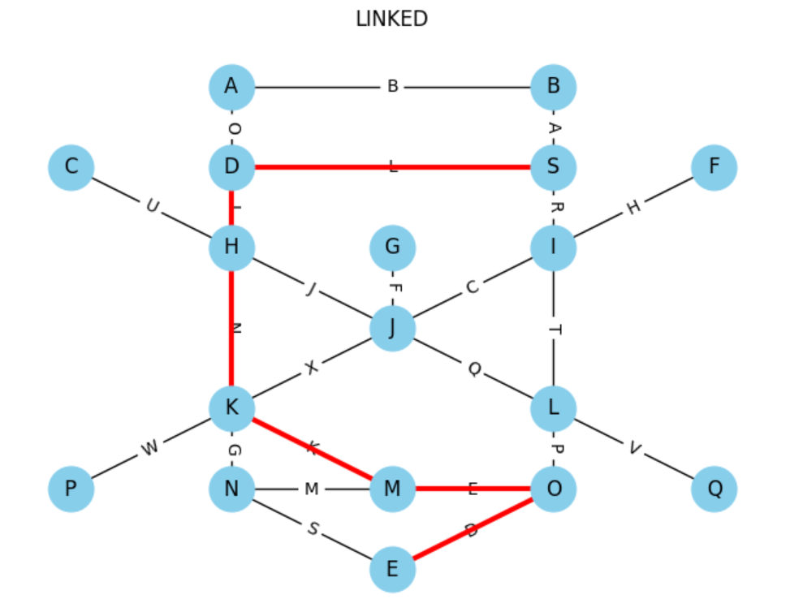

hakank4x: My comments below is hakank4.
DS: I am going through them one by one and marking off as completed. I am changing hakank4 to hakank4x when each one is done.

- [What I Wish I Knew When Learning Picat: Introduction](#what-i-wish-i-knew-when-learning-picat-introduction)
  - [A Motivating Example](#a-motivating-example)
  - [My Personal Vendetta With Optimization](#my-personal-vendetta-with-optimization)
  - [How This Document Is Organized](#how-this-document-is-organized)
  - [About Picat](#about-picat)
  - [Picat vs. Other Languages](#picat-vs-other-languages)
    - [Picat Has Common Programming Concepts](#picat-has-common-programming-concepts)
    - [Things Picat Has In Common With Logic Programming (Prolog)](#things-picat-has-in-common-with-logic-programming-prolog)
    - [Things Picat Has Uniquely (I think)](#things-picat-has-uniquely-i-think)
    - [Things Picat Doesn't Come With](#things-picat-doesnt-come-with)
  - [Using the Manual](#using-the-manual)
  - [Some Notes About Example Code](#some-notes-about-example-code)
    - [Clauses and Scope](#clauses-and-scope)
    - [Arity and `/x` notation in predicates and functions](#arity-and-x-notation-in-predicates-and-functions)
- [Constraint Programming and the Planner](#constraint-programming-and-the-planner)
  - [Fibonacci and Tabling](#fibonacci-and-tabling)
  - [Domain/Decision Variables and Constraints, `cp` `::`, `#=`](#domaindecision-variables-and-constraints-cp--)
  - [Constraint Example: Some Numbers that Multiply](#constraint-example-some-numbers-that-multiply)
  - [What Constraints are there?](#what-constraints-are-there)
    - [Constraint Operators](#constraint-operators)
    - [Arithmetic on Lists and Expressions](#arithmetic-on-lists-and-expressions)
    - [Global Constraints](#global-constraints)
  - [Using `solve` and `solve_all` with `cp`, `sat`, `mip` and `smt`](#using-solve-and-solve_all-with-cp-sat-mip-and-smt)
    - [Common Options Across All Solvers](#common-options-across-all-solvers)
    - [The Four Solver Modules](#the-four-solver-modules)
      - [CP, Constraint Programming or Constraint Logic Programming (Integer)](#cp-constraint-programming-or-constraint-logic-programming-integer)
      - [SAT, Boolean Satisfiability (Integer)](#sat-boolean-satisfiability-integer)
      - [SMT, Satisfiability Modulo Theories (Integer)](#smt-satisfiability-modulo-theories-integer)
      - [MIP, Mixed-Integer Programming (Integer and Real)](#mip-mixed-integer-programming-integer-and-real)
- [Constraint and Planner Example Programs](#constraint-and-planner-example-programs)
  - [Constraint Example: Advent of Code 2016 Day 15](#constraint-example-advent-of-code-2016-day-15)
  - [Constraint Example: Jane Street Bug](#constraint-example-jane-street-bug)
  - [Constraint Example: Santa's Knapsack](#constraint-example-santas-knapsack)
  - [The Planner](#the-planner)
  - [Planner Example: Blocks World](#planner-example-blocks-world)
  - [Planner Example: Wizards!](#planner-example-wizards)
  - [Planner Example: Moving Stuff](#planner-example-moving-stuff)
  - [Planner Example: Twisty Passages All The Same](#planner-example-twisty-passages-all-the-same)
  - [Planner and Constraint Example: Traveling Salesperson](#planner-and-constraint-example-traveling-salesperson)
- [Picat Isn't Python (or Exactly Prolog)](#picat-isnt-python-or-exactly-prolog)
  - [Maybe You Already Know Prolog?](#maybe-you-already-know-prolog)
  - [Variables](#variables)
    - [Multidimensional Lists and Arrays](#multidimensional-lists-and-arrays)
    - [Indexing a Range with Steps](#indexing-a-range-with-steps)
  - [Assignment (Binding) vs. Unification (Bind or Fail) vs. Equality (Only Numbers)](#assignment-binding-vs-unification-bind-or-fail-vs-equality-only-numbers)
    - [Default binding](#default-binding)
    - [Unification: the `=` operators](#unification-the--operators)
    - [Equality: the `==` and `=:=` operators](#equality-the--and--operators)
    - [Assignment and Re-assignment: `=`, `:=` and `bind_vars()`](#assignment-and-re-assignment---and-bind_vars)
    - [Reassignment via Predicate and Function Arguments](#reassignment-via-predicate-and-function-arguments)
    - [Reassignment vs Unificiation and Backtracking](#reassignment-vs-unificiation-and-backtracking)
  - [Global Maps](#global-maps)
  - [Program Structure and Control Flow](#program-structure-and-control-flow)
    - [The `main` predicate and Picat file extension.](#the-main-predicate-and-picat-file-extension)
    - [Whitespace](#whitespace)
    - [Anonymous Variables: `_` aka underscore](#anonymous-variables-_-aka-underscore)
    - [Predicates and Logic Programming "Weirdness": `append/3`](#predicates-and-logic-programming-weirdness-append3)
    - [`append/4` for parsing](#append4-for-parsing)
    - [Functions!](#functions)
    - [Is it a Predicates or a Function?](#is-it-a-predicates-or-a-function)
    - [`=>` vs `=` and conditions](#-vs--and-conditions)
    - [Pattern matching and `@`](#pattern-matching-and-)
    - [When to use `$` and when not to](#when-to-use--and-when-not-to)
    - [Function call syntax: `()` and `.`](#function-call-syntax--and-)
    - [Statement delimiters](#statement-delimiters)
    - [Control flow: `if` and `foreach`](#control-flow-if-and-foreach)
    - [Control flow: the `;` aka "or" operator](#control-flow-the--aka-or-operator)
    - [Control flow: `cond` and `compare_terms`](#control-flow-cond-and-compare_terms)
    - [Control flow: `call` and `apply`](#control-flow-call-and-apply)
    - [Control flow: `list_to_and`](#control-flow-list_to_and)
  - [Example: Global fact = Global state](#example-global-fact--global-state)
  - [Example: Dynamic Dispatch with `apply` and `call`](#example-dynamic-dispatch-with-apply-and-call)
  - [Non-determinism: `?=>` and more `table`](#non-determinism--and-more-table)
  - [`reduce` for functional folds](#reduce-for-functional-folds)
  - [Helper functions for accumulators](#helper-functions-for-accumulators)
  - [More Haskell Functions in Picat](#more-haskell-functions-in-picat)
- [Using Picat For Instruction](#using-picat-for-instruction)
- [Errors I Always Make and How I Compensate](#errors-i-always-make-and-how-i-compensate)
  - [Type Errors, Numbers and Characters, `println` vs `writeln`](#type-errors-numbers-and-characters-println-vs-writeln)
  - [More Type Errors: Lists and Arrays](#more-type-errors-lists-and-arrays)
  - [List Ranges With \[\]](#list-ranges-with-)
  - [And More Type Errors: `""` vs `''` aka Atoms and Strings, Oh My](#and-more-type-errors--vs--aka-atoms-and-strings-oh-my)
  - [Predicate vs Function (sort of a type error)](#predicate-vs-function-sort-of-a-type-error)
  - [Unification vs Assignment](#unification-vs-assignment)
  - [Forgetting a comma or a period (or having an extra one)](#forgetting-a-comma-or-a-period-or-having-an-extra-one)
  - [Trying to use list indexing with decision/domain variable](#trying-to-use-list-indexing-with-decisiondomain-variable)
- [Debugging](#debugging)
  - [Print and Printf are Your Friends](#print-and-printf-are-your-friends)
  - [Print within `solve`!](#print-within-solve)
  - [Globally Control Progress/Debug Println](#globally-control-progressdebug-println)
  - [`readchar` for single step execution](#readchar-for-single-step-execution)
  - [`time` to calculate execution time](#time-to-calculate-execution-time)
- [Things I Still Don't Fully Understand or Wish Had More Example](#things-i-still-dont-fully-understand-or-wish-had-more-example)
  - [Functions and Predicates I Don't Understand](#functions-and-predicates-i-dont-understand)
    - [`acyclic_term`](#acyclic_term)
    - [`list_to_and(List) = Conj`](#list_to_andlist--conj)
  - [Constraints I Don't Understand](#constraints-i-dont-understand)
    - [`neqs`](#neqs)
    - [`regular`,`circuit` and `table_in` constraints](#regularcircuit-and-table_in-constraints)
  - [Conceptual Areas I'm Not Comfortable With](#conceptual-areas-im-not-comfortable-with)
    - [DCGs](#dcgs)
    - [Global maps](#global-maps-1)
    - [`!`](#)
    - [Event Driven Actors](#event-driven-actors)
  - [Things I Would Like Added to the Index](#things-i-would-like-added-to-the-index)
- [Enhancements I'd Like](#enhancements-id-like)
- [Resources](#resources)
  - [Code Examples](#code-examples)
  - [Modules](#modules)
  - [Editor Plugins](#editor-plugins)
  - [Optimization/Constraint Programming Resources](#optimizationconstraint-programming-resources)


# What I Wish I Knew When Learning Picat: Introduction

August 2025

I have long been interested in constraint programming, which has been referred to as the "Holy Grail" of programming where the user states the problem and the computer solves it. https://dl.acm.org/doi/fullHtml/10.1145/242224.242304

While this is far from reality, constraint programming can reduce and scan the search space for NP dynamic programming problems without the user having to explicitly code the backtracking/search algorithm. Examples include: shortest path, knapsack, n-queens, Sudoku and so on. 

Picat is a great language for learning these concepts and also an interesting general purpose programming language. 

My background in programming is mostly procedural (Python) and pure functional (Haskell). So my challenge with Picat is multi-faceted: 1. Learn how constraint programming works in general, 2. Learn how constraint programming works in Picat, 3. Learn how Picat works.

Because Picat is a descendent of Prolog, it's core is a logic programming paradigm. And while the Picat manual is excellent, it moves along a quick clip and I had to read it very carefully to understand what I didn't understand. Think Calculus textbook. It's all documented, but makes sense sometimes only after you've learned it.

Also, because it's a niche language, there's a limited amount of online support. There's no StackExchange/Picat. (There are a few Picat questions there though!) I was lucky to get in contact with one of the key developers/users of the language, Håkan Kjellerstrand, who kindly helped me through many a head scratching moment. His website is invaluable: https://hakank.org/picat/.

He also made a customized ChatGPT with Picat's documentation that has helped me as well, although like all LLMs, it can hallucinate solutions that don't work and has a tiny training dataset compared with JavaScript. But it has been more useful than not as I bang my head against the wall of knowledge.

This document is my attempt to share what I learned and is intended for programmers who have similar experience to me: a reasonable grasp of a common language such as Python, C, JavaScript, etc or a background with a functional language such as Haskell or OCaml, but not much use of Prolog or other logic programming language, and possibly no idea what constraint programming is. 

Consider this a rough draft representing my personal learning curve. This document is not intended to be read top to bottom, but rather to help you if you get stuck where I did and hopefully give you the insight to move forward. As such, there's some redundancy between sections because I'm trying to make them self-contained as much as possible.

*Notes:*

 *I am much indebted to Advent of Code for providing a wealth of puzzles that have helped me learn Picat (and other languages). https://adventofcode.com*

 *Title inspired by What I Wish I Knew When I was Learning Haskell, which helped me learn that language. https://github.com/sdiehl/wiwinwlh*

 *Many extra thanks to Håkan Kjellerstrand for editing a draft of this document, and always being ready to answer any question on Picat.*

## A Motivating Example

Remember simultaneous linear equations? For example, here's a [problem](ttps://www.reddit.com/r/learnmath/comments/wdgk6x/ways_to_solve_system_of_equations_with_4_unkowns/) from Reddit's Learn Math:

$$
x + y = 2 \\
y + z = 7 \\
z + w = 13 \\
w + x = 8 \\
w \ge 0 \\
x \ge 0 \\
$$
Think how you might solve this with any programming languages you know. Maybe nested `for` loops over possible values? Or a `filter` with conditions? Or just do it in your head?

With Picat, this is straightforward:
```
import cp. % the constraint solver module

main =>
    X + Y #= 2, % #= means RHS equals LHS in valid solutions
    Y + Z #= 7, 
    Z + W #= 13, 
    W + X #= 8, 
    W #>= 0, X #>= 0,

    Sols = solve_all([W,X,Y,Z]), % find all solutions
    
    foreach (S in Sols) 
        [W1,X1,Y1,Z1] = S, % pattern match on the variables
        println([w=W1,x=X1,y=Y1,z=Z1]) % print them out
    end.
```
This outputs:
```
    [w = 0,x = 8,y = -6,z = 13]
    [w = 1,x = 7,y = -5,z = 12]
    [w = 2,x = 6,y = -4,z = 11]
    [w = 3,x = 5,y = -3,z = 10]
    [w = 4,x = 4,y = -2,z = 9]
    [w = 5,x = 3,y = -1,z = 8]
    [w = 6,x = 2,y = 0,z = 7]
    [w = 7,x = 1,y = 1,z = 6]
    [w = 8,x = 0,y = 2,z = 5]
```
Nice!

## My Personal Vendetta With Optimization

My interest in optimization goes back to when I worked on the Optimization Subroutine Library at IBM Kingston in my first job out of college in 1989.
IBM needed a technical writer for the manual who had a background in computing and math, and as a dual CS/Math major with a writing minor, who also happened to have a father who worked at IBM for 30 years, I was the perfect person.

OSL was a cutting edge Simplex and interior-point barrier method linear optimization library of subroutines for IBM mainframes that worked with Fortran, APL, and hard-core 360 Assembly. 
It could also take advantage of the "vector processing facility" to do multiple operations simultaneously. Today we call that SIMD.

This was software that cost in the hundreds of thousands of dollars and ran on machines that cost millions. But it was in great demand nonetheless: Airlines and trucking companies used OSL for scheduling, oil and gas companies for evaluating the potential of drill sites. 

Nowadays, you can just download for free any of a number of linear programming libraries and run them on your laptop with more compute than any 1990s mainframe. 

However, at the time, and still today, the math at the center of this is over my head, and I never really understood how the optimization worked or how to use it myself. Which is why I find Picat so appealing. **Picat enables learning about constraint programming and optimization with the linear algebra and discrete mathematics quietly in the background.**

*Fun fact: A couple the researchers from IBM who wrote much of OSL, John Forrest and John Tomlin, were and are instrumental in COIN-OR, an open source optimization software initiative. John Forrest was not the friendliest to a young technical writer, but John Tomlin was as kind as possible.
https://www.informs.org/Recognizing-Excellence/Award-Recipients/John-Forrest 
https://www.coin-or.org/coinCup/coinCup2007Winner.html*

## How This Document Is Organized

This document has the following primary sections:

- [Introduction](#what-i-wish-i-knew-when-learning-picat-introduction). (you are here!), which includes some high level information about Picat.
- [Constraint and Planner Programming](#constraint-programming-and-the-planner), these capabilities are the reason I wanted to learn Picat and are a central strength of the language. If you are familiar with Prolog then start here.
- [Picat is not Python](#picat-isnt-python). This is the section if you're unfamiliar with Prolog and logic programming concepts. I had always struggled with these, so I share what I found challenging and helpful. There's also some neat tricks here such as dynamic dispatch.
- [Resources](#resources). Links to more information about Picat and example code.
- [Appendix: Using Picat In Class](#appendix-using-picat-for-instruction). Some ideas for how to autograde Picat student assignments.
- [Appendix: My Errors](#errors-i-always-make-and-how-i-compensate). The things I always get wrong, although I'm doing it less now that I've written this!
- [Appendix: Debugging](#appendix-debugging). Some ideas for debugging that I rely on.
- [Appendix: Stuff I Don't Know](#appendix--things-i-still-dont-fully-understand). Things that I don't fully understand about Picat.


## About Picat

What is Picat?

1. A dynamically typed hybrid of imperative, logic, functional and constraint programming. 
2. A programming language with support for Boolean Satisfiability (SAT), Mixed-Integer Programming (MIP), Satisfiability Modulo Theories (SMT), and Finite Domain (FD) Constraint Programming (CP) solvers.
3. Combines some of the best ideas of Prolog, Python, Haskell, MiniZinc/z3, OR-Tools.
3. A wonderful resource for learning logic and constraint programming.

Answer: all of the above.

## Picat vs. Other Languages

Let's look at how Picat stacks up against some programming languages you may know.

| Other Language      | Picat                 
| :----------   | :----                  
| Imperative: Python, JavaScript   | = Straightforward syntax <br> = Print from any statement to debug  <br> - Libraries are limited <br> - Community is small
| Functional: Haskell, OCaml | = Functional concepts  <br> - No lambdas
| Solvers: Z3, MiniZinc  | + Full programming language vs. just a solver
| Logic: Prolog  | + Functions <br> = Unification, non-determinism, tabling <br> = Most "standard" Prolog features

---
\+ Advantage, = Similar, - Disadvantage

### Picat Has Common Programming Concepts

| Concept               |  Picat                                          |
| :----------------     | :------                                         |
| Comments              | `% percent sign for comments. /* */ for block comments |
| Variables             | `A=5, B=3.4, C=(1234 mod 7).` <br> Note: Variables start with a capital letter in Picat.| 
| [Numeric Separator](https://rosettacode.org/wiki/Numeric_separator_syntax) | `A=1_000_000.` This is syntactic sugar. |
| Strings               | `println("Hello World.")` |
| Linked Lists          | `MyList =[3,4,6,1,56,123.65,"a string?",[a,sub,list]]`|
| Arrays (O(n) access)  | `My2DArray = {{1,2},{3,4}}, println(My2dArray[1,2]).` |
| List Comprehension.   |  `Xs = [X : X in 1..5, X != 2].`                      |
| Pattern Matching      |  `head([H\|T])=H.`                                    |
| Loops                 |  `foreach (X in MyList) Y=X*X,println(X) end.`        |
| Recursion             | `fib(0)=1. fib(1)=1. fib(N)=fib(N-1)+fib(N-2).`.      |
hakank4x: Note that is recursion with functions. Perhaps you should also add a recursion with predicates, e.g. member/2:
hakank4x: member(X,[X|_]).
hakank4x: member(X,[_|L) :- member(X,L).
DS: added

| Functions             | `double(X) = R => R = X*2`                            |
hakank4x: Why not simply:
hakank4x:   double(X) = X*2.
DS: trying to show use of return value. edited.


| Output                |  `print()`, `println()`, `printf()`                   |
| Input                 | `read_file_lines("datafile.txt").`                    |
| Higher Order Functions| `map(reverse,MyStringList).` or `MyStringList.map(reverse).`|
||| 

Also: Hashmaps, Sets, Ordered Sets and Binary Heaps.

### Things Picat Has In Common With Logic Programming (Prolog)  

- Variables start with a Capital Letter.
- Atoms
- Unification
- Finite Domain Variables
- Tabling (Automatic Memoization)
- Non-Determinism
- Definite Clause Grammar (DCG) (Although I don't know how to use them. So if you do, please let me know.)


### Things Picat Has Uniquely (I think)

- Planner

    There is a planner definition language, [PDDL](https://planning.wiki/guide/whatis/pddl), but it is not a general progamming language like Picat, and I did not find it very easy to learn.

- Solver polymorphism + Turing Complete

    While DSL languages such as MiniZinc is designed to work with multiple backend solvers, and languages such as Prolog and Python are Turing Complete with bindings to solvers, the integrated nature of Picat's solvers along with being a full programming language does stand out as unique.

hakank4x: There are quite a few constraint systems that are intergrated with full programming languages, e.g. OR-tools (for Python, C++, C#, and Java, Gecode for C++, Choco and JaCoP for Java, etc.
DS: I had noted the integration, added more.
hakank4x: What's perhaps unique that Picat has this included by default as well as it has this support together with a planner module.
DS: done

### Things Picat Doesn't Come With

- Classes, Objects   
- Lambdas/Anonymous Functions
- Strong Typing, Type Hinting
- Monads 


More at: https://picat-lang.org/download/picat_compared_to_prolog_haskell_python.html

## Using the Manual

https://picat-lang.org/download/picat_guide.pdf
- The manual is the single most important document for learning Picat. It has everything, but can be very terse, and so must be read closely.
- The index at the back lists all the commands and hyperlinks to them. I use this more than any other method when programming in Picat.

## Some Notes About Example Code 

### Clauses and Scope

Each clause in Picat ends with a `.`. In example code each line is fully distinct for variable scope. `%` begins a comment.

For example:

```
A=5. % A=5. 
```
But `A` is only `5` in this clause. After the `.`, `A` goes out of scope.

hakan4: Proably too picky: This is perhaps a little strange example since a statement like this must be in a body of a predicate/function to make sense. Or in the REPL (and there the "." is not actually needed). 

And if you prefer spaces around your operators, please go ahead.

```
A="A Wildebeest!". % A is a string. 
```
Again, `A` is in scope only until the `.` and doesn't exist after.
```
B=A+A. %** Error  : Free variable in expression: '+' 
```
 `A` hasn't been defined in this clause. 
 
 But using a `,` provides a continuous scope for `A`.
```
A=5,B=A+A. %A=5 and B=10.
```

### Arity and `/x` notation in predicates and functions

In Prolog and Picat, it's common to refer to a function by the number of arguments it has. This is known as the functions' *arity*. For example, `new_list/1` as in:
```
A=new_list(5). % make a list of 5 things
```
Why? Because often there's a version of the predicate or function with a different number of arguments.
```
A=new_list(5,0). % make a list of 5 things and initialize them all to 0.
```

# Constraint Programming and the Planner

Constraint programming let's you solve problems that require searching through possible solutions. How can you place queens on a chessboard so that no queen is able to take another? (N-queens) Can a knight on chessboard visit every square once and end by returning to its starting square? (Knights tour) The best route for a traveling salesman? (Traveling Salesman) The quickest way out of a maze? (Shortest Path) How best to choose items to fill a suitcase? (Knapsack) How to complete a partially filled Sudoku puzzle? (Sudoku)

All of these, and many many more can be found via the links in the [resources](#resources) section. 

The main concept here is the minimization of a function defined by a set of rules aka constraints. The function has variables whose values are not known, but can be defined to be within a given range. These are called "decision variables," and differ from normal variables.

hakank4x: Again picky: The N-queens problem and Knight's Tour are not really minimization problems.
hakank4x: I would state it something like this:
hakank4x: "The main concept here is the satisfaction (and sometimes optimization) ...".
DS: done

Decision variables can be real/floating point values or integers, and in most most cases, there's no closed form solution to obtain their values. Constraint programming is NP-Hard. https://en.wikipedia.org/wiki/Integer_programming#Heuristic_methods

There are many applicable techniques you may have seen in a CS algorithms class: Dijkstra's algorithm, A*, recursion/induction, A/B pruning, branch-and-bound, fail first, breadth first search, depth first search, simplex, gradient descent, satisfiability solver, memoization/tabling or just brute force.

A solution is found through iteration and any efficiency over brute force is through careful selection of which potential solution to try next, when to give up and try a different one, and identification of when a given search location is the same as a previous one. This last item is also known as symmetry breaking, that is, if a state is identical/symmetrical to a previous one, don't do the calculations all over again.
hakank4s: "A solution _using these algorithms_ is found ...".
DS: done

These algorithms can reduce the time to find a solution from hours to fractions of a second, but learning all of them and implementing them for a specific problem can be challenging. Enter Picat!

Picat has multiple built-in solvers: Boolean Satisfiability (SAT), Mixed-Integer Programming (MIP), Satisfiability Modulo Theories (SMT), and Finite Domain (FD) Constraint Programming (CP). Incredibly, the interface to all of them is largely the same. This lets you switch between CP and SAT, for example by just changing and `import` statement. 

There's also the amazing a Planner for finding minimum cost solutions to problems expressed via actions on a global state. 

## Fibonacci and Tabling

Let's take a the example every dynamic programming text begins with, Fibonacci numbers. $F_n = F_{n-1} + F_{n-2}$. In Picat:

```
fib(0) = 1.
fib(1) = 1.
fib(N) = fib(N-1)+fib(N-2).
```
Run this with and we quickly see a problem with compute time.
```
main =>
    time(println(fib(5))),
    time(println(fib(30))),
    time(println(fib(40))).
---------------------------------
8 CPU time 0.0 seconds.
1346269 CPU time 0.042 seconds.
165580141 CPU time 4.755 seconds.
---------------------------------
```
`fib` is recalculating every value of `N-1` and `N-2` for each `N`. At `fib(40)` that's 331,160,281 recursive calls. https://cboard.cprogramming.com/c-programming/168662-fibonacci-how-long-would-take.html

The solution is to memoize the values into a hash table after they are computed so that they can be looked up rather than brute forced on subsequent calls.

Picat (and many Prolog solutions) make this ridiculously easy. Here's the revised code.


```
main =>
    time(println(fib(5))),
    time(println(fib(30))),
    time(println(fib(40))),
    time(println(fib(4000))).

table
fib(0) = 1.
fib(1) = 1.
fib(N) = fib(N-1)+fib(N-2).
---------------------------------
8 CPU time 0.0 seconds.
1346269 CPU time 0.0 seconds.
165580141 CPU time 0.0 seconds.
64574884490948173531376949015369595644413900640151342708407577598177210359034088914449477807287241743760741523783818897499227009742183152482019062763550798743704275106856470216307593623057388506776767202069670477506088895294300509291166023947866841763853953813982281703936665369922709095308006821399524780721049955829191407029943622087779296459174012610148659520381170452591141331949336080577141708645783606636081941915217355115810993973945783493983844592749672661361548061615756595818944317619922097369917676974058206341892088144549337974422952140132621568340701016273422727827762726153066303093052982051757444742428033107522419466219655780413101759505231617222578292486081002391218785189299675757766920269402348733644662725774717740924068828300186439425921761082545463164628807702653752619616157324434040342057336683279284098590801501
CPU time 0.013 seconds.
---------------------------------

```
## Domain/Decision Variables and Constraints, `cp` `::`, `#=`

The core idea of constraint programming are decision variables, which are variables that have a range of potential values that are then solved by adding conditions/constraints they must meet. 

Terminology Note: the Picat manual calls these *domain* variables and the common term of art is *decision* variable. According to [IBM](https://www.ibm.com/docs/en/icos/22.1.1?topic=expressions-domains-variables), a decision variable has a domain. So there you go. I will largely use *domain* because I cut-and-pasted a good bit from the manual.

Here's an example. Note that the module `cp` must be imported to use domain variables.
```
A :: 1..10 % A is a number between 1 and 10
```

hakank4x: You might to add "import cp." in this first example so one can see the exact syntax.
DS: done.

If you type this into the interactive Picat REPL, you get: 
```
A = DV_0104d8_1..10
```
Let's modify this so that `A` must be even. We do this by adding a constraint with `#=`.

```
A :: 1..10, A mod 2 #= 0.     
% REPL says: A = DV_010970_2_4_6_8_10
```

hakank4x: This shows the power of a constraint solver: Sometimes the domain can be reduced directly, i.e. the domain if A is now only the even numbers. (This is discussed more in the Picat book, chapter 2-3).
DS: done.

## Constraint Example: Some Numbers that Multiply

It's also easy to make a list or array of domain variables. Here's a contrived problem:
- 5 increasing numbers that differ by 1,2,3, and 4
- The product of the numbers is less than 100000
- The first number is as large as possible 
Let's say we want to find a sequence of 5 numbers between 1 and 100 where their product is less than 100000, but where the first number is as large as possible (but between 1 and 100).

```
import cp.

main => 
    N :: 1..100, 
    X = new_list(5),
    X :: 1..100,
    Y :: 0..100000,
    increasing_strict(X), % not really necessary
    foreach(I in 1..X.len-1)
        X[I+1] #= X[I]+I
    end,
    X[1] #> N,
    prod(X)#<Y,

    solve([$max(N)],X ++ [Y]), % find largest N

    println(y=Y),
    println(x=X),
    println(n=N).
```
Output is :
```
y = 72577
x = [6,7,9,12,16]
n = 5
```

## What Constraints are there?

There's lots of constraints that can be applied to via a constraint operator or to a list or expression of domain variables and global constraints. 

Picat has implemented quite a few constraints, but there are so, so, so many more. Hakan has implemented more of them here: https://www.hakank.org/picat/#global.

*Rabbit Hole:  There's even a [Global Constraint Catalog!](https://sofdem.github.io/gccat/gccat/sec5.html) Take a look at your own peril to your free time.*

hakank4x: A fun challenge to reader: Pick one or two global constraint that look fun and try to implement them in Picat.
DS: Edit made. However, fun is in the eye of the beholder. :-)

### Constraint Operators

Numeric: `::`, `notin`, `#=`, `#!=`, `#<`, `#=<`, `#<=`, `#>`, `#>=`
Logical: `#~` (not),`#/\` (and),`#^` (XOR),`#\/` (or),`#=>` (left side implies right),`#<=>` (left and right are equivalent)

hakank4x: Or: "... #=> (implication), #<=> (equivalence)"
DS: done

### Arithmetic on Lists and Expressions

- `cond`(*BoolConstr*,*ThenExp*,*ElseExp*): if the Boolean constraint is true, then the *ThenExp* else *ElseExp*
- `count`(*V*,*List*): The number of times *V* occurs in a list of variables
- `max`(*List*): The maximum a list of domain variables
- `max`(*Exp1*,*Exp2*): The maximum of *Exp1* and *Exp2*
- `min`(*List*): The minimum of a list of domain variables
- `min`(*Exp1*,*Exp2*): The minimum of *Exp1* and *Exp2*
- `prod`(*List*): The product of a list of domain variables
- `sum`(*List*): The sum of a list of domain variables

I often think I need to constrain on the length of a list, but that's because I'm thinking about the problem from my Python/Haskell view. What I really want is usually `count` or `max` or `sum`. 

For example, in this Advent of Code [problem](#constraint-example-santas-knapsack), I want to minimize the number of items in the list `Bins` assigned to bin 1. Item`Bins[X] = 0` for an assignment of that element to bin 1 and `Bins[X] != 0` for any other bin. 

My initial thought: `Bins` should be shortest. Therefore, filter `Bins` and then minimize `len(Bins)`. But this is functional programming,. What I really need is just: The count of items in `Bins` equal to 0. I can do this a few ways:

```
L1 #= sum([(Bins[I] #= 0) : I in 1..N]), % L1 = Bin 1 size
L1 #= sum([1 : I in 1..N, Bins[I]] #= 0) % condition on right hand side of list comprehension
L1 #= count(0,Bins)
% and then in when we invoke solve, we use min
solve($[min(L1)],Bins).
```

hakank4x: That's a great example of the difference between imperative/functional vs constraint thinking!
DS: Yep, learning to think in Prolog/Picat is a shift of perspective. Edit done.

###  Global Constraints

I copied this list (and the majority of the text) from the Picat manual, but reduced to the high-level points. This means I removed some detail and for the more complex constraints, refer to the manual! https://picat-lang.org/download/picat_guide.pdf

Note: In all cases where there list *List* it can also be an *Array*. 

- `acyclic`(*Vs*,*Es*): The undirected graph represented by *Vs* and *Es* contains no cycles. [*see hcp for how the graph is defined*]

- `acyclic_d`(*Vs*,*Es*): The directed graph represented by *Vs* and *Es* contains no cycles.

- `all_different`(*List*): All variables in the list or array are different.

- `all_distinct`(*List*): The same as `all_different`, but for the `cp` module it maintains a higher level of consistency. For some problems, this is faster, and, for some other problems, it is slower.

- `all_different_except_0`(*List*): This constraint is true if all non-zero values in the *List* are different.

- `assignment`(*List 1*,*List 2*): This constraint ensures that the first *List* is a dual or the second. i.e., if the *ith* element of the first is *j*, then the *jth* element of the second is *i*.

- `at_least`(*N*,*L*,*V*): There are at least *N* elements in *L* that are equal to *V*, all must be integers.

- `at_most`(*N*,*L*,*V*): There are at most *N* elements in *L* that are equal to *V*, all must be integers.

- `circuit`(*List*): The *List* forms a Hamiltonian cycle. This constraint ensures that each variable has a different value, and that the graph formed by the assignment does not contain any sub-cycles. 

    For example, for the constraint `circuit([X1,X2,X3,X4])`, `[3,4,2,1]` is a solution, but `[2,1,4,3]` is not, because `1->2, 2->1, 3->4, 4->3` contains two sub-cycles.

- `count`(*V,*List*,*Rel*,*N*): The number of elements of *List* where *V Rel N* is true. Rel is one of `#=`, `#!=`, `#>`, `#>=`, `#<`, `#=<`, or `#<=`. This constraint can be defined as:

        count(V,L,Rel,N) =>
            sum([V #= E : E in L]) #= Count,
            call(Rel,Count,N).

- `count`(*V*,*List*,*N*): The same as `count`(*V*,*List*,*#=*,*N*).

- `cumulative`(*Starts*,*Durations*,*Resources*,*Limit*): This constraint is for describing and solving time-based scheduling problems. The arguments *Starts*, *Durations*, and *Resources*
are lists of integer-domain variables of the same length, and *Limit* is an integer-domain
variable. 

    Let *Starts* be *[S1 , S2 , . . ., Sn ]*, *Durations* be *[D1 , D2 , . . ., Dn ]*, and *Resources* be *[R1 , R2 , . . ., Rn ]*.

    For each job *i*, *Si* represents the start time, *Di* represents the duration, and *Ri* represents the units of *Resources* needed. *Limit* is the limit on the units of *Resources* available at any time. This constraint ensures that the limit cannot be exceeded at any time.

- `decreasing`(*List*): The *List* is in (non-strictly) decreasing order.

- `decreasing_strict`(*List*): The *List* is in strictly decreasing order.

- `diffn`(*RectangleList*): This constraint ensures that no two rectangles in *RectangleList*
overlap with each other. A rectangle in an n-dimensional space is represented by a list of
2 × n elements *[X1 , X2 , . . ., Xn , S1 , S2 , . . ., Sn ]*, where *Xi* is the starting
coordinate of the edge in the *ith* dimension, and *Si* is the size of the edge.

- `disjunctive_tasks`(*Tasks*): *Tasks* is a list of terms. Each term has the form
`disj_tasks(S1,D1,S2,D2)`, where `S1` and `S2` are  integer-domain variables, and `D1` and `D2` are positive integers. This constraint is equivalent to posting the disjunctive constraint `S1+D1 #=< S2 #\/ S2+D2 #=< S1` for each term in `Tasks`;  the
constraint converts the disjunctive tasks into global constraints.

- `element`(*I*,*List*,*V*): The *Ith* element of *List* is *V*, where all are integer-domain variables.

- `element0`(*I*,*List*,*V*): The same as element(I,List,V), except 0-based, rather than 1-based, indexing is used.

- `exactly`(*N*,*List*,*V*): This constraint succeeds if there are exactly *N* elements in *L* that
are equal to *V* , all must be
integer-domain variables.

- `global_cardinality`(*List*,*Pairs*): *List* is a list of integer-domain variables
*[X1 , . . ., Xd]*, and *Pairs* is a list of pairs *[K1 -V1 , . . ., Kn -Vn]*, where each key
*Ki* is a unique integer, and each *Vi* is an integer-domain variable. 

    The constraint is true if every element of L*ist is equal to some key, and, for each pair *Ki-Vi* , exactly *Vi* elements of *List* are equal to *Ki*. This constraint can be defined as follows:

        global_cardinality(List,Pairs) =>
            foreach ($Key-V in Pairs)
            sum([B : E in List, B#<=>(E#=Key)]) #= V
            end.

- `hcp`(*Vs*,*Es*): The directed graph represented by Vs and Es forms a Hamiltonian cycle. 

    *Vs* is a list of pairs of the form *{V,B}*, and *Es* is a list of triplets of the form *{V1,V2,B}*. 
    
    A pair *{V,B}* in *Vs*, where *V* is a ground term and *B* is a Boolean variable, denotes that *V* is in the graph if and only if *B = 1*. 
    
    A triplet *{V1,V2,B}* denotes that *V1* is connected to *V2* by an edge in the graph if and only if *B = 1*. 
    
    The `circuit` and `subcircuit` constraints can be implemented as follows by using `hcp`:
```
    circuit(L) =>
        N = len(L),
        L :: 1..N,
        Vs = [{I,1} : I in 1..N],
        Es = [{I,J,B} : I in 1..N,
        J in fd_dom(L[I]),
        J !== I,
        B #<=> L[I] #= J],
        hcp(Vs,Es).

    subcircuit(L) =>
        N = len(L),
        L :: 1..N,
        Vs = [{I,B} : I in 1..N,
        B #<=> L[I] #!= I],
        Es = [{I,J,B} : I in 1..N,
        J in fd_dom(L[I]),
        J !== I,
        95B #<=> L[I] #= J],
        hcp(Vs,Es).
```
- `hcp`(*Vs*,*Es*,*K*): The same as hcp(Vs,Es), except that it also constrains the number of vertices in the graph to be *K*.

- `hcp_grid`(*A*): This constraint ensures that the grid graph represented by *A*, which is
a two-dimensional array of Boolean (0/1) variables, forms a Hamiltonian cycle.

    In a grid graph, each cell is directly connected horizontally and vertically, but not diagonally, to its neighbors. Only cells labeled 1 are considered as vertices of the graph. This constraint is
    implemented as follows by using `hcp`:
```
    hcp_grid(A) =>
        NRows = len(A),
        NCols = len(A[1]),
        Vs = [{(R,C), A[R,C]} :
        R in 1..NRows,
        C in 1..NCols],
        Es = [{(R,C), (R1,C1), _} :
        R in 1..NRows,
        C in 1..NCols,
        (R1,C1) in neibs(A,NRows,NCols,R,C)],
        hcp(Vs,Es).

    neibs(A,NRows,NCols,R,C) =
        [(R1,C1) : (R1,C1) in [(R-1,C), (R+1,C),
        (R,C-1), (R,C+1)],
        R1 >= 1, R1 =< NRows,
        C1 >= 1, C1 =< NCols,
        A[R1,C1] !== 0].
```
- `hcp_grid`(*A*,*Es*): The same as `hcp_grid`(*A*), except that it also restricts the edges to *Es*, which consists of triplets of the form *{V1,V2,B}*. 

    In a triplet in *Es*, *V1* and *V2* take the form *(R,C)*, where *R* is a row number and *C* is a column number, and *B* is a Boolean variable, which denotes that *V1* is connected to *V2* by an edge in the graph if and only if *B = 1*. If *Es* is a variable, then it is bound to the edges of the grid graph.

- `hcp_grid`(*A*,*Es*,*K*): The same as
`hcp_grid`(*A*,*Es*), except that it also constrains the number of vertices in the graph to be *K*.

- `increasing`(*List*): The *List* is in (non-strictly) increasing order.

- `increasing_strict`(*List*): The *List* is in strictly increasing order.

- `lex_le`(*List 1*,*List 2*): List 1 is lexicographically less than or equal to List 2. 

- `lex_lt`(L1 ,L2 ): (*List 1*,*List 2*): List 1 is lexicographically less than to List 2. 

- `matrix_element`(*Matrix*,*I*,*J*,*V*): True if the entry at *<I,J>* in *Matrix* is *V*, where all are integer-domain variables.

- `matrix_element0`(*Matrix*,*I*,*J*,*V*): The same as `matrix_element`, except that it uses 0-based, rather than 1-based, indexing.

- `neqs`(*NeqList*): *NeqList* is a list of inequality constraints of the form `X #!= Y` , where `X` and `Y` are integer-domain variables. This constraint is equivalent to the conjunction of the inequality constraints in *NeqList*, but it extracts `all_distinct` constraints from the inequality constraints

- `nvalue`(*N*,*List*): The number of distinct values in *List* is *N*, where *List* is a list of integer-domain variables.

- `path`(Vs*,*Es*,*Src*,*Dest*): The undirected graph represented by *Vs* and *Es* has a path from *Src* to *Dest*. [*see hcp for how the graph is defined*]
    
    Note that the graph is assumed to be undirected. If there exists a triplet *{V1,V2,B}* in *Es*, then the triplet *{V2,V1,B}* will be added to *Es* if it is not specified.

- `path_d`(*Vs*,*Es*,*Src*,*Dest*): The same as
`path`(*Vs*,Es,*Src*,*Dest*), except that the graph is directed.

- `regular`(*List*,*Q*,*S*,*M*,*Q0*,*F*): Given a finite automaton (DFA or NFA) of *Q* states numbered *1, 2,...,Q* with input *1..S*, transition matrix *M* , initial state *Q0 (1 ≤ Q0 ≤ Q)*, and a list of accepting states *F*, True if the *List* is accepted by the automaton.

    The transition matrix M represents a mapping from 1..Q × 1..S to 0..Q, where 0 denotes
    the error state. For a DFA, every entry in M is an integer, and for an NFA, entries can be a
    list of integers.

    The `regular` constraint is covered in the [Constraint book](https://picat-lang.org/picatbook2015/constraint_solving_and_planning_with_picat.pdf)

- `scalar_product`(*A*,*X*,*Product*): The scalar product of A and X is *Product*, where
*A* and *X* are lists or arrays of integer-domain variables, and *Product* is an integer-domain variable. *A* and *X* must have the same length.

• `scalar_product`(*A*,*X*,*Rel*,*Product*): The scalar product of A and X has the relation *Rel* with *Product*, where *Rel* is one of the following operators: `#=`, `#!=`, `#>=`, `#>`,
`#=<` (or `#<=`), and `#<`.

- `scc`(*Vs*,*Es*):The undirected graph represented by *Vs* and
*Es* is strongly connected.
[*see hcp for how the graph is defined*]

    Note that the graph is assumed to be undirected. If there exists a triplet *{V1,V2,B}* in *Es*, then the triplet *{V2,V1,B}* will be added to *Es* if it is not specified

- `scc`(*Vs*,*Es*,*K*): The same as `scc`(*Vs*,*Es*), except that it also constrains the number of vertices in the graph to be *K*.

- scc_grid(A): This constraint ensures that the grid graph represented by A, which is a
two-dimensional array of Boolean variables, forms a strongly connected undirected graph.

    In a grid graph, each cell is directly connected horizontally and vertically, but not diagonally, to its neighbors. Only cells labeled 1 are considered as vertices of the graph. 
    
    This constraint
is implemented as follows by using `scc`:
```
    scc_grid(A) =>
        NRows = len(A),
        NCols = len(A[1]),
        Vs = [{(R,C), A[R,C]} :
        R in 1..NRows,
        C in 1..NCols],
        Es = [{(R,C), (R1,C1), _} :
        R in 1..NRows,
        C in 1..NCols,
        (R1,C1) in neibs(A,NRows,NCols,R,C),
        (R,C) @< (R1,C1)],
        scc(Vs,Es).

    neibs(A,NRows,NCols,R,C) =
        [(R1,C1) : (R1,C1) in [(R-1,C), (R+1,C),
        (R,C-1), (R,C+1)],
        R1 >= 1, R1 =< NRows,
        C1 >= 1, C1 =< NCols,
        A[R1,C1] !== 0].
```
Note that there is an edge between each pair of neighboring cells in the resulting graph as
long as the cells are in the graph.

- `scc_grid`(*A*,*K*): The same as `scc_grid`(*A*,*Es*), except that it also
constrains the number of vertices in the graph to be *K*.

- `scc_d`(*Vs*,*Es*): The directed graph represented by *Vs* and
*Es* is strongly connected, where *Vs* and *Es* are the same as those in scc(*Vs*,*Es*), except
that the graph is directed.

- `scc_d`(*Vs*,*Es*,*K*): The same as `scc_d`(*Vs*,*Es*), except that it also
constrains the number of vertices in the graph to be *K*.

- `serialized`(*Starts*,*Durations*): This constraint describes a set of non-overlapping
tasks, where *Starts* and *Durations* are lists of integer-domain variables, and the lists have
the same length. Let *Os* be a list of *1s* that has the same length as *Starts*. This constraint is
equivalent to cumulative(*Starts*,*Durations*,*Os*,*1*).

- `subcircuit`(*List*): This constraint is the same as circuit(*List*), except
that not all of the vertices are required to be in the circuit. If the *ith* element of *List* is *i*, then the vertex *i* is not part of the circuit.

- `subcircuit_grid`(*A*): The grid graph represented by *A*, which is a two-dimensional array of Boolean (0/1) variables, forms a Hamiltonian cycle. 

    In a grid graph, each cell is directly connected horizontally and vertically, but not diagonally, to its neighbors. Only non-zero cells are considered as vertices of the graph.

- `subcircuit_grid`(*A*,*K*): The same as
`subcircuit_grid`(*A*), except that it also constrains the number of vertices in the graph
to be *K*.

- `tree`(*Vs*,*Es*): This constraint ensures that the undirected graph represented by *Vs* and *Es* is a tree. [*see `hcp` for how the graph is defined*]

    Note that the graph to be constructed is assumed to be undirected. If there exists a triplet *{V1,V2,B}* in *Es*, then the triplet *{V2,V1,B}* will be added to *Es* if it is not specified.

- `tree`(*Vs*,*Es*,*K*): The same as `tree`(*Vs*,*Es*), except that it also constrains the number of vertices in the tree to be *K*.


## Using `solve` and `solve_all` with `cp`, `sat`, `mip` and `smt`

Let's go back to the [example](#a-motivating-example) I used in the intro. I fibbed a little. Yes, it's easy to solve this toy problem and yes it can be done with all the solvers, but using each solver is slightly different. They aren't fully "hot swappable".

Here's the full version of that code where all the solvers are specified. You can try this by uncommenting a different solver from the one in the code.

```
% import cp. % solve with cp

% import sat. % solve with sat

% import mip. % solve with mip, uou need to install cbc, glpk, gurobi or compile Picat from scratch for scip 

hakank4x: Typo "uou" -> "you"
DS: done.

import smt. % solve with smt, you need to install cvc or z3

main =>
    % for sat and smt, need to explictly make new dvars
    % also works for cp and mip, 
    % but if you want non-integer solutions for mip
    % need to specify they can be real numbers with something after the decimal point
    % for example, instead of new_dvar use W :: 0.0..100.0
    W = new_dvar(), 
    X = new_dvar(),
    Y = new_dvar(),
    Z = new_dvar(),
    X + Y #= 2, 
    Y + Z #= 7, 
    Z + W #= 13, 
    W + X #= 8, 
    W #>= 0, X #>= 0,

    Sols = solve_all([W,X,Y,Z]), % cp, sat or smt which defaults to calling z3
    % Sols = solve_all($[cbc],[W,X,Y,Z]), % one option for mip
    
    foreach (S in Sols) 
        [S1,S2,S3,S4] = S,
        println([w=S1,x=S2,y=S3,z=S4])
    end.

```

hakank4x: Hmm, I'd rather use the domain as the initialization of the decision variable, if possible.
hakank4x: Also, for the cp solve you don't have to initialize with new_dvar/0 at all since it figure out the domains.
hakank4x: And this is one of the reasons that I also first try with the cp solver, then sat or mip solver.

DS: done

`solve(Vars)` finds one solution and `solve_all = Sols` finds, well, all the solutions. 

`solve` is a predicate and the domain variables in `Vars` will be replaced with a valid soution after the call to `solve`. 

`solve_all = Sols` is a function and the list of valid solutions is bound to `Sols`. `Sols` will be a list even if there's only one solution.

### Common Options Across All Solvers

When calling `solve` and `solve_all` there's some common options you can select, regardless of which solver you use.

- `$limit`(*N*): Search up to *N* solutions.
- `$max`(*Var*): Maximize the variable *Var*.
- `$min`(*Var*): Minimize the variable *Var*.
- `$report`(*Call*): Execute Call each time a better answer is found while searching for an optimal answer. (Not available with `mip`.) I used this for debugging in this [program](#constraint-example-santas-knapsack).

**Options are the first argument in a `solve` call and have to be inside a list, even if there's only one.**
For example, in the above we could write:
```
Sols = solve_all([$min(W)],[W,X,Y,Z]). 
```
or
```
Sols = solve_all($[limit(3),report(printf("Got one! %w",W))],[W,X,Y,Z]). 
```
Note the use of `$`. This means that Picat should not attempt to evaluate the term as an immediate function call. Also note that the `$` can be outside of the list for multiple options. Or inside on both options. More on `$` [here](#when-to-use--and-when-not-to).

### The Four Solver Modules

Let's look at the four solver modules and what makes them different from each other, and the options you can provide to the solver for them. 

*Note: Picat is primarily focused on problems with integer aka finite-domain solutions. (Yes, integers are infinite, but not in computer programs that are expected to halt.) While MIP provides the ability to have real-valued solutions, if you are really looking for non-linear optimization, Picat is not the right tool.*

hakank4x: "not the right tool": I assume that you mean non-linear optimization with MIP solvers and float-values here.
hakank4x: For finite-domain non-linear optimization, I would disagree.
DS: Edited. But a question, do you have an example of non-linear? (I am sure you do, you have done so many examples!)

*On the other hand, Picat does have a neural network modules that interfaces to the [FAAN neural network library](https://leenissen.dk/). I'm sure someone could use it for non-linear optimzation, given that this is exactly what neural networks do. However, that person is not me. Hakan, of course, has some [example code](https://www.hakank.org/picat/nn_hakank/).*


#### CP, Constraint Programming or Constraint Logic Programming (Integer)

CP finds feasible values for decision variables by searching through and reducing the domains of those variables via algorithmic techniques such as: breadth and depth-first search, tabling (memoization), backtracking, refinement, perturbation, constraint propogation, combinatorics, unification, and other heuristics.

The `cp` module has been more the sufficient for all of the Advent of Code problems in this text and it's been the main one I use. It also has the most option to adjust the search strategy. 

hakank4x: Have you compared with the SAT solver for these AoC problems? For harder problems, SAT might be quite faster.
DS: Edited. I haven't really tried the other solvers. And I have used planner so much that it's my go to almost always.

Here's the scoop copied right out of the manual:

- `backward`: The list of variables is reversed first.
- `constr`: Variables are first ordered by the number of attached constraints.
- `degree`: Variables are first ordered by degree, i.e., the number of connected variables.
- `down`: Values are assigned to variables from the largest to the smallest.
- `ff`: The first-fail principle is used: the leftmost variable with the smallest domain is selected.
- `ffc`: The same as with the two options: `ff` and `constr`.
- `ffd`: The same as with the two options: `ff` and `degree`.
- `forward`: Choose variables in the given order, from left to right.
- `inout`: The variables are reordered in an inside-out fashion. For example, the variable list [X1,X2,X3,X4,X5] is rearranged into the list [X3,X2,X4,X1,X5].
- `label`$(CallName)$: This option informs the `cp` solver that once a variable $V$ is selected, the user-defined call $CallName(V)$ is used to label $V$, where $CallName$ must be defined in the same module, an imported module, or the global module.
- `leftmost`: The same as `forward`.
- `max`: First, select a variable whose domain has the largest upper bound, breaking ties by selecting a variable with the smallest domain.
- `min`: First, select a variable whose domain has the smallest lower bound, breaking ties by selecting a variable with the smallest domain.
- `rand`: Both variables and values are randomly selected when labeling.
- `rand_var`: Variables are randomly selected when labeling.
- `rand_val`: Values are randomly selected when labeling.
- `reverse_split`: Bisect the variable’s domain, excluding the lower half first.
- `split`: Bisect the variable’s domain, excluding the upper half first.
- `updown`: Values are assigned to variables from the values that are nearest to the middle of the domain.

I say this later on, but it bears repeating: The search and labeling methods can greatly affect solution time. See pgs 59-61 in the [Picat constraint book](https://picat-lang.org/picatbook2015/constraint_solving_and_planning_with_picat.pdf) for an example of trying all the combinations of solve options on a Magic Squares problem. Results there range from essentially instaneous to more than the author's set limit of 10 seconds.

#### SAT, Boolean Satisfiability (Integer)

SAT converts a constraint problem into propositional logic via a Boolean algebra expression composed of *ands* and *ors*. This representation of the problem with only ^ (and) and v (or) is known as Conjunctive Normal Form or Clause Normal Form (CNF). 

SAT solvers rely on an extensive body of computer science research that shows the equivalence of many NP-Hard problems to both each other and to SAT. And that according to the [Cook-Levin](https://en.wikipedia.org/wiki/Cook%E2%80%93Levin_theorem) theorem, "Any problem in NP can be reduced in polynomial time by a deterministic Turing machine to the Boolean satisfiability problem."

Here's an example of a Sudoku rule that each row has all numbers in CNF from an Aalto University [course](https://users.aalto.fi/~tjunttil/2021-DP-AUT/notes-sat/solving.html). $C_3$ is one rule and $x_{r,c,v}$ is a matrix of variables where $r$ is the row, $c$ is the column, and $v$ is the value at that row and column.

$$
C_3 = \bigwedge_{r,v \in [1..n]}(x_{r,1,v} \lor x_{r,2,v} \lor ... \lor x_{r,n,v})
$$

The full example at the link has 6 rules:

$$
\phi = C_1 \land C_2 \land C_3 \land C_4 \land C_5 \land C_6
$$

The CNF is run through the SAT solver to determine if the there's an assignment of the variables (in the above $x$) that satisfies the combination of the rules $\phi$. If so, we have a Sudoku solution.

Picat manages the conversion of a constraint program and its domain variables into CNF and then runs its internal SAT solver. However, if you want to use your own, you can have Picat save (dump) the CNF file. Here's a  link to a bunch of [SAT solvers](https://github.com/urbanophile/awesome-sat-solvers) and more tutorials.

Here's Picat's options when using `sat`:

- `dump`: Dump the CNF code to stdout.
- `dump`$(File)$: Dump the CNF code to $File$.
- `seq`: Use sequential search to find an optimal answer.
- `split`: Use binary search to find an optimal answer (default).
- `$nvars`$(NVars)$: The number of variables in the CNF code is $NVars$.
- `$ncls`$(NCls)$: The number of clauses in the CNF code is $NCls$.

I believe `$nvars` and `$ncls` provides access to the number of variables and clauses should you need them. 

#### SMT, Satisfiability Modulo Theories (Integer)

SMT are built on the ideas of SAT and include additional methods and data structures such as bitvectors. Many SMT solvers make use of DPLL(T).

>Davis–Putnam–Logemann–Loveland (DPLL) algorithm is a complete, backtracking-based search algorithm for deciding the satisfiability of propositional logic formulae in conjunctive normal form, i.e. for solving the CNF-SAT problem. https://en.wikipedia.org/wiki/DPLL_algorithm   


SMT solvers are also closely related to automated theorem provers, and one of the main SMT solver, [Z3 from Microsoft Research](https://www.microsoft.com/en-us/research/project/z3-3/), states on its web page, "A theme shared among many of the algorithms is how they exploit a duality between finding satisfying solutions and finding refutation proofs."

To use the `smt` module in Picat, you need to install an external SMT solver and invoke solve with the name of the solver. Picat will export a file with the appropriate format and then call the external solver. Picat uses the SMT-LIB2 format for output. SMT options are:


| SMT solver  | Licencse    | `solve`               |  Picat System Call or Interface                                       |  Link |
|-------------|-----------  |------------           |-                                                  |  -----|
| cvc4        | open source | `solve([cvc4],Vars)`  | `cvc4` *TempFile* > *SolFile*           |  [link](https://cvc4.github.io/)        |
| z3          | open source | `solve([z3],Vars)`    | Picat calls z3. This is the default.    |  [link](https://www.microsoft.com/en-us/research/project/z3-3/)    |    
| other       | n/a | `solve([dump],Vars)` <br> `solve([dump`$(File)$`],Vars)` | Dump the constraints in SMT-LIB2 format to stdout or to $File$| n/a

| gurobi      | paid        | `solve([gurobi],Vars)`| `gurobi_cl ResultFile=`*SolFile* *TempFile*           |  [link](https://www.gurobi.com/)               |
| CPLEX        | paid       | `solve([dump`$(File)$`],Vars)`  | You have load the *File* into CPLEX     |  [link](https://www.ibm.com/products/ilog-cplex-optimization-studio/cplex-optimizer)   |
|||

hakank4x: Hmm, gurobi and CPLEX are MIP solvers, not SMT solvers. I see that they are included below in the MIP listing.
DS: Woops! I had copied the table for format and forgot to delete! Fixed now.

Two other options are:

- `logic`$(Logic)$: Instruct the SMT solver to use $Logic$ in the solving, where $Logic$ must be an atom or a string, and the specified logic must be available in the SMT solver. The default logic for Z3 is “LIA”, and the default logic for CVC4 is “NIA”.

hakank4x: My favorite SMT logic for z3 is QF_FD. It can be quite fast.
DS: Edited.

- `tmp`$(File)$: Dump the SMT-LIB2 format to $File$ rather than the default file “__tmp.smt2”, before calling the SMT solver. The name File must be a string or an atom that has the extension name “.smt2”. When this file name is specified, the SMT solver will save the solution into a file name that has the same main name as $File$ but the extension name “.sol”.

*Rabbit hole (the biggest): The world of theorem provers associated research into the boundaries of NP and decidability is about as big a rabbit hole as possible and sweeps in all the big names of Turing, Curry, Howard, Gödel, Russell, Frege, and many more.*

*Here's a sample program in [Lean](https://lean-lang.org/), a theorem proving programming language, for solving some linear inequalty constraints. Gotta love the keyword `grind` for searching the solution space:*

```
example (x y : Int) :
    27 ≤ 11*x + 13*y → 11*x + 13*y ≤ 45
    → -10 ≤ 7*x - 9*y → 7*x - 9*y > 4 := by
  grind
```
*Should you wish to see into the current state of the related P vs. NP problem, may I recommend this book by Avi Wigderson that I made it halfway through: https://www.math.ias.edu/avi/book.*


#### MIP, Mixed-Integer Programming (Integer and Real)

MIP solves problems with real (continuous), integer, or binary decision variables or any mixture of these. This is as opposed to LP, linear programming, which only allows for continuous solutions. Both, howerver, are based on numerical linear algebra techniques. MIP algorithms for finding solutions in the search space include branch-and-bound, branch-and-cut, cutting plans, interior-point methods, Lagrangian relaxation, and Simplex. 

To use the `mip` module in Picat, you need to install an external MIP solver and invoke `solve` with the name of the solver. Picat will export a file with the appropriate format and then call the external solver. Options are:

| MIP solver  | Licencse    | `solve`               |  Picat System Call or Interface                                       |  Link |
|-------------|-----------  |------------           |-                                                  |  -----|
| cbc         | open source | `solve([cbc],Vars)`   | `cbc` *TempFile* `solve -solu` *SolFile*       |  [link](https://github.com/coin-or/Cbc)        |
| glpk        | open source | `solve([glpk],Vars)`  | `glpsol -lp -o` *SolFile* *TempFile*                 |  [link](https://www.gnu.org/software/glpk/)    |    
| scip        | open source | `solve([scip],Vars)`  | Internal C interface that requires you to build Picat from [source](https://picat-lang.org/download.html) with SCIP enabled
| gurobi      | paid        | `solve([gurobi],Vars)`| `gurobi_cl ResultFile=`*SolFile* *TempFile*           |  [link](https://www.gurobi.com/)               |
| CPLEX        | paid       | `solve([dump`$(File)$`],Vars)`  | You have load the *File* into CPLEX     |  [link](https://www.ibm.com/products/ilog-cplex-optimization-studio/cplex-optimizer)   |
|||

When using `mip`, if you want real valued solutions (non-integer), then you need to specify an interval for the domain variable in the form $L..U$ , where $L$ and $U$ are real values. That is, there must be something after the decmial. For example `1.34` or `2.0`.

Also, nonlinear constraints are not allowed. For example, you can't do this:

```
import mip.

main =>
    X :: 0.0..100.0,
    2**X #= 31,

    solve([glpk],X),
    println(x=X).

```
results in
```
*** error(dvar_expected(_a18),nonlinear_constraint)
```

*Fun fact: Simplex and interior-point were the two algorithms that IBM's [OSL software](https://support.sas.com/resources/papers/proceedings-archive/SUGI93/Sugi-93-57%20Kearney.pdf) implemented and I documented in [1989](#my-personal-vendetta-with-optimization). CPLEX is OSL's "descendant" sort of. OSL is more directly an ancestor of the open source COIN-OR tools and CPLEX was an IBM acquisition in 2009. I fear a rabbit hole coming on....*


# Constraint and Planner Example Programs

## Constraint Example: Advent of Code 2016 Day 15

https://adventofcode.com/2016/day/15

The problem from AOC:

>When a button is pressed, a capsule is dropped and tries to fall through slots in a set of rotating discs to finally go through a little hole at the bottom and come out of the sculpture. If any of the slots aren't aligned with the capsule as it passes, the capsule bounces off the disc and soars away. You feel compelled to get one of those capsules.
>
>The discs pause their motion each second and come in different sizes; they seem to each have a fixed number of positions at which they stop. You decide to call the position with the slot 0, and count up for each position it reaches next.
>
>Furthermore, the discs are spaced out so that after you push the button, one second elapses before the first disc is reached, and one second elapses as the capsule passes from one disc to the one below it. So, if you push the button at time=100, then the capsule reaches the top disc at time=101, the second disc at time=102, the third disc at time=103, and so on.
>
>The button will only drop a capsule at an integer time - no fractional seconds allowed.
>
>For example, at time=0, suppose you see the following arrangement:
>
>Disc #1 has 5 positions; at time=0, it is at position 4.
>
>Disc #2 has 2 positions; at time=0, it is at position 1.
>
>If you press the button exactly at time=0, the capsule would start to fall; it would reach the first disc at time=1. Since the first disc was at position 4 at time=0, by time=1 it has ticked one position forward. As a five-position disc, the next position is 0, and the capsule falls through the slot.
>
>Then, at time=2, the capsule reaches the second disc. The second disc has ticked forward two positions at this point: it started at position 1, then continued to position 0, and finally ended up at position 1 again. Because there's only a slot at position 0, the capsule bounces away.
>
>If, however, you wait until time=5 to push the button, then when the capsule reaches each disc, the first disc will have ticked forward 5+1 = 6 times (to position 0), and the second disc will have ticked forward 5+2 = 7 times (also to position 0). In this case, the capsule would fall through the discs and come out of the machine.
>
>However, your situation has more than two discs; you've noted their positions in your puzzle input. What is the first time you can press the button to get a capsule?
>
>--- Part Two ---
>
>After getting the first capsule (it contained a star! what great fortune!), the machine detects your success and begins to rearrange itself.
>
>When it's done, the discs are back in their original configuration as if it were time=0 again, but a new disc with 11 positions and starting at position 0 has appeared exactly one second below the previously-bottom disc.
>
>With this new disc, and counting again starting from time=0 with the configuration in your puzzle input, what is the first time you can press the button to get another capsule?

This puzzle is perfect for Picat. Some things to notice:

- Look how long the description is versus the code!
- The use of parallel lists to encode the problem variables. The first list has the number of positions for each disc, `DPos`, and the second list has the position of the disk at time zero, `DTZ`. This is a common approach. 
- As the capsule falls, the equation for $T_{start}$ for a given $Disc$ is:

    $(T_{start}+ Distance + Disc_{time-zero}) \mod Disc_{num-positions} = 0$
- We could code this as a `foreach` loop:
  
```
    foreach (D in 1..DPos.len)
        0 #= (T+D+DTZ[D]) mod DPos[D]
    end,
```

- But because each is zero, the sum is zero, and one line of code looks cooler than three. So we used `sum(...) #= 0`.
- Because we are looking to know the time to press the button, the variable `T` is set to a range of possible values. 
- The notation `::` means that the variable is within the set of values of the list on the right side of the expression.
- The notation `1..5` means "a list with items 1 to 5 i.e., [1,2,3,4,5]"
- We aren't given a range of times, so the program sets the range of the solution T to between 0 and `maxint_small()`, which is not very small: it's 72,057,594,037,927,935, aka $2^{56}-1$, and it the largest possible value that's allowed in a decision variable, and the smallest value is $-2^{56}-1$.
- `solve` is a predicate and unifies `T` with the solution.
- If you wanted all the solutions, `solve_all` is a function and looks like `Sols = solve_all(T).`
- On this problem the `cp` solver is the fastest, but that's not always the case.

    | Solver | Part1 | Part2 |
    |--------|-------|-------|
    | cp     | 0.04  | 0.25  |
    | sat*   | 1.88  | 7.32  |
    | mip    | 0.40  | 2.40  |

- The reason SAT is so much sloser is because the domain of T is so large. To get these results the domain was reduced to 10_000_000 to get it to work.
hakank4x: Typo "sloser" -> "slower".
DS: done.

- **Important: In general usage, CP solver tends to be faster than SAT for easy problems, but for harder problem SAT tends to be faster. But whether a problem is "easy" or "hard" often can only be determined by testing it.**
- In section "2.4 Minesweeper - Using SAT" in the [Picat constraint programming book](https://picat-lang.org/picatbook2015/constraint_solving_and_planning_with_picat.pdf), CP beats SAT for $N \le 430$ and above that SAT wins.


```
import cp. 

main =>
    time(Part1 = go([17,3,19,13,7,5],
                    [15,2,4,2,2,0])), %0.04 sec
    printf("Answer Part 1: %w\n",Part1), % 400_589

    time(Part2 = go([17,3,19,13,7,5,11],
                    [15,2,4,2,2,0,0])), % 0.25 sec
    printf("Answer Part 2: %w\n",Part2). % 3_045_959

go(DPos,DTZ) = T =>
    %(Time + Dist + Time Zero Position) mod Disc Positions
    T :: 0..maxint_small(), % 72_057_594_037_927_935
    T :: 0..10_000_000, % for SAT also note use of  _ sugar to make large number readable
    sum([(T+D+DTZ[D]) mod DPos[D] : D in 1..DPos.len]) #=0,
    solve([$min(T)],T).
```


## Constraint Example: Jane Street Bug

https://www.janestreet.com/bug-byte/


> Bug Byte
> 
>Fill in the edge weights in the graph below with the numbers 1 through 24, using each number exactly once. Labeled nodes provide some additional constraints:
>
>The sum of all edges directly connected to this node is M.
>
>There exists a non-self-intersecting path starting from this node where N is the sum of the weights of the edges on that path. Multiple numbers indicate multiple paths that may overlap.
>
>Once the graph is filled, find the shortest (weighted) path from to and convert it to letters (1=A, 2=B, etc.) to find a secret message.


In Picat, here's a solution. The nodes and edges are defined and then the constraints about the known values of nodes and possibly values for the edge weights. Each constraint reduces the search space.

The constraint in this program are `all_distinct`, `#=`, `#^` and `#<=`.

`all_distinct` means that the values of the list of edges are all different from each other. When combined with the previous line that puts them in the range of 1 to 24, that means the edges will contain every possible value between 1 and 24. 

The `#=` constraint syntax ensures that the left and right side are equal. Another way to look at this is that the constraint tells the solver module (in this case `cp`) to try to find a set of values of left and right that are equal. 

`#<=` is less than or equal and `#^` is the logical XOR.

Some more notes:

`V :: 1..24` means that `V` is a variable that could be set to any number between 1 and 24, inclusive. Further constraints will limit this, but initially each V is open to all possible values in this range.

The line `EdgeVars = [(Edge, V) : Edge in Edges, V :: 1..24]` results initially in this:

```
[((A,B),_09b8::[1 ..24]),((A,D),_0a80::[1 ..24]),((B,S),_0b48::[1 ..24]),((C,H),_0c10::[1 ..24]),((D,S),_0cd8::[1 ..24]),((D,H),_0da0::[1 ..24]),((S,I),_0e68::[1 ..24]),((F,I),_0f30::[1 ..24]),((G,J),_0ff8::[1 ..24]),((H,J),_010c0::[1 ..24]),((H,K),_01188::[1 ..24]),((I,J),_01250::[1 ..24]),((I,L),_01318::[1 ..24]),((J,K),_013e0::[1 ..24]),((J,L),_014a8::[1 ..24]),((K,M),_01570::[1 ..24]),((K,P),_01638::[1 ..24]),((K,N),_01700::[1 ..24]),((L,O),_017c8::[1 ..24]),((M,N),_01890::[1 ..24]),((M,O),_01958::[1 ..24]),((N,E),_01a20::[1 ..24]),((O,E),_01ae8::[1 ..24]),((Q,L),_01bb0::[1 ..24])]
```

The `_xxxx` is a unique identifier for the individual decision variable `V` and the `::[1..24]` shows that it has a range of possible values that will have to be constrained.

If we added a `sum` constraint:

```
EdgeVars = [(Edge, V) : Edge in Edges, V :: 1..24],
sum([V : (_, V) in EdgeVars]) #= 30

```
The result would be:

```
[((A,B),_09b8::[1 ..7]),((A,D),_0a80::[1 ..7]),((B,S),_0b48::[1 ..7]),((C,H),_0c10::[1 ..7]),((D,S),_0cd8::[1 ..7]),((D,H),_0da0::[1 ..7]),((S,I),_0e68::[1 ..7]),((F,I),_0f30::[1 ..7]),((G,J),_0ff8::[1 ..7]),((H,J),_010c0::[1 ..7]),((H,K),_01188::[1 ..7]),((I,J),_01250::[1 ..7]),((I,L),_01318::[1 ..7]),((J,K),_013e0::[1 ..7]),((J,L),_014a8::[1 ..7]),((K,M),_01570::[1 ..7]),((K,P),_01638::[1 ..7]),((K,N),_01700::[1 ..7]),((L,O),_017c8::[1 ..7]),((M,N),_01890::[1 ..7]),((M,O),_01958::[1 ..7]),((N,E),_01a20::[1 ..7]),((O,E),_01ae8::[1 ..7]),((Q,L),_01bb0::[1 ..7])]
```

Given the limit of 30 for the sum of all of the decision variables, the constraint solver has determined that the maximum value of each variable now is 7. Note: sometimes the solver cannot do this domain reduction before the call to `solve`. 

We will need a different set of constraints to solve the bug byte, and they are in the code below. But before you look at it, some things to note:

- The comments say that we only need `C`, `F`, and `G` to solve. How was this determined? Through trial and error! Someone smarter than me may have been able to figure it out, but I had to go and manually try and figure out combinations to solve. 
- This was one of my first Picat programs and it took me a long time and a lot of confusion to start to understand what exactly I was "solving" and how to represent the problem in code.
- The shortest path code was lifted right out of the Picat book, with a slight modification for this problem. 
- The shortest path uses `table` and the `(+,+,+,-,min)` indicates that the first three arguments, `Graph`,`X`,`Y`, are inputs, the fourth, `Path`, is an output, and fifth, `WL`, aka weight, is to be minimized.
- **This Prolog-style shortest path is a mind bender for me still, and it really shows how odd logic programming can feel.** The code says:
  - If X and Y have an edge between them, that's the shortest path.
  - If not, the `?=>` on the first rule, then the shortest path is from X to Z and then Z to Y.
  - What? Huh? How?
  - Yes, that's it. Picat searches over the entire space and returns the one with the minimum W
  

```
import cp.

main =>
    % Define the graph with nodes and edges
    Nodes = ['A', 'B', 'C', 'D', 'E', 'F', 'G', 'H', 'I', 'J', 'K', 'L', 'M', 'N', 'O', 'P', 'Q', 'S'],
    Edges = [('A', 'B'), ('A', 'D'),
             ('B', 'S'),
             ('C', 'H'),
             ('D', 'S'), ('D', 'H'),
             ('S', 'I'),
             ('F', 'I'),
             ('G', 'J'),
             ('H', 'J'), ('H', 'K'),
             ('I', 'J'), ('I', 'L'),
             ('J', 'K'), ('J', 'L'),
             ('K', 'M'), ('K', 'P'), ('K', 'N'),
             ('L', 'O'),
             ('M', 'N'), ('M', 'O'),
             ('N', 'E'),
             ('O', 'E'),
             ('Q', 'L')],

    % Edges are tuples of nodes and weights in range 1..24
    EdgeVars = [(Edge, V) : Edge in Edges, V :: 1..24],
    
    % Unique edge weights
    % Reduce search space to 24! = 6,204,484,903,168,028,160
    all_distinct([V : (_, V) in EdgeVars]),

    % Constraint to enforce known edge weights 
    % Reduce search space to 19! = 121,645,100,408,832,000
    KnownWeights = [(('D','S'), 12),
                    (('J', 'K'), 24),
                    (('K', 'N'), 7),
                    (('I', 'L'), 20)],
    foreach((Edge, Weight) in KnownWeights),
        member((Edge, Weight), EdgeVars)
    end,
    
    % Constraint to enforce known sum of weights for nodes
    % Reduce search space to 48
    KnownSums = [('A', 17), 
                 ('B', 3),
                 ('H', 54),
                 ('I', 49),
                 ('J', 60),
                 ('K', 79),
                 ('L', 75),
                 ('M', 29),
                 ('N', 39),
                 ('O', 25)],
    foreach((Node, Sum) in KnownSums),
        NodeEdges = [(N1, N2) : (N1, N2) in Edges, (N1 = Node ; N2 = Node)],
        NodeVars = [V : (Edge, V) in EdgeVars, Edge in NodeEdges],
        sum(NodeVars) #= Sum
    end,

    % Constraint that sum of weight on an edge = KnownPathSum OR 
    % sum of weight plus min edge on neighbor is <= to KnownPathSums
    % only need C, G, and F to reduce search space to 2
    KnownPathSums = [
                    ('C', 31),
                    %  ('D', 19), 
                    %  ('D', 23),
                     ('G', 6), 
                    %  ('G', 9), 
                    %  ('G', 16),
                     ('F', 8)],
    foreach((Node, Sum) in KnownPathSums),
        NodeEdges = [(N1, N2) : (N1, N2) in Edges, N1 = Node],
        NodeVars = [V : (Edge, V) in EdgeVars, Edge in NodeEdges],
        Neighbors = [N2 : (N1, N2) in Edges, N1 = Node],
        NodeOneHopEdges = [(N1, N2) : (N1, N2) in Edges, N1 in Neighbors],
        NodeOneHopVars = [V : (Edge, V) in EdgeVars, Edge in NodeOneHopEdges],
        (sum(NodeVars) #= Sum) #^ (sum(NodeVars) + min(NodeOneHopVars) #=< Sum)
    end,

    Solutions = solve_all([ffc], EdgeVars),
    printf("Number of solutions: %d\n", length(Solutions)),
    foreach(Solution in Solutions)
        AllEdges = Solution ++ [((Y,X), Weight) : ((X,Y), Weight) in Solution],
        sp(AllEdges, 'S', 'E', Path, _),
        Message = [chr(W+64) : ((X,Y), W) in Path],
        println('====================='),
        println(Path),
        println("Message is: "++Message),
    end,
    save_solution(Solutions),
    println("Done!").

% shortest path adapted from Picat Manual
table (+,+,+,-,min)
sp(Graph,X,Y,Path,WL) ?=>
    Path = [((X,Y),Wxy)],
    WL = Wxy,
    member(((X,Y), Wxy), Graph).

sp(Graph,X,Y,Path,WL) =>
    Path = [((X,Z), Wxz)|Path1],
    member(((X,Z), Wxz), Graph),
    sp(Graph,Z,Y,Path1,WL1),
    WL1 = Wzy,
    WL = Wxz+Wzy.

% Save to file for use with Python to make a graph
save_solution(Solutions) =>
    Out = open("solutions.txt", write),
    foreach(Solution in Solutions)
        println(Out, Solution)
    end,
    close(Out).
```

The output is two potential solutions. Which is close enough for a person to figure out which the right one is. (It's the one that's a word.)

```
Number of solutions: 2
=====================
[((S,I),18),((I,J),3),((J,L),17),((L,O),16),((O,E),4)]
Message is: RCQPD
=====================
[((S,D),12),((D,H),9),((H,K),14),((K,M),11),((M,O),5),((O,E),4)]
Message is: LINKED
Done!
```
Here's a visual of the shortest path made with Python. The edges are labelled in order from node S to node E: LINKED.




## Constraint Example: Santa's Knapsack

https://adventofcode.com/2015/day/24

Advent of Code 2015 day 24 is a knapsack problem. Typically AOC problems get harder from day 1 to day 25, but day 24 is a breeze in Picat! Here's the instructions:

>Part 1
>
>It's Christmas Eve, and Santa is loading up the sleigh for this year's deliveries. However, there's one small problem: he can't get the sleigh to balance. If it isn't balanced, he can't defy physics, and nobody gets presents this year.
>
>No pressure.
>
>Santa has provided you a list of the weights of every package he needs to fit on the sleigh. The packages need to be split into three groups of exactly the same weight, and every package has to fit. The first group goes in the passenger compartment of the sleigh, and the second and third go in containers on either side. Only when all three groups weigh exactly the same amount will the sleigh be able to fly. Defying physics has rules, you know!
>
>Of course, that's not the only problem. The first group - the one going in the passenger compartment - needs as few packages as possible so that Santa has some legroom left over. It doesn't matter how many packages are in either of the other two groups, so long as all of the groups weigh the same.
>
>Furthermore, Santa tells you, if there are multiple ways to arrange the packages such that the fewest possible are in the first group, you need to choose the way where the first group has the smallest quantum entanglement to reduce the chance of any "complications". The quantum entanglement of a group of packages is the product of their weights, that is, the value you get when you multiply their weights together. Only consider quantum entanglement if the first group has the fewest possible number of packages in it and all groups weigh the same amount.
>
>For example, suppose you have ten packages with weights 1 through 5 and 7 through 11. For this situation, some of the unique first groups, their quantum entanglements, and a way to divide the remaining packages are as follows:

| Group 1             | Group 2   | Group 3         |
|---------------------|----------|-----------------|
| 11 9 (QE=99)        | 10 8 2   | 7 5 4 3 1       |
| 10 9 1 (QE=90)      | 11 7 2   | 8 5 4 3         |
| 10 8 2 (QE=160)     | 11 9     | 7 5 4 3 1       |
| 10 7 3 (QE=210)     | 11 9     | 8 5 4 2 1       |
| 10 5 4 1 (QE=200)   | 11 9     | 8 7 3 2         |
| 10 5 3 2 (QE=300)   | 11 9     | 8 7 4 1         |
| 10 4 3 2 1 (QE=240) | 11 9     | 8 7 5           |
| 9 8 3 (QE=216)      | 11 7 2   | 10 5 4 1        |
| 9 7 4 (QE=252)      | 11 8 1   | 10 5 3 2        |
| 9 5 4 2 (QE=360)    | 11 8 1   | 10 7 3          |
| 8 7 5 (QE=280)      | 11 9     | 10 4 3 2 1      |
| 8 5 4 3 (QE=480)    | 11 9     | 10 7 2 1        |
| 7 5 4 3 1 (QE=420)  | 11 9     | 10 8 2          |


> Of these, although 10 9 1 has the smallest quantum entanglement (90), the configuration with only two packages, 11 9, in the passenger compartment gives Santa the most legroom and wins. In this situation, the quantum entanglement for the ideal configuration is therefore 99. Had there been two configurations with only two packages in the first group, the one with the smaller quantum entanglement would be chosen.
>
> What is the quantum entanglement of the first group of packages in the ideal configuration?
>
> Part 2
>
>
>That's weird... the sleigh still isn't balancing.
>
>"Ho ho ho", Santa muses to himself. "I forgot the trunk".
>
>Balance the sleigh again, but this time, separate the packages into four groups instead of three. The other constraints still apply.
>
>Given the example packages above, this would be some of the new unique first groups, their quantum entanglements, and one way to divide the remaining packages:

| Group 1            | Group 2  | Group 3    | Group 4    |
|--------------------|---------|------------|------------|
| 11 4 (QE=44)       | 10 5    | 9 3 2 1    | 8 7        |
| 10 5 (QE=50)       | 11 4    | 9 3 2 1    | 8 7        |
| 9 5 1 (QE=45)      | 11 4    | 10 3 2     | 8 7        |
| 9 4 2 (QE=72)      | 11 3 1  | 10 5       | 8 7        |
| 9 3 2 1 (QE=54)    | 11 4    | 10 5       | 8 7        |
| 8 7 (QE=56)        | 11 4    | 10 5       | 9 3 2 1    |

>Of these, there are three arrangements that put the minimum (two) number of packages in the first group: 11 4, 10 5, and 8 7. Of these, 11 4 has the lowest quantum entanglement, and so it is selected.
>
>Now, what is the quantum entanglement of the first group of packages in the ideal configuration?

And here's the code. Some things to note:
- There are two parts and two solution algorithms per part. 
- Bins are represented by a list of 1s and 0s to indicate if a particular weight is in bin 1 or either of bin 2 or bin 3. 
- It doesn't matter which items are in bin 2 vs. bin 3, only that bin 1 represents $\frac{1}{3}$ of the total. 
- In my initial attempts on the problem I solved for bin 2 and bin3 and it took an order of magnitude longer to solve. 
- Faster solving depends very much on selecting the right problem to solve!
- The first algorithm `go_kn` uses a modified version of the knapsack algorithm from the [Picat book about constraint solving](https://picat-lang.org/picatbook2015/constraint_solving_and_planning_with_picat.pdf). It does not use the `cp` solver module. It a standard BFS (or is it DFS) with the amazing `table` to memoize and speed up. 
- The second algorithm is uses `cp` and `#=` to constrain the solution to the problem statement.
- Algorithm 1 (tabling) is much faster than algorithm 2 (CP), but both are pretty fast. Interestingly part 1 shows a bigger difference in times than part 2.

    |         | Knapsack | CP default | CP degree/updown |
    |---------|----------|-------     | ---------------- |
    | Part 1  | 0.010s   | 1.6s       | 0.263s           |
    | Part 2  | 0.001s   | 0.5s       | 0.019s           |

- The table has two columns for CP. One is the default search strategy `solve()`, the second specifies `degree` and `updown`, which mean, according to the Manual.

    - `degree`: Variables are first ordered by degree, i.e., the number of connected variables.
    - `updown`: Values are assigned to variables from the values that are nearest to the middle of the domain.

- A full list of the possible search strategies is on page 100 of the [Manual](https://picat-lang.org/download/picat_guide_html/picat_guide.html#x1-15000012.6).
- This is where a *little bit of the magic wears off*. Having some sense of your problem and how to search it best does help. On the other hand, you can just try all the methods and see which works best. 
- It is not usually clear at the outset which will be the fastest method. See pgs 59-61 in the [Picat constraint book](https://picat-lang.org/picatbook2015/constraint_solving_and_planning_with_picat.pdf) for an example of trying all the combinations of solve options on a Magic Squares problem.
- **Regardless, I found the CP version of the problem easier to grok and less CS major than the recursive graph search of the standard knapsack. And that's why we're using Picat, right? For the magic of letting the computer search.**
- I used `println` via `report` inside of `solve` to track what's going on because I was having a hard time to get this code to work.
- As I understand it, Picat does not really support multi-objective optimization with two min/1. So I'm not sure how I got this to work!


hakank4: Here's a preprint of our ICLP conference paper that discusses some hard AoC 2024 problems: https://www.arxiv.org/abs/2507.11731 
DS: I happened upon it the other day. Some intense stuff in there. I used the shortest path code there for AOC 2016 day 17 where I needed to do longest path. I plan to add that after finishing your edits. (I did about half of 2024 and used Haskell.)

```
import cp.

main => 
    % Weights = {1, 2, 3, 4, 5, 7, 8, 9, 10, 11}, % example
    Weights = {1,2,3,7,11,13,17,19,23,31,37,41,43,47,53,59,61,67,71,73,79,83,89,97,101,103,107,109,113}, % problem
    time(go_kn(Weights,sum(Weights)//3, 1)),
    printf("\n"),
    time(go(Weights, sum(Weights)//3, 1)),
    printf("\n"),
    time(go_kn(Weights, sum(Weights)//4, 2)),
    printf("\n"),
    time(go(Weights, sum(Weights)//4, 2)).
    
go(Weights,Target,Q) =>
    assign_bin1(Weights,Target,Bins,QE,L1),
    % solve($[min(L1), min(QE), % using degree and updown is faster
    solve($[degree,updown,min(L1), min(QE), 
              report(printf("Found %w, %w %w\n", L1, QE, Bins))],  % debug info from inside solve!
              Bins),
    Bin1Weights = [Weights[I]: I in 1..Weights.length, Bins[I]==0],
    printf("Bin 1: %w\n",Bin1Weights),
    printf("CP Answer Part %d: %w\n",Q,prod(Bin1Weights)).

assign_bin1(Weights,Target,Bins,QE,L1) =>
    N = length(Weights),
    Bins = new_array(N),
    Bins :: 0..1,
    Bin1Sum #= sum([Weights[I]*(Bins[I] #= 0) : I in 1..N]),
    Bin1Sum #= Target,
    L1 #= sum([(Bins[I] #= 0) : I in 1..N]), % Minimize L1 = Bin 1 length
    QE #= prod([max(1,W*(Bins[I]#=0)) : I in 1..N, W = Weights[I]]). % Minimize QE = product of weights in bin 1

go_kn(Weights,Target,Q) =>
    knapsack(to_list(Weights),Target,Sack,Val),
    printf("Bin 1: %w\n",Sack),
    printf("Table Answer Part %d: %w\n",Q,second(Val)).

% knapsack modified from https://picat-lang.org/picatbook2015/constraint_solving_and_planning_with_picat.pdf
% Val = (Length of Sack, QE)
% Item is a list of weights

% for the table + is input, - is output, and min is the objective
table(+,+,-,min)
knapsack(_,C,Sack,Val), C<=0 =>
    Sack = [], Val = (1,1).
knapsack([_|L],C,Sack,Val), C > 0 ?=>
    knapsack(L,C,Sack,Val).
knapsack([IWeight|L],C,Sack,Val), C >= IWeight =>
    Sack = [IWeight|Sack1],
    knapsack(L,C-IWeight,Sack1,Val1),
    Val = (first(Val1)+1,second(Val1)*IWeight).
```
Here's some of the output:

```
Found 13, 5612243503168302 {0,0,0,0,0,0,0,0,0,1,1,1,1,1,1,1,1,1,1,1,1,1,1,1,0,0,0,1,0}
Found 11, 42371251364442 {0,0,0,0,0,0,1,1,1,1,1,1,1,1,0,1,1,1,1,1,1,1,1,1,0,1,0,0,0}
Found 9, 438478398078 {0,0,0,0,1,1,1,1,1,1,1,1,1,1,1,1,1,1,1,1,1,0,1,1,0,0,0,1,0}
Found 7, 23538056666 {0,0,1,1,1,1,1,1,1,1,1,1,1,1,1,1,1,1,1,1,1,1,1,0,0,0,0,0,1}
Found 6, 11846773891 {0,1,1,1,1,1,1,1,1,1,1,1,1,1,1,1,1,1,1,1,1,1,0,1,0,1,0,0,0}
Bin 1: [1,89,101,107,109,113]
CP Answer Part 1: 11846773891
```
## The Planner

The `planner` module is, as far as I know, unique to Picat. It lets you define a starting state, action to create the next state, the final/goal state, and then just solve it. It's quite amazing!

Planner acts as high-level interface to the underlying solver and mechanics of tabling and goal state checking. 

## Planner Example: Blocks World

Here's an example from the documentation for the programming language Curry, which combines functional and logic paradigms. https://curry-lang.org/docs/tutorial/html/curry-tutorial.Ch6.S1.html#SS3


>The “blocks world” consists of 3 possibly empty piles, labeled p, q and r, of unique blocks labeled A, B, C, etc. “Start” and “Final” below are two examples from [blocks world](https://www.d.umn.edu/~gshute/cs2511/projects/Java/assignment6/blocks/blocks.xhtml).


>A blocks world “problem” consists of two worlds, like Start and Final above. Its solution consists in the moves that produce the second world from the first one. A “move” transfers the block on top of a pile to the top of another pile. No other blocks are affected by the move. 

Here's a solution with the Picat `planner`.

*Note: A neat trick here is the use of `()` and `;` (meaning "or") to create the equivalent of a `case` statement in another language. Although it's not really a case statement. More detail on this [here](#control-flow-the--aka-or-operator).*

```
import planner.

main =>
    problem(S),
    best_plan(S,Plan), % solves the problem S
    println(S[1]), % prints the first state
    foreach (Step in Plan)
        println(Step) % prints each state
    end,
    printf("Solution cost: %w\n", length(Plan)).
 
% uncomment an S to run it
problem(S) => 
    % S = [[[a,b],[],[]], [[],[a,b],[]]]. % simple
    % S = [[[a,b],[],[]], [[],[b,a],[]]].  % simple
    S = [[[a,b,c,d,e],[],[]], [[],[c,b,a,d,e],[]]]. % difficult

% the goal state
final(State), State[1] == State[2] => true.

% action predicate defines how to go to the next state: NextS
% Action variable is used to write the chosen step to the log

action([[S1,S2,S3],G],NextS,Action,Cost) =>

    % pattern match on all the possible moves
    % this works like a case statement although all options are evaluated
    % Goal is G and is passed through as part of the state

    (
    S1 = [H1|T1], 
        NewS1 = T1,      
        NewS2 = [H1|S2], 
        NewS3 = S3,      
        Action = $("1->2",NewS1,NewS2,NewS3)
        ;
    S1 = [H1|T1], 
        NewS1 = T1,      
        NewS2 = S2,      
        NewS3 = [H1|S3], 
        Action = $("1->3",NewS1,NewS2,NewS3)
        ;
    S2 = [H2|T2], 
        NewS1 = S1,      
        NewS2 = T2,      
        NewS3 = [H2|S3], 
        Action = $("2->3",NewS1,NewS2,NewS3)
        ;
    S2 = [H2|T2], 
        NewS1 = [H2|S1], 
        NewS2 = T2,      
        NewS3 = S3,      
        Action = $("2->1",NewS1,NewS2,NewS3)
        ;
    S3 = [H3|T3], 
        NewS1 = [H3|S1], 
        NewS2 = S2,      
        NewS3 = T3,      
        Action = $("3->1",NewS1,NewS2,NewS3)
        ;
    S3 = [H3|T3], 
        NewS1 = S1,      
        NewS2 = [H3|S2], 
        NewS3 = T3, 
        Action = $("3->2",NewS1,NewS2,NewS3) 
    ),
    Cost = 1, % the cost for a given step
    NextS = [[NewS1,NewS2,NewS3],G]. % the next state.

```

This outputs:

```
[abcde,[],[]]
(1->2,bcde,a,[])
(1->2,cde,ba,[])
(1->3,de,ba,c)
(2->3,de,a,bc)
(2->3,de,[],abc)
(1->3,e,[],dabc)
(1->2,[],e,dabc)
(3->2,[],de,abc)
(3->2,[],ade,bc)
(3->2,[],bade,c)
(3->2,[],cbade,[])
Solution cost: 11
```

## Planner Example: Wizards!

https://adventofcode.com/2015/day/22

Advent of Code 2015 day 22. This has a long description, sorry! But hopefully helpful in understanding what's needed.

>--- Day 22: Wizard Simulator 20XX ---
>
>Little Henry Case decides that defeating bosses with swords and stuff is boring. Now he's playing the game with a wizard. Of course, he gets stuck on another boss and needs your help again.
>
>In this version, combat still proceeds with the player and the boss taking alternating turns. The player still goes first. Now, however, you don't get any equipment; instead, you must choose one of your spells to cast. The first character at or below 0 hit points loses.
>
>Since you're a wizard, you don't get to wear armor, and you can't attack normally. However, since you do magic damage, your opponent's armor is ignored, and so the boss effectively has zero armor as well. As before, if armor (from a spell, in this case) would reduce damage below 1, it becomes 1 instead - that is, the boss' attacks always deal at least 1 damage.
>
>On each of your turns, you must select one of your spells to cast. If you cannot afford to cast any spell, you lose. Spells cost mana; you start with 500 mana, but have no maximum limit. You must have enough mana to cast a spell, and its cost is immediately deducted when you cast it. Your spells are Magic Missile, Drain, Shield, Poison, and Recharge.
>
>Magic Missile costs 53 mana. It instantly does 4 damage.
>Drain costs 73 mana. It instantly does 2 damage and heals you for 2 hit points.
>Shield costs 113 mana. It starts an effect that lasts for 6 turns. While it is active, your armor is increased by 7.
>Poison costs 173 mana. It starts an effect that lasts for 6 turns. At the start of each turn while it is active, it deals the boss 3 damage.
>Recharge costs 229 mana. It starts an effect that lasts for 5 turns. At the start of each turn while it is active, it gives you 101 new mana.
>Effects all work the same way. Effects apply at the start of both the player's turns and the boss' turns. Effects are created with a timer (the number of turns they last); at the start of each turn, after they apply any effect they have, their timer is decreased by one. If this decreases the timer to zero, the effect ends. You cannot cast a spell that would start an effect which is already active. However, effects can be started on the same turn they end.
>
>For example, suppose the player has 10 hit points and 250 mana, and that the boss has 13 hit points and 8 damage:
>
>-- Player turn --
>- Player has 10 hit points, 0 armor, 250 mana
>- Boss has 13 hit points
>Player casts Poison.
>
>-- Boss turn --
>- Player has 10 hit points, 0 armor, 77 mana
>- Boss has 13 hit points
>Poison deals 3 damage; its timer is now 5.
>Boss attacks for 8 damage.
>
>-- Player turn --
>- Player has 2 hit points, 0 armor, 77 mana
>- Boss has 10 hit points
>Poison deals 3 damage; its timer is now 4.
>Player casts Magic Missile, dealing 4 damage.
>
>-- Boss turn --
>- Player has 2 hit points, 0 armor, 24 mana
>- Boss has 3 hit points
>Poison deals 3 damage. This kills the boss, and the player wins.
>Now, suppose the same initial conditions, except that the boss has 14 hit points instead:
>
>-- Player turn --
>- Player has 10 hit points, 0 armor, 250 mana
>- Boss has 14 hit points
>Player casts Recharge.
>
>-- Boss turn --
>- Player has 10 hit points, 0 armor, 21 mana
>- Boss has 14 hit points
>Recharge provides 101 mana; its timer is now 4.
>Boss attacks for 8 damage!
>
>-- Player turn --
>- Player has 2 hit points, 0 armor, 122 mana
>- Boss has 14 hit points
>Recharge provides 101 mana; its timer is now 3.
>Player casts Shield, increasing armor by 7.
>
>-- Boss turn --
>- Player has 2 hit points, 7 armor, 110 mana
>- Boss has 14 hit points
>Shield's timer is now 5.
>Recharge provides 101 mana; its timer is now 2.
>Boss attacks for 8 - 7 = 1 damage!
>
>-- Player turn --
>- Player has 1 hit point, 7 armor, 211 mana
>- Boss has 14 hit points
>Shield's timer is now 4.
>Recharge provides 101 mana; its timer is now 1.
>Player casts Drain, dealing 2 damage, and healing 2 hit points.
>
>-- Boss turn --
>- Player has 3 hit points, 7 armor, 239 mana
>- Boss has 12 hit points
>Shield's timer is now 3.
>Recharge provides 101 mana; its timer is now 0.
>Recharge wears off.
>Boss attacks for 8 - 7 = 1 damage!
>
>-- Player turn --
>- Player has 2 hit points, 7 armor, 340 mana
>- Boss has 12 hit points
>Shield's timer is now 2.
>Player casts Poison.
>
>-- Boss turn --
>- Player has 2 hit points, 7 armor, 167 mana
>- Boss has 12 hit points
>Shield's timer is now 1.
>Poison deals 3 damage; its timer is now 5.
>Boss attacks for 8 - 7 = 1 damage!
>
>-- Player turn --
>- Player has 1 hit point, 7 armor, 167 mana
>- Boss has 9 hit points
>Shield's timer is now 0.
>Shield wears off, decreasing armor by 7.
>Poison deals 3 damage; its timer is now 4.
>Player casts Magic Missile, dealing 4 damage.
>
>-- Boss turn --
>- Player has 1 hit point, 0 armor, 114 mana
>- Boss has 2 hit points
>Poison deals 3 damage. This kills the boss, and the player wins.
>You start with 50 hit points and 500 mana points. The boss's actual stats are in your puzzle input. (see code below) What is the least amount of mana you can spend and still win the fight? (Do not include mana recharge effects as "spending" negative mana.)
>
>--- Part Two ---
>
>On the next run through the game, you increase the difficulty to hard.
>
>At the start of each player turn (before any other effects apply), you lose 1 hit point. If this brings you to or below 0 hit points, you lose.
>
>With the same starting stats for you and the boss, what is the least amount of mana you can spend and still win the fight?

Like I said, that was a lot of instruction. Here's a short table with the spells summarized.

| Spell    | Mana | Damage | Heal | Effect                     |
|----------|------|--------|------|----------------------------|
| Missile  | 53   | 4      |      |                            |
| Drain    | 73   | 2      | 2    |                            |
| Shield   | 113  |        |      | +7 armor for 6 turns       |
| Poison   | 173  |        |      | 3 damage for 6 turns       |
| Recharge | 229  |        |      | +101 mana for 5 turns      |

The code is below. Some things to note:

- The problem state is expressed with a nested list that includes all of the elements, even if they don't get modified, such as the boss' damage to the player. 
- This state is passed from each action to the next and modified as needed based on the chosen action.
- There are two `action` predicates, which are pattern matched on whose turn it is. `0` for the player and `1` for the boss. (And why is Bruce Springsteen always the enemy?)
- The notation `State@[0,[MaxHP, HP, Mana, BHP, BDamage], Shield, Poison, Recharge, Mode]` binds the variable State to all of the list after the `@` sign. This way it can be referenced in whole in the `Action` variable rather than having to retype all of that.
- The notation `_` for variables in the `final` predicate mean that the variable isn't being used. The term of art here is *anonymous variable*. Which is weird to think about. It's still variable, but no one cares.

hakank4: Another way of thinking of these anonymous variables is that they are simply placeholders for something we don't care about.
hakank4: Though I kind of like your version of stating it.

- Like Blocks World, this code uses a construct similar to a  case statement formed through clauses separated by `;` meaning "or". (It's not exactly a case statement because backtracking/failure will automatically evaluate the other alternatives. Logic programming! See this [section](#control-flow-the--operator).)

- `sign` is used to avoid having an `if`. For example, `NBHP = BHP - (3 * sign(Poison))` means that if `Poison` is 0, then `sign(Poison)` is 0, but if `Poison` is greater than 0, `sign` returns 1. It didn't run any faster, but I felt like a boss for writing it this way.
- The list of possible spells is built up by addition, `++`, rather than starting with all and removing. At first I tried removing, but the logic was complex to use `delete` and hard to implement. Accumulating allowed spells was much more straightforward to code.
- Also, the ability to reassign, `:=`, or what the functional people call *mutability*, can be very handy. *Unsafe* as the functional crowd calls it, yes, but oh so nice. However, like any good weapon, one must be careful to not cut off your own foot, so be careful when reassigning variable values. Standard Prolog, fyi, has only immutable variables.

hakank4: I'm not so sure about "unsafe" here, since I have to explicitly change unification to reassignment.  I would instead have called reassingment "unpure" in the context of functional programming, but then I'm not a "pure" functional programmer. :-)

- **The key to this problem is trying all of the possible spells that are available. That's where `member` comes in.** This line

    `member([Spell,SpellMana],Spells`

    means: non-deterministically select a pair of values from the `Spells` list and then try all the other ones. Or at least all the other ones that meet the criteria of the solver. **And this is the holy grail.** While I have some sense of which values will be picked and how the selection happens, and while to really get the most out of Picat I do need to know this, I also kind of don't need to know.
- `member` means not having to learn how to write my own depth-first (DFS) or breadth-first search (BFS). **How cool is this?**

```
import planner.
import math.

main =>

    problem(S),
    Initial1 = [0,S,0,0,0,0], % Turn, [Player, Boss], Shield, Poison, Recharge, Mode
    % time2(best_plan_unbounded(Initial1,Plan1,PlanCost1)), % 3.33 s
    % time2(best_plan(Initial1,Plan1,PlanCost1)), % 1.72 s
    time2(best_plan_bb(Initial1,Plan1,PlanCost1)), % 0.06 s
    foreach (Step in Plan1)
        println(Step)
    end,
    printf("Part 1 solution length: %w\n", length(Plan1)),
    printf("Part 1 answer = mana cost: %w\n", PlanCost1),
    
    Initial2 = [0,S,0,0,0,1],
    time2(best_plan_bb(Initial2,Plan2,PlanCost2)), % fastest
    printf("Part 2 solution length: %w\n", length(Plan2)),
    printf("Part 2 answer = mana cost: %w\n", PlanCost2).

problem(S) => 
    % S = [10,10,250,13,8]. % Example 1: 10 Max HP, 10 HP, 250 mana, boss 13 HP and 8 damage
    % S = [10,10,250,14,8]. % Example 2: 10 Max HP, 10 HP, 250 mana, boss 14 HP and 8 damage
    S = [50,50,500,55,8].  % Puzzle: 10 Max HP, 10 HP, 250 mana, boss 14 HP and 8 damage


final(State@[_,[_, HP, Mana, BHP, _], _, _, _, _]), HP > 0, BHP <= 0 => true.

% Play Turn 0
action(State@[0,[MaxHP, HP, Mana, BHP, BDamage], Shield, Poison, Recharge, Mode],NextS,Action,Cost) =>
    HP := HP - Mode, 
    Mana := Mana + (101 * sign(Recharge)), % apply recharge 

    Spells = [["missile", 53], ["drain", 73]],
    if (Shield <= 1)   then (Spells := Spells ++ [["shield", 113]]) end,
    if (Poison <= 1)   then (Spells := Spells ++ [["poison", 173]]) end,
    if (Recharge <= 1) then (Spells := Spells ++ [["recharge", 229]]) end, 
    member([Spell,SpellMana],Spells), 
    SpellMana <= Mana,
    NMana := Mana - SpellMana,
    (
     Spell == "missile"  , BHP := BHP - 4; 
     Spell == "drain"    , BHP := BHP - 2, HP := min(HP+2, MaxHP); 
     Spell == "shield"   , Shield := 6; 
     Spell == "poison"   , Poison := 6; 
     Spell == "recharge" , Recharge := 5 + 1
    ),
    NBHP = BHP - (3 * sign(Poison)), % apply poison
    
    Action = [State, Spell],
    Cost = SpellMana,
    NextS = [1,[MaxHP, HP, NMana, NBHP, BDamage], max([Shield-1,0]), max([Poison-1,0]), max([Recharge-1,0]), Mode].

% Boss Turn 1
action(State@[1,[MaxHP, HP, Mana, BHP, BDamage], Shield, Poison, Recharge, Mode],NextS,Action,Cost) =>    
    Mana := Mana + (101 * sign(Recharge)), % apply recharge 
    NBHP = BHP-(3 * sign(Poison)), % apply poison 
    NHP = HP - max([BDamage-(7 * sign(Shield)),1]), % min damage = 1
    NHP > 0,
    Action = [State, boss],
    Cost = 0,
    NextS = [0,[MaxHP, NHP, Mana, NBHP, BDamage], max([Shield-1,0]), max([Poison-1,0]), max([Recharge-1,0]), Mode].

```

And here's the output:
```
% Searching with the bound 268435455
% Searching with the bound 3518
% Searching with the bound 3405
% Searching with the bound 2970
% Searching with the bound 2917
% Searching with the bound 2482
% Searching with the bound 2296
% Searching with the bound 2001
% Searching with the bound 1928
% Searching with the bound 1742
% Searching with the bound 1460
% Searching with the bound 1347
% Searching with the bound 1294
% Searching with the bound 952

CPU time 0.09 seconds. Backtracks: 0

[[0,[50,50,500,55,8],0,0,0,0],missile]
[[1,[50,50,447,51,8],0,0,0,0],boss]
[[0,[50,42,447,51,8],0,0,0,0],poison]
[[1,[50,42,274,48,8],0,5,0,0],boss]
[[0,[50,34,274,45,8],0,4,0,0],recharge]
[[1,[50,34,45,42,8],0,3,5,0],boss]
[[0,[50,26,146,39,8],0,2,4,0],missile]
[[1,[50,26,194,32,8],0,1,3,0],boss]
[[0,[50,18,295,29,8],0,0,2,0],shield]
[[1,[50,18,283,29,8],5,0,1,0],boss]
[[0,[50,17,384,29,8],4,0,0,0],poison]
[[1,[50,17,211,26,8],3,5,0,0],boss]
[[0,[50,16,211,23,8],2,4,0,0],missile]
[[1,[50,16,158,16,8],1,3,0,0],boss]
[[0,[50,15,158,13,8],0,2,0,0],missile]
[[1,[50,15,105,6,8],0,1,0,0],boss]
[[0,[50,7,105,3,8],0,0,0,0],missile]
Part 1 solution length: 17
Part 1 answer = mana cost: 953
% Searching with the bound 268435455
% Searching with the bound 1500
% Searching with the bound 1460
% Searching with the bound 1407
% Searching with the bound 1294
% Searching with the bound 1288

CPU time 0.045 seconds. Backtracks: 0

Part 2 solution length: 17
Part 2 answer = mana cost: 1289
```

## Planner Example: Moving Stuff

https://adventofcode.com/2016/day/11

Advent of Code 2016 day 11 has you moving stuff up and down with an elevator based on constraints. So perfect for Planner! Apologies again for the length of the description.

>--- Day 11: Radioisotope Thermoelectric Generators ---
>
>You come upon a column of four floors that have been entirely sealed off from the rest of the building except for a small dedicated lobby. There are some radiation warnings and a big sign which reads "Radioisotope Testing Facility".
>
>According to the project status board, this facility is currently being used to experiment with Radioisotope Thermoelectric Generators (RTGs, or simply "generators") that are designed to be paired with specially-constructed microchips. Basically, an RTG is a highly radioactive rock that generates electricity through heat.
>
>The experimental RTGs have poor radiation containment, so they're dangerously radioactive. The chips are prototypes and don't have normal radiation shielding, but they do have the ability to generate an electromagnetic radiation shield when powered. Unfortunately, they can only be powered by their corresponding RTG. An RTG powering a microchip is still dangerous to other microchips.
>
>In other words, if a chip is ever left in the same area as another RTG, and it's not connected to its own RTG, the chip will be fried. Therefore, it is assumed that you will follow procedure and keep chips connected to their corresponding RTG when they're in the same room, and away from other RTGs otherwise.
>
>These microchips sound very interesting and useful to your current activities, and you'd like to try to retrieve them. The fourth floor of the facility has an assembling machine which can make a self-contained, shielded computer for you to take with you - that is, if you can bring it all of the RTGs and microchips.
>
>Within the radiation-shielded part of the facility (in which it's safe to have these pre-assembly RTGs), there is an elevator that can move between the four floors. Its capacity rating means it can carry at most yourself and two RTGs or microchips in any combination. (They're rigged to some heavy diagnostic equipment - the assembling machine will detach it for you.) As a security measure, the elevator will only function if it contains at least one RTG or microchip. The elevator always stops on each floor to recharge, and this takes long enough that the items within it and the items on that floor can irradiate each other. (You can prevent this if a Microchip and its Generator end up on the same floor in this way, as they can be connected while the elevator is recharging.)
>
>You make some notes of the locations of each component of interest (your puzzle input). Before you don a hazmat suit and start moving things around, you'd like to have an idea of what you need to do.
>
>When you enter the containment area, you and the elevator will start on the first floor.
>
>For example, suppose the isolated area has the following arrangement:
>
>The first floor contains a hydrogen-compatible microchip and a lithium-compatible microchip.
>The second floor contains a hydrogen generator.
>The third floor contains a lithium generator.
>The fourth floor contains nothing relevant.
>As a diagram (F# for a Floor number, E for Elevator, H for Hydrogen, L for Lithium, M for Microchip, and G for Generator), the initial state looks like this:
>
    F4 .  .  .  .  .  
    F3 .  .  .  LG .  
    F2 .  HG .  .  .  
    F1 E  .  HM .  LM  
>
>Then, to get everything up to the assembling machine on the fourth floor, the following steps could be taken:
>
>Bring the Hydrogen-compatible Microchip to the second floor, which is safe because it can get power from the Hydrogen Generator:
>
    F4 .  .  .  .  .  
    F3 .  .  .  LG .  
    F2 E  HG HM .  .  
    F1 .  .  .  .  LM 
>Bring both Hydrogen-related items to the third floor, which is safe because the Hydrogen-compatible microchip is getting power from its generator:
>
    F4 .  .  .  .  .  
    F3 E  HG HM LG .  
    F2 .  .  .  .  .  
    F1 .  .  .  .  LM 
>Leave the Hydrogen Generator on floor three, but bring the Hydrogen-compatible Microchip back down with you so you can still use the elevator:
>
    F4 .  .  .  .  .  
    F3 .  HG .  LG .  
    F2 E  .  HM .  .  
    F1 .  .  .  .  LM 
>At the first floor, grab the Lithium-compatible Microchip, which is safe because Microchips don't affect each other:
>
    F4 .  .  .  .  .  
    F3 .  HG .  LG .  
    F2 .  .  .  .  .  
    F1 E  .  HM .  LM 
>Bring both Microchips up one floor, where there is nothing to fry them:
>
    F4 .  .  .  .  .  
    F3 .  HG .  LG .  
    F2 E  .  HM .  LM 
    F1 .  .  .  .  .  
>Bring both Microchips up again to floor three, where they can be temporarily connected to their corresponding generators while the elevator recharges, preventing either of them from being fried:
>
    F4 .  .  .  .  .  
    F3 E  HG HM LG LM 
    F2 .  .  .  .  .  
    F1 .  .  .  .  .  
>Bring both Microchips to the fourth floor:
>
    F4 E  .  HM .  LM 
    F3 .  HG .  LG .  
    F2 .  .  .  .  .  
    F1 .  .  .  .  .  
>Leave the Lithium-compatible microchip on the fourth floor, but bring the Hydrogen-compatible one so you can still use the elevator; this is safe because although the Lithium Generator is on the destination floor, you can connect Hydrogen-compatible microchip to the Hydrogen Generator there:
>
    F4 .  .  .  .  LM 
    F3 E  HG HM LG .  
    F2 .  .  .  .  .  
    F1 .  .  .  .  .  
>Bring both Generators up to the fourth floor, which is safe because you can connect the Lithium-compatible Microchip to the Lithium Generator upon arrival:
>
    F4 E  HG .  LG LM 
    F3 .  .  HM .  .  
    F2 .  .  .  .  .  
    F1 .  .  .  .  .  
>Bring the Lithium Microchip with you to the third floor so you can use the elevator:
>
    F4 .  HG .  LG .  
    F3 E  .  HM .  LM 
    F2 .  .  .  .  .  
    F1 .  .  .  .  .  
>Bring both Microchips to the fourth floor:
>
    F4 E  HG HM LG LM 
    F3 .  .  .  .  .  
    F2 .  .  .  .  .  
    F1 .  .  .  .  .  
>In this arrangement, it takes 11 steps to collect all of the objects at the fourth floor for assembly. (Each elevator stop counts as one step, even if nothing is added to or removed from it.)
>
>In your situation, what is the minimum number of steps required to bring all of the objects to the fourth floor?
>
>--- Part Two ---
>
>You step into the cleanroom separating the lobby from the isolated area and put on the hazmat suit.
>
>Upon entering the isolated containment area, however, you notice some extra parts on the first floor that weren't listed on the record outside:
>
> - An elerium generator.
> - An elerium-compatible microchip.
> - A dilithium generator.
> - A dilithium-compatible microchip.
>
>These work just like the other generators and microchips. You'll have to get them up to assembly as well.
>
>What is the minimum number of steps required to bring all of the objects, including these four new ones, to the fourth floor?

Phew! Here's the code. And some things to note:

- The problem state is represented by two lists: one with the floor each molecule is on and one with the floor each generator is on.
- These two arrays are parallel so that the same molecule and generator are paired by index in the problem setup.
- The names of the molecules/generators are not stored. It is inferred by the index into the list, but as you will see, we play fast and loose with this.
- The solution speed is very dependent on how the search space is reduced through the constraints. My initial version took 45 seconds for part 1 and 245 seconds for part 2. After many enhancements, the time was reduced to 0.02 and 0.09 seconds, respectively.
- Here's what made the code run faster:
    - unbounded search (depth first)
    - `Item2 < Item1` removes the symmetric solutions where `Item1 >= Item2`
    - extract `get_move` into its own function
    - precompute the number of items and pass as state (`MolE.len` for example)
    - `Action` is set to `[]`
    - ++[0] instead of [0]++ when setting `Item2`
    - `counter` function instead of `membchk`
    - try to bring up two whenever possible and only down one
    - only go down if items are on floors below the elevator
    - *Biggest gain* zipped pairs of `{Mol,Gen}` sorted rather than `[Mol ++ Gen]` this allows for symmetry breaking meaning that moving a pair {2,0}, for example, doesn't matter if it's one molecule or another, the move is identical.
    - remove `table`. I tried adding `table` everywhere, but it's built into the planner and just slowed things down 
- I also tried adding a `heuristic` function. In this case it didn't make any difference.
- In terms of the search method, `best_plan_unbounded` was the fastest. The other methods were about twice as long to complete: `best_plan`, `best_plan_bin`, `best_plan_bb` and `best_plan_nondet`.
- There a great explanation of how to solve efficiently on Reddit. https://www.reddit.com/r/adventofcode/comments/5hoia9/comment/db1v1ws/
- In case you didn't see this syntax elsewhere here `S@[A,B,C]` means that `S` is bound to the list `[A,B,C]` and that it can be referenced wherever you want to use the entire list without decomposing it.

```
import planner.
import util.

main =>    
    % example, requires 11 moves
    MolE = [1,1], %H, Li
    GenE = [2,3],  %HGen, LiGen
    ProbE = [1,MolE.len,zip(MolE,GenE).sort], % elevator on ground floor
    time2(best_plan_unbounded(ProbE,PlanE)), 
    printf("Example solution length: %w\n", length(PlanE)),

    % part 1
    Mol1 = [2,1,2,1,1],  %Po, Tm, Pm, Ru, Co
    Gen1 = [1,1,1,1,1],  %Po, Tm, Pm, Ru, Co
    Prob1 = [1,Mol1.len,zip(Mol1,Gen1).sort], % elevator on ground floor
    time2(best_plan_unbounded(Prob1,Plan1)), 
    printf("Part 1 solution length: %w\n", length(Plan1)),

    % part 2
    Mol2 = [2,1,2,1,1,1,1],  %Po, Tm, Pm, Ru, Co, El, Di
    Gen2 = [1,1,1,1,1,1,1],  %Po, Tm, Pm, Ru, Co, El, Di    
    Prob2 = [1,Mol2.len,zip(Mol2,Gen2).sort], % elevator on ground floor
    time2(best_plan_unbounded(Prob2,Plan2)), 
    printf("Part 2 solution length: %w\n", length(Plan2)).

final(State@[E,N,Items]),Items.map(sum).sum == 4*2*N => true. % all 4th floor

action(State@[E,N,Items],NextS,Action,Cost) =>
    [NewE,NewItems] = get_move(E,N,Items),
    Action = [],
    % 30x  speedup pairs/sort and action memoizes duplicate states
    NextS = [NewE,N,NewItems.pairs.sort], 
    Cost = 1.

get_move(E,N,Items) = [NewE,NewItems] =>
    N2 = N*2,
    FlatItems = Items.map(to_list).flatten,

    % .001 sec speedup
    if min(FlatItems) >= E % don't move to emptied bottom floors
        then Move = 1 
        else member(Move,[-1,1]) end,
    NewE = E+Move, NewE >0, NewE <=4, % elevator moves

    FloorItems = [I : I in 1..N2, FlatItems[I]==E], % pick item from current floor
    member(Item1, FloorItems),
    
    NewItems = copy_term(FlatItems),
    NewItems[Item1] := FlatItems[Item1]+Move,

    % 0.3x  speedup
    if Move = 1 % always try to bring up two / down one item
    then member(Item2, FloorItems++[0]), 
         Item2 < Item1,
         if Item2 > 0 then
            NewItems[Item2] := FlatItems[Item2]+Move end
    end,

    NewGBF = counter(NewItems), % GBF means generators by floor
    foreach (I in 1..2..N2) % step 2.
       NewItems[I] = NewItems[I+1]; % mol attached to its generator OR
       NewGBF[NewItems[I]] = 0 % no other gen on floor
    end.

% would be nice if this were builtin, but easy enough to code
pairs(L) = [{L[I],L[I+1]} : I in 1..2..L.len]. 

% counter is O(n)
counter(L) = R =>
    R = [0,0,0,0],
    foreach(I in 2..2..L.len)
        R[L[I]] := 1
    end.
```

## Planner Example: Twisty Passages All The Same

https://adventofcode.com/2016/day/13

Advent of Code 2016 day 13 has another good candidate for the planner. 

> --- Day 13: A Maze of Twisty Little Cubicles ---
>
> You arrive at the first floor of this new building to discover a much less welcoming environment than the shiny atrium of the last one. Instead, you are in a maze of twisty little cubicles, all alike.
>
> Every location in this area is addressed by a pair of non-negative integers (x,y). Each such coordinate is either a wall or an open space. You can't move diagonally. The cube maze starts at 0,0 and seems to extend infinitely toward positive x and y; negative values are invalid, as they represent a location outside the building. You are in a small waiting area at 1,1.
>
> While it seems chaotic, a nearby morale-boosting poster explains, the layout is actually quite logical. You can determine whether a given x,y coordinate will be a wall or an open space using a simple system:
>
>     Find x*x + 3*x + 2*x*y + y + y*y.
>
>     Add the office designer's favorite number (your puzzle input).
>
>     Find the binary representation of that sum; count the number of bits that are 1.
>
>         If the number of bits that are 1 is even, it's an open space.
>
>         If the number of bits that are 1 is odd, it's a wall.
> For example, if the office designer's favorite number were 10, drawing walls as # and open spaces as ., the corner of the building containing 0,0 would look like this:

          0123456789
        0 .#.####.##
        1 ..#..#...#
        2 #....##...
        3 ###.#.###.
        4 .##..#..#.
        5 ..##....#.
        6 #...##.###
> Now, suppose you wanted to reach 7,4. The shortest route you could take is marked as O:

          0123456789
        0 .#.####.##
        1 .O#..#...#
        2 #OOO.##...
        3 ###O#.###.
        4 .##OO#OO#.
        5 ..##OOO.#.
        6 #...##.###

> Thus, reaching 7,4 would take a minimum of 11 steps (starting from your current location, 1,1).
>
> What is the fewest number of steps required for you to reach 31,39?
>
> --- Part Two ---
> How many locations (distinct x,y coordinates, including your starting location) can you reach in at most 50 steps?

Here's the code. Items of note:

- The biggest gain is from tabling the function `f` which indicates if a given coordinate is a wall or open space.
- Tabling `action` also gives a small speedup.
- The `planner` will use the function named `heuristic`, if provided, as an aid in finding the solution. Here this approach helped by providing the "Manhattan distance" to the solution for part 1.
- For part 2 there are two algorithms, a standard breadth first search (BFS) which does not use the solver and a "brute force" approach of just calling the solver on every possible coordinate that's up to 50 steps away from the start.
- I couldn't wrap my head around BFS and had to turn to ChatGPT, which, except for some syntax errors, provided the code. This runs super fast, 0.001 seconds.
- For the brute force solution, Picat is fast enough to get it done in less than 0.4 seconds.

```
import planner.

main =>
    % I = 10,       % example
    % End = [7,4],  % example
    I = 1358,       % puzzle
    End = [31,39],  % part 1
    Start = [1,1],

    print_maze(9,9,I),
    
    time(best_plan([Start,End,I],Plan,Cost)), % .007 sec
    printf("Answer Part 1: %w\n",Cost),

    time(Part2Alt = part2alt(50,Start,I)),  % 0.4 sec
    printf("Answer Part 2 Alt: %w\n",Part2Alt.len),

    time(Part2 = paths(50,Start,I)),        % 0.001 sec
    printf("Answer Part 2: %w\n",Part2.len).

% Part 1 

final([Loc,End,_]), Loc = End => true.

action(S@[[X,Y],End,I],NextS,Action,Cost) =>
    member([DX,DY],[[1,0],[0,1],[-1,0],[0,-1]]),
    NewX = X + DX, NewY = Y + DY,
    NewX >= 0, NewY >= 0,
    f(NewX,NewY,I), % no moving into a wall
    NextS = [[NewX,NewY],End,I],
    Action = [NewX,NewY],
    Cost = 1. 

% 4x speedup
heuristic([[X,Y],[EX,EY],_]) = abs(X-EX)+abs(Y-EY).

% table 10x speedup
table 
f(X,Y,I) => even((X*X + 3*X + 2*X*Y + Y + Y*Y + I).to_binary_string.map(to_int).sum).

% Part 2

paths(Steps, Start, I) = Visited =>
    Visited = bfs(Steps, [Start],[Start], I).    

% ChatGPT BFS
bfs(0, _Frontier, Visited, _I) = Visited.  
bfs(Steps, Frontier, Visited0, I) = VisitedFinal =>
    Next := [],
    Vacc := Visited0,
    foreach ([X,Y] in Frontier)
        foreach ([DX,DY] in [[1,0],[0,1],[-1,0],[0,-1]])
            NX = X + DX,  NY = Y + DY,
            if NX >= 0, NY >= 0 then 
                if f(NX,NY,I), not membchk([NX,NY], Vacc) then
                    Vacc := Vacc ++ [[NX,NY]],
                    Next := Next ++ [[NX,NY]]
                end
            end
        end
    end,
    VisitedFinal = bfs(Steps-1, Next, Vacc, I).


part2alt(Steps,Start,I) = R => 
    Poss = possible(Steps,Start,I),
    Visited = [],
    while (Poss != [])
        if best_plan([Start,Poss.head,I],Steps,Plan,Cost) 
            then Visited := (Visited ++ [Poss.head]) end,
        Poss := Poss.tail,
    end,
    R = Visited.

possible(Steps,[X1,Y1],I) = R =>
    R = sort_remove_dups([[X+DX,Y+DY] : X in 0..Steps+1, Y in 0..Steps+1, X+Y<=Steps+1, 
                       [DX,DY] in [[1,0],[0,1],[-1,0],[0,-1]],
                       X+DX>=0, Y+DY>=0, f(X+DX,Y+DY,I)]).

% Helpers

print_maze(MX,MY,I) =>
    printf("  %w\n",stringify(0..MX)),
    foreach(Y in 0..MY) 
        printf("%w ",Y),
        foreach(X in 0..MX)
            if f(X,Y,I) then Wall = "." else Wall = "#" end,
            printf("%w",Wall)
        end,
        printf("\n")
    end.

% My maze, upper corner
%   0123456789
% 0 .#.####.##
% 1 ..#..#...#
% 2 #....##...
% 3 ###.#.###.
% 4 .##..#..#.
% 5 ..##....#.
% 6 #...##.###

stringify([]) = "".
stringify([H|T]) = to_string(H)++stringify(T).

```

## Planner and Constraint Example: Traveling Salesperson

https://adventofcode.com/2016/day/24

Advent of Code has a challenge that is a classic traveling salesperson who has to visit multiple locations and take the overall shortest path.

> --- Day 24: Air Duct Spelunking ---
> 
> You've finally met your match; the doors that provide access to the roof are locked tight, and all of the controls and related electronics are inaccessible. You simply can't reach them.
> 
> The robot that cleans the air ducts, however, can.
> 
> It's not a very fast little robot, but you reconfigure it to be able to interface with some of the exposed wires that have been routed through the HVAC system. If you can direct it to each of those locations, you should be able to bypass the security controls.
> 
> You extract the duct layout for this area from some blueprints you acquired and create a map with the relevant locations marked (your puzzle input). 0 is your current location, from which the cleaning robot embarks; the other numbers are (in no particular order) the locations the robot needs to visit at least once each. Walls are marked as #, and open passages are marked as .. Numbers behave like open passages.
> 
> For example, suppose you have a map like the following:
```
            ###########
            #0.1.....2#
            #.#######.#
            #4.......3#
            ###########
```
> To reach all of the points of interest as quickly as possible, you would have the robot take the following path:
> 
>     0 to 4 (2 steps)
>     4 to 1 (4 steps; it can't move diagonally)
>     1 to 2 (6 steps)
>     2 to 3 (2 steps)
> 
> Since the robot isn't very fast, you need to find it the shortest route. This path is the fewest steps (in the above example, a total of 14) required to start at 0 and then visit every other location at least once.
> 
> Given your actual map, and starting from location 0, what is the fewest number of steps required to visit every non-0 number marked on the map at least once?
> 
> Your puzzle answer was 412.
> 
> --- Part Two ---
> 
> Of course, if you leave the cleaning robot somewhere weird, someone is bound to notice.
> 
> What is the fewest number of steps required to start at 0, visit every non-0 number marked on the map at least once, and then return to 0?
> 
> Your puzzle answer was 664.

My initial solution took over 4 minutes, and by the time I was done optimizing, it was down to just over 4 seconds. How did I achieve such wizardry? 

*Note: 4 seconds is actually pretty slow compared to the [solutions](https://www.reddit.com/r/adventofcode/comments/5k1he1/2016_day_24_solutions/) others came up with for this problem. But we aren't in this to win, or because we know how to solve this kind of problem with known [algorithms](https://en.wikipedia.org/wiki/Held%E2%80%93Karp_algorithm), but because we wanted to solve it with the holy grail!*

Attempts and speed:

1. A `planner` based solution with the option to move from a given `Maze` location to another if it's in a precomputed set of valid neighbors. As we go, add each Visited required location to a list and compare against the total required list. `Reqs`.
2. Don't compare the list of visited required locations with `Reqs`, just check its length. (20% speedup)
3. Rather than building a list of visited, delete from `Reqs` as we visit one. (20% speedup)
4. Pre-compute dead ends, those locations with only one valid neighbor, and prune them if they aren't in `Reqs`. (25% speedup)
5. Use `planner` to find all the shortest paths and compute a `Dists` table of distances between all pairs of `Reqs`. Then use `cp` to get the minimum path that meets constraints of the problem. The bulk of the time is the `planner` loop, everything else runs almost instantaneously. (50% speedup) 

Attempt 5 eliminated any checks in the `action` predicate. It just finds a path from a given `Start` to `End`. Look how short it is!

- **A note on the use of a list element or matrix element as a constraint. In order to constrain on the value of an element in `Dists` we have to use `matrix_element`. Not regular index notation. This had me stuck for a while.**
```
    matrix_element(Dists,Path[I+1],Path[I],D)] % works
    Dists[[Path[I+1],Path[I]] : I in 1..N-1] % does not work
```
- **Similarly, for a list you will want to use `element(I,List,V )` and not `V #= List[I]`.**

hakank4: Note that V #= List[I] does not work when I is a decision variable. If I is a plain integer you don't need element/3.
hakank4: Similarly for matrix_element/4: If Path was a list of plain integers you could write it as a list comprehension.

- And one more note, look at the giant condition in the `parse` function `foreach`. I had originally constructed that with some nested `if` statements, but the conditions take care of that all and the body of the loop is just one statement. *No difference in performance, but it's so cool!*

*Note: I had problems with the repeated use/abuse of `planner`. Hakan did some research and suggested to add `table` in front of the `action`, which confused me because I thought `action` was already tabled. But without this extra `table` the code would get stuck somewhere in the loop. Another option is `initialize_table`, which is commented out, but can also "unstick" the completion of the code. I am using version 3.8#7. By the time you read this, a future version may have fixed it. The beta version notes, "+ Avoid segfault caused by c_INITIALIZE_TABLE." which may or may not be related to what's happening here.*

```
import planner.
import cp.

main =>
    cl_facts([$show(true)]), % globally control progress printing, see my_println
    % cl_facts([$show(false)]), 

    % Maze = read_file_lines("test24_2016.data").to_array,
    Maze = read_file_lines("day24_2016.data").to_array,
    save_maze(Maze,"day24_2016_pruned.data"),

    % Neibs are the neighbors of each [Y,X] Maze location
    % Reqs are the required [Y,X] coordinates to visit
    [Neibs,Reqs] = prune(Maze),
    N = Reqs.len,

    % Dists is a table of distances between each pair of reqs
    Dists = new_array(N,N), bind_vars(Dists,999),
    foreach (I in 1..N-1, J in I+1..N) 
        % initialize_table, % this can also fix if Picat gets "stuck" on repeated calls
        best_plan([Reqs[I],Neibs,Reqs[J]],_,C),
        Dists[I,J] := C,
        Dists[J,I] := C,
        my_println([i=I,j=J,c=C]) % see progress
    end,

    foreach (Row in Dists) my_println(Row) end, % show Dists
    
    % find the best Path from Reqs[1] that includes all other Reqs
    Path = new_list(N),
    Path :: 1..N,
    all_different(Path),
    Path[1] #= 1, % start at Req[1]
    Part1 #= sum([D : I in 1..N-1, matrix_element(Dists,Path[I+1],Path[I],D)]),
    solve([$min(Part1)],Path),
    my_println(Path), % show Path
    printf("Answer Part 1: %w\n",Part1),

    % find the best Path from Reqs[1], visit all Reqs, return to Reqs[1]
    Path2 = new_list(N+1),
    Path2 :: 1..N,
    Path2[1] #= 1, Path2[N+1] #= 1,
    all_different(slice(Path2,1,N)), % neat use of slice
    Part2 #= sum([D : I in 1..N, matrix_element(Dists,Path2[I+1],Path2[I],D)]),
    solve([$min(Part2)],Path2),
    my_println(Path2),% show Path
    printf("Answer Part 2: %w\n",Part2).

% Planner final and action states

final(S@[CurYX,_Neibs,End]), CurYX=End => true.

% multiple calls to planner cause Picat to freeze
% adding table seems to eliminate
table
action([[Y,X],Neibs,End],NextS,_,Cost) =>
    member(MoveTo,Neibs[Y,X]),
    NextS = ([MoveTo,Neibs,End]),
    Cost = 1.

% Parse maze and prune dead ends

prune(Maze) = [Neibs,Reqs] => 
    Reqs = parse_reqs(Maze),
    Neibs = parse(Maze),
    my_println(vsize_no_prune=get_size(Neibs)), % see progress
    Flag := true, % flag to keep doing this until no more prunes
    while (Flag)
        Flag := false,
        % if a [Y,X] has only one neighbor, and it isn't in Reqs 
        % the neighbor can be pruned
        foreach(Y in 1..Neibs.len, X in 1..Neibs[1].len, 
                not member([Y,X],Reqs),
                len(Neibs[Y,X]) == 1)
            Maze[Y,X] := '$', % mark pruned with $
            Flag := true,
        end,
        Neibs := parse(Maze),
        my_println(vsize_prune=get_size(Neibs)), % see progress
    end.

parse(Maze) = Neibs =>
    MaxY = Maze.len, MaxX = Maze[1].len,
    Neibs = new_array(MaxY,MaxX), bind_vars(Neibs,[]),
    foreach (Y in 1..MaxY, X in 1..MaxX, 
            MYX = Maze[Y,X],
            [DY,DX] in [[-1,0],[1,0],[0,1],[0,-1]],
            NX = X+DX, NY = Y+DY, 
            between(1,MaxY,NY), between(1,MaxX,NX),
            not member(Maze[NY,NX],['#','$']), % $ is a pruned location
            not member(MYX,['#','$']))
        Neibs[Y,X] := Neibs[Y,X] ++ [[NY,NX]]
    end.

parse_reqs(Maze) = Reqs => 
    NumLocs = [[Maze[Y,X].to_int,[Y,X]] : Y in 1..Maze.len, X in 1..Maze[1].len, not member(Maze[Y,X],['.','#','$'])],
    Reqs = [[Y,X] : [_,[Y,X]] in NumLocs.sort(1)].

% Utility functions

get_size(Neibs) = S =>
    S = 0,
    foreach(Y in 1..Neibs.len, X in 1..Neibs[1].len)
        S := S + len(Neibs[Y,X])
    end.

my_println(X) =>
    show(Show), % global fact for printing progress info
    if Show then println(X) end.

save_maze(Maze,File) =>
    show(Show),
    if Show then
        FD = open(File,write),
        foreach (Row in Maze)
            println(FD,Row)
        end,
        close(FD)
    end.
```

Here's the upper corner of the "pruned" maze:
```
###################################################
#$$$$$$$#.....#.....#$#$$$$$#$#...#$#$$$$...#$#$.$#
#$#######.#.#.#.###.#$#####$#$#.#.#$#####.#.#$#####
#....0#$#.....#.#...#.......#$$.....#$$$#......1#$$
#.#####$#.#.#.#.#.###.###.#.###.#.#.#$###.#.#.#.###
```

The output of the above code, with the `show` predicate set to `true` is:
```
vsize_no_prune = 9944
vsize_prune = 9516
vsize_prune = 9124
vsize_prune = 8980
vsize_prune = 8836
vsize_prune = 8782
vsize_prune = 8728
vsize_prune = 8698
vsize_prune = 8672
vsize_prune = 8656
vsize_prune = 8640
vsize_prune = 8632
vsize_prune = 8624
vsize_prune = 8618
vsize_prune = 8612
vsize_prune = 8606
vsize_prune = 8600
vsize_prune = 8596
vsize_prune = 8592
vsize_prune = 8590
vsize_prune = 8588
vsize_prune = 8586
vsize_prune = 8584
vsize_prune = 8584
[i = 1,j = 2,c = 92]
[i = 1,j = 3,c = 30]
[i = 1,j = 4,c = 288]
[i = 1,j = 5,c = 66]
[i = 1,j = 6,c = 234]
[i = 1,j = 7,c = 224]
[i = 1,j = 8,c = 270]
[i = 2,j = 3,c = 82]
[i = 2,j = 4,c = 204]
[i = 2,j = 5,c = 86]
[i = 2,j = 6,c = 154]
[i = 2,j = 7,c = 148]
[i = 2,j = 8,c = 190]
[i = 3,j = 4,c = 278]
[i = 3,j = 5,c = 48]
[i = 3,j = 6,c = 224]
[i = 3,j = 7,c = 214]
[i = 3,j = 8,c = 260]
[i = 4,j = 5,c = 258]
[i = 4,j = 6,c = 70]
[i = 4,j = 7,c = 84]
[i = 4,j = 8,c = 34]
[i = 5,j = 6,c = 200]
[i = 5,j = 7,c = 190]
[i = 5,j = 8,c = 236]
[i = 6,j = 7,c = 22]
[i = 6,j = 8,c = 44]
[i = 7,j = 8,c = 58]
{999,92,30,288,66,234,224,270}
{92,999,82,204,86,154,148,190}
{30,82,999,278,48,224,214,260}
{288,204,278,999,258,70,84,34}
{66,86,48,258,999,200,190,236}
{234,154,224,70,200,999,22,44}
{224,148,214,84,190,22,999,58}
{270,190,260,34,236,44,58,999}
[1,3,5,2,7,6,8,4]
Answer Part 1: 412
[1,2,4,8,6,7,5,3,1]
Answer Part 2: 664
```
# Picat Isn't Python (or Exactly Prolog)

My primary programming languages are Python and Haskell. I often make syntax errors or have problems because I forget about these items below. If you come from these or a C-syntax style language, you may also need to read this. 

## Maybe You Already Know Prolog?

This whole section is *predicated* on the idea that you are largely unfamiliar with the concepts of Prolog and other logic programming languages. But maybe you already k1now Prolog? If that's the case, did you see what I did with predicated? Ha! Hahahahah. Ahem. Yes. Anyway...
hakank4: Typo "k1now" -> "know". Or is that some leet speak that I don't k1now? :-)

If you do know Prolog you should know that Picat supports:

- Horn clauses using the Prolog syntax of `:-/2`. This makes it straightforward to port Prolog programs. 
- Prolog style *if-then-else* in the form *(If -> Then; Else)* and mandates the presence of the else-part.
- The `!` cut operator, however because Picat has `=>/2` (deterministic) and `?=>/2` (non-deterministic) (in contrast to just Horn clauses with `:-/2`), the `!/0` is unnecessary in Picat. In other words, `!/0` is only used with `:-/2`, but not with `=>/2` and `?=>/2`.
    
    *Note: For me, I find `!` confusing and have managed to completely avoid it with Picat. Should you wish, here's some slides about cut from a class I took: https://courses.grainger.illinois.edu/cs421/sp2020/slides/11.2.1-prolog-cut.pdf and the SWI-Prolog manual's explanation: https://www.swi-prolog.org/pldoc/doc_for?object=!/0. God speed.*

- `cl_facts` for adding facts to the database, but it doesn't have Prolog's `clause/2` for metaprogramming.
hakank4: or support for the assert/retract family. These are found via bp module, but that is messy and undocumented.

- Definite Clause Grammar (DCG) rules for parsing strings with `-->`, but does not have the `phrase` predicate for processing them. 

    Should you want to use DCGs in Picat: 
    - Here's an [introduction](https://lpn.swi-prolog.org/lpnpage.php?pagetype=html&pageid=lpn-htmlse29)
    - And some [examples](https://www.hakank.org/picat/dcg_utils_test.pi) which require this [module](https://www.hakank.org/picat/dcg_utils.pi)
    - And more examples: search for "dcg" or "DCG" at https://hakank.org/picat/.

- `is/2` for unifying on numeric values. It allows binding across integer and float numeric data types. 

    In Prolog, there a big difference between `is/2` and `=/2`: `is/2` requires a numerical context "LHS is RHS", and requires that RHS is a numerical evaluation. In Prolog `X = 2+2` means that `X` is unified with `2+2`, i.e. does not do any evaluation. Picat blurs this difference by evaluating `2+2`. 

    ```
    A is 5. % A is bound to 5.

    4 is A. % Error, "Free variable in expression: is"
    
    5.0 is 5 % Succeds/true/yes. Equivalent to Picat's =:=.
    ```
    I have never found a reason to use `is` instead of `=`.

hakank4: To get the Prolog version of `X = 2 + 2`, one use `X = $2 + 2`.

*Note: For a more in-depth comparison of Picat and Prolog, look [here](https://picat-lang.org/download/picat_compared_to_prolog_haskell_python.html).*

*Rabbit Hole: Picat is a descendent of the [B-Prolog language](https://en.wikipedia.org/wiki/B-Prolog), and therefore is part of the whole [Prolog family](https://en.wikipedia.org/wiki/Comparison_of_Prolog_implementations) and also [logic programming family](https://en.wikipedia.org/wiki/Logic_programming#Variants_and_extensions).*

*Giant Rabbit Hole: Logic programming dates back to 1972, but its roots go deep into the math of predicate/symbolic logic and it was central to the first wave of Artificial Intelligence (AI). The idea was to encode knowledge into systems of rules sometimes known as "expert systems". And this is also why the Picat constraint programming book's cover says "Springer Briefs in Intelligent Systems: Artificial Intelligence, Multiagent Systems and Cognitive Robotics".*

*This is in contrast to the "AI" of today, which is statistically based.
hakank4: Picky: You mean 'to the "AI" that most people think is AI today', right?
hakank4: Constraint programming is still an AI approach, as is logic programming (and genetic programming, inductive logic programming, etc), but we are less and less people that think in this way.
hakank4: And Neural Networks, Machine Learning (at least some of the thinks that people call Machine Learning) is AI as well.
hakank4: In short: AI is more than LLMs.

Someday someone may find a way to unite these two branches of thought: encoded knowledge and statistically inferred likelihood, but until then, Prolog and its ilk have been [pushed somewhat aside](https://eugeneasahara.com/2024/08/04/does-prolog-have-a-place-in-the-llm-era/) by the neural networks and transformers...and now we might consider all of concepts of epistemology and what it is to "know" and if knowledge graphs and [ontologies](https://www.ontotext.com/knowledgehub/fundamentals/what-is-a-knowledge-graph/) hold the key. But was Plato right that all knowledge is subjective? Perhaps dependent type systems should be considered as solutions for encoding high order [kinds](https://app.scinito.ai/article/W4406222352), if these levels of logic really are necessary in the real world, and...um...where was I?*

hakank4: Also see https://en.wikipedia.org/wiki/Neuro-symbolic_AI

If none of this makes any sense, then the rest of this section is for you.


## Variables
- Variable names must have an initial capital letter or underscore. 
- Like Prolog, Picat programmers tend towards short, often single character variable names.
- Long variable names tend to be bi-capitalized, but this is just a style recommendation.
  
Personally, I find the whole "Prolog, we don't use variables more than a two characters long" a little hard to follow. I can see where it comes from the history of logic programming coming from symbolic logic, but for reading other people's code, somewhat longer names would be perfectly fine by me.

```
A = 5. % OK

_A = 5. % OK

a = 5. % Parses, but the result is 'false'. Because the atom 'a' does not unify with the number 5.

A=5,b=4. % Parses, but fails because the atom b!=4, and therefore A does not get bound to 5.

b=4;A=5. % A is bound to 5. because b!=4 and ';' means 'or'.

NoJavaVariableNamesHere=true. % OK, but this is not normal Picat style, but you do you however you want.
```

hakank4: You have a point, of course. I checked some of my Picat and/or Prolog programs and found a couple of longer names such as
hakank4: Words, NumColors, AcceptingStates, NumPieces, PositionBike.
hakank4: Though in small predicates, I would think that short variable names are preferred.


### Multidimensional Lists and Arrays

Do you wonder what the syntax is for referencing the elements of a multidimensional list or array? Wonder no more! Here's code from [Rosetta Code](https://rosettacode.org/wiki/Arrays#Picat).

The structure is row major. Meaning `I` is each row and `J` is each column. While this is only 2D, it generalizes to more dimensions.

```
main =>
    % 2D arrays
    A2 = new_array(4,4),
    foreach(I in 1..4, J in 1..4) 
        A2[I,J] := (I-1)*4+J
    end,
    foreach(Row in A2) println(Row) end,

    % These functions are defined in the util module.
    % They returns lists so we have to convert them to arrays.
    println('rows     '=to_array(A2.rows)), 
    println('columns  '=A2.columns.to_array),
    println(diagonal1=A2.diagonal1.to_array),
    println(diagonal2=A2.diagonal2.to_array).
```
Output
```
{1,2,3,4}
{5,6,7,8}
{9,10,11,12}
{13,14,15,16}
rows      = {{1,2,3,4},{5,6,7,8},{9,10,11,12},{13,14,15,16}}
columns   = {{1,5,9,13},{2,6,10,14},{3,7,11,15},{4,8,12,16}}
diagonal1 = {1,6,11,16}
diagonal2 = {4,7,10,13}
```

### Indexing a Range with Steps

For a range with steps use *start..step..end*. For example:

```
A=1..9. % A = [1,2,3,4,5,6,7,8,9]
A=1..2..9. % A = [1,3,5,7,9]
```
*Note: no brackets around the range. It's a list already. In Haskell this would need to be `[1..9]` and `[1,3..9]`. If you type `A=[1..9]` into Picat you get a nested list: `[[1,2,3,4,5,6,7,8,9]]`.*

## Assignment (Binding) vs. Unification (Bind or Fail) vs. Equality (Only Numbers)

Here be dragons. Or at least a sharp corner to hit your head on when you realize your program is failing because you used the wrong one.

Logic programming uses the concepts of binding and unification. Binding is similar to assignment in other programming languages. Unification attempts to validate if the left and right side are the same, and if not either binds one side to the other or fails. Examples will help here.

### Default binding

When a variable is first parsed by Picat, it is in an uninstantiated state. Trying to use it will result in an error.

```
A. % in the REPL: *** error(instantiation_error,call).

hakank4: Yes, that's correct but a little misleading. Here's a valid use of the use of an unitialized variable:
hakank4: A = B
hakank4: Though by itself it's quite meaningless. Later in the program one can add this
hakank4: B = 3
hakank4: Which binds/unifies A as well.

hakank4: A better error to show might be this (B is unitialized):
hakank4: Picat> A = B + 3  
hakank4: ** Error  : Free variable in expression: '+'

A. % as a standalone predicate in a program *** SYNTAX ERROR *** (22-22) wrong head.
```
"Wrong head" here means that Picat is expecting either a predicate or a function that have a `=`, `=>`, or `?=>`, not a standalone variable reference. 

However, when it's first referenced the variable will be given a unique identifier, which can be seen if we try to print an unbound variable: 

```
println(A). % If A hasn't been defined/bound then _3d084e8 (or some other unique identifier) 
```

### Unification: the `=` operators

It is always tricky to try to explain unification, which is expressed by the  `=` operator. It performs one thing that looks like two. [The Picat manual](https://picat-lang.org/download/picat_guide_html/picat_guide.html#x1-590003.5) says, "The unification T1 = T2 is true if term T1 and term T2 are already identical, or if they can be made identical by instantiating the variables in the terms." Which, in my opinion, feels a bit like "a monad is a monoid in the category of endofunctors". True, but useful only once you already know what the concept means.

Assigning a variable to an expression for it's first use and checking the equality of a variable and an expression on subsequent uses are both aspects of unification. 

Unification is also, central to its functioning, bidirectional, for example:

```
[A,3] = [hello,B] % A becomes hello and B becomes 3.
```

Unification is at the heart of logic programming, but it also underlies type inference, type checking and pattern matching in functional programming languages such as Haskell and OCaml. However, unless you have tried to build a type inference engine, you are unlikely to have heard the term used in functional programming. 

Unification results either in success/true/yes or fail/false/no. The slash here indicates these are the synonyms. The evaluation results in success or failure, the logical value of the evaluation for each respectively is true/false and the Picat interpreter will output `yes` or `no` to indicate this.

Key point: a successful unification results in an unbound variable being bound. Let's look at some examples.

**VERY IMPORTANT:** The explicit and central use of unification is the main difference between Prolog and almost all other programming languages. 

Picat makes it easier for people coming from non-logic programming backgrounds by including functions (see below), `foreach` loops and list comprehensions. 

hakak4: And reassignments.

However, Picat is still a member of the Prolog family and as such, understanding how unification works is required for anything but the simplest program.

*Rabbit Hole: Unification is central to type inference in languages such as Haskell. There's the Hindley-Milner algorithm W, for example, which use unification to determine if the type of an expression. Here's a link to [algorithm W](https://jeremymikkola.com/posts/2018_03_25_understanding_algorithm_w.html). Someone even made a [t-shirt](https://www.zazzle.com/hindley_milner_type_inference_t_shirt-235812502357339841?srsltid=AfmBOoqfsJFxLIaP58Hyh0MSh5UJFZW3iNL76iSjdQLdOAOl2zWFyTfw)!*

*Rabbit Hole: Mercury is a functional/logic language that includes unification. Unlike Picat, it is purely function and strongly typed. https://mercurylang.org/ Verse is also functional/logic, but is not yet publicly available except for programming games such as Fortnight. Yes, really. https://files.gotocon.com/uploads/slides/conference_65/2896/original/GOTO.pdf*

```
A=5, println(A). % A is bound to the value 5, and the unification succeeds allowing the statement to print 5. 

5=A, println(A). % A is bound to 5 because unification is bidirectional. <- IMPORTANT
```

Read the above as 
 1. `A` is given a unique identifier as a default binding.
 
    From the Picat manual "A variable gets a type once it is bound to a value. Variables in Picat, like variables in mathematics, are value holders. Unlike variables in imperative languages, Picat variables are not symbolic addresses of memory locations. A variable is said to be free if it does not hold any value. A variable is instantiated when it is bound to a value." 

 2. The default binding can be made/shown to be equivalent to `5` through unification.
   
 3. Unification binds `5` to `A`'s unique identifier.
   
 4. `,` means the logical "and" operation.

 5. Because the left side of the `,` is true we can output the value of `A` with a `println`.
   
 6. As noted above `A=5` is identical to `5=A` because unification is bidirectional. **<- Important**

Compare this with:

```
A=5, A=3, println(A). % Fails/false/no. 
```

Read the above as:
1. `A=5 `binds/unifies/assigns `5` to `A`. 
2. `A=3` attempts to unify `A` with `3`. This fails `5` cannot be made to equal `3`.
3. Because step 2 is false, the overall `,` clause is false and the `println` doesn't happen.
4. The entire clause fails. `A` will not be bound to `5` after this clause! ** <- Important**

```
A=5, A!=3, println(A). % Succeeds/true/yes.

A!=3, A=5, println(A). % Fails/false/no.
```

`!=` is "not unifiy". In the first line above `A` does get bound to `5`. The second line fails because for `A!=3` the variable `A` has not been instantiated or bound to a value and therefore cannot be unified with `3`.

Now look at this. Did you expect it?

```
A=B, println([A,B]). % A and B point to the same unique identifier -> [_10a58,_10a58]

B=5,A=B, println(A). % B unifies/binds to 5, A binds to B, A is 5 -> 5.

A=B,B=5, println(A) % B unifies with A, B binds to 5, A is now 5. <- Important
```

Above is a two variable example. Both left and right in `A=B` are unbound variables, which means the unification points them to same unique identifier. Therefore whenever A or B gets bound to a value A will be also.


### Equality: the `==` and `=:=` operators

If you want to test equality without unifying or binding, then `==` does this, just like Python or JavaScript. Well, not like JavaScript, which has [`===`](https://developer.mozilla.org/en-US/docs/Web/JavaScript/Guide/Equality_comparisons_and_sameness) and more rabbit holes about equality. Why is equality so complex? Because it's both about the value and type of the objects on the left and right-hand sides.

```
A=5,A==5. % Succeeds/true/yes

A==5. % Fails/false/no. Picat provides the amusing error: ** Warning: superfluous call to ==

A=3,A!==5. % Succeeds/true/yes

A=5,A!==5. % Fails/false/no. A is not bound to 5. <- Important
```

Note: Two terms can be equivalent with `==` even if they don't point to the same unique identifier.

Numerical equality can also be checked with `=:=`, which considers float and interger types the same and allows for a difference of 0.00000001. Also, not numerically equal is `=\=`. For example:

```
5=5.0 % Fails/false/no

5=:=5.0 % Succeeds/true/yes

5=:=5.1 % Fails/false/no

5=:=5.000001 % Fails/false/no

5=:=5.000000000001 % Succeeds/true/yes

5=\=6 % Succeeds/true/yes
```

### Assignment and Re-assignment: `=`, `:=` and `bind_vars()` 


In logic programming, as noted above, `=` is unification, binding, and initial assignment. And for initial assignment of a structure such as a list or array there is `bind_vars()`. 


However, variables in Picat are re-assignable, meaning `:=` overwrites the previous value. The manual says, "In order to simulate imperative language variables, Picat provides the assignment operator :=."

*Note: Using A := 5 for the first occurrence of A is considering bad style.
To force the re-binding of a value to a variable, `:=` is the operator.*

*Note: It's not really correct to say that variables are "mutable". What is happening with `:=/2` is that a new variable is created under the hood, and then is given the same variable name. More info [here](https://picat-lang.org/download/picat_guide_html/picat_guide.html#x1-780005.1). 

This matters because backtracking can undo this re-assignment when evaluating alternatives. Which means it will work the way you expect it to. The manual says, "When LHS is an access in the form X[I], the component of X indexed I is updated. This update is undone if execution backtracks over this assignment." 

And while I find this confusing, it also seems to "just work the way I expect" so I've stopped worrying about it.*

Anyway, here's some examples!

```
A:=5. % A is re-assigned to 5, we assume that A was already bound previously.

A=3,A:=5. % A is re-assigned to 5.

A:=5,A=3. % Fails/false/no. A is not bound to 5.

A=new_list(5), bind_vars(A,"b"). % A = [[b],[b],[b],[b],[b]]

A=new_list(5), bind_vars(A,"b"), A[1]:="c". % A = [[c],[b],[b],[b],[b]]

A=new_array(2,3), bind_vars(A,0). % A = {{0,0,0},{0,0,0}}
```

### Reassignment via Predicate and Function Arguments

The statement above about Picat "just works the way I expect" remains true, but what you expect needs to be what's going to happen. Lists, arrays, and maps passed as arguments to predicates and functions can have their values modified through reassignment inside the predicate or function, but cannot change in size. 

In other words, don't think of arguments being passed by value or by reference, but there being a context to what can be reassigned via a predicate or function argument and what cannot.

Here's some example code:

```
main =>
    A = 0,
    println(a=A), % a = 0

    p0(A),
    println(a=A), % a = 0

    L = [0,0,0],
    println(l=L), % l = [0,0,0]

    p1(L),
    println([p1,l=L]), % [p1,l = [0,0,0]]

    p2(L),
    println([p2,l=L]), % [p2,l = [3,0,0]]

    p3(L),
    println([p3,l=L]), % [p3,l = [3,0,0]]

    p4(L),
    println([p4,l=L]), % [p4,l = [3,3,0]]

    R = f1(L),
    println([f1,l=L]). % [f1,l = [3,3,3]]

p0(X) => X := 3.

p1(X) => X := [].

p2(X) => X[1] := 3.

p3(X) => X := [4,4,4], X[2] := 3.

p4(X) => X[2] := 3, X := [4,4,4].

f1(X) = R => R = 1, X[3] := 3.

```

### Reassignment vs Unificiation and Backtracking

Keep repeating: this works the way I expect it to. Anyway, here's what backtracking can do with reassignment versus unification.

Take a look at this code below. `member/2` assigns a single value from the list `1..3` to `T` and `S`. `member` is non-deterministic and on a *fail* condition, it will backtrack and select a different value from the list. 

The *fail* condition can be forced by the `fail/0` predicate or through another failure, such as failed unification.

hakank4: Or a failed equivalence test.

`go1` is using unification with `=/2` and `go2` is using reassignment with `:=/2`. 

In `go1`, unification fails at `X = T*2` forcing backtracking at that line because `X` already is bound to `T*1`.

In `go2`, `Y:=S*2` does not force backtracking because `:=` causes reassignment of `Y`.

```

main =>
    (member(T,1..3), % pick one member of list for T
    X = T*1,
    println([go1,x=X,t=T]), 
    X = T*2,  % fails, backtrack
    println([go1,x=X,t=T]), 
    X = T*3,  % we never make it here
    println([go1,x=X,t=T])
    );
   (nl,
    member(S,1..3), % pick one member of list for S
    Y := S*1,
    println([go2,y=Y,s=S]), 
    Y := S*2,  % no backtracking 
    println([go2,y=Y,s=S]), 
    Y := S*3,  % no backtracking
    println([go2,y=Y,s=S]), 
    fail % fail forces backtracking
).
```
Outputs
```
[go1,x = 1,t = 1]
[go1,x = 2,t = 2]
[go1,x = 3,t = 3]

[go2,y = 1,s = 1]
[go2,y = 2,s = 1]
[go2,y = 3,s = 1]
[go2,y = 2,s = 2]
[go2,y = 4,s = 2]
[go2,y = 6,s = 2]
[go2,y = 3,s = 3]
[go2,y = 6,s = 3]
[go2,y = 9,s = 3]

*** error(failed,main/0)
```
The final error is caused by `fail` running out of backtrack options with `member`.

hakank4: The reason you got the last error(faild,main/0) is because main/0 ends without any "true thingy".
hakank4: If you change to main ?=> to set in non-deterministic context:
hakank4:    main ?=>
hakank4:      % ....
hakank4:    ).
haknak4: and add this below:
hakank4:    main => true.
hakank4: then there's no error.


## Global Maps

Picat has "prebuilt maps" which are accessible globally. This is something I've only just begun to learn about and haven't used them myself. Instead I was using `cl_facts` to create global information on a small scale [here](#example-global-fact--global-state) and [here](#globally-control-progressdebug-println).

*Note: Some langauges call these data structures *dictionaries* (Python) or *hash maps* (Haskell) or *key-value pairs* (Java).*

Global data makes function and predicate definitions shorter because you don't have to pass global state via arguments, and global state can be updated at anytime and anywhere in the code.

However, global data is, by definition, not local and therefore makes programs absolutely not-pure because functions and predicates operations can be affected by the side effect of the global value. And by being impure it can make the code harder to reason about and debug. 

On the other hand, do you enjoy the State Transformer Monad in Haskell to preserve purity? 

Moving on, here's an example of a global map:

```
main =>
 Map = get_global_map(),
 Map.put(counter,0),
 Map.put(a_list,[1,2,3,4,5,6,7]),
 println([counter=Map.get(counter),a_list=Map.get(a_list)]),
 my_func.

my_func =>
 Map2 = get_global_map(),
 Map2.put(counter,Map2.get(counter)+1),
 Map2.put(a_list,Map2.get(a_list)++[8]),
 println([counter=Map2.get(counter),a_list=Map2.get(a_list)]).
```

Outputs:

```
[counter = 0,a_list = [1,2,3,4,5,6,7]]

[counter = 1,a_list = [1,2,3,4,5,6,7,8]]
```

Picat has three kinds of prebuilt maps: heap maps, global maps, and table maps. These differ in the way they handle backtracking. Following is an excerpt from the manual:

> *Heap maps*: Changes to a heap map up to a choice point are undone when execution backtracks to that choice point. There are an unlimited
number of prebuilt heap maps.
>
> *Global maps*: A big difference between
a global map and a heap map is that changes to the global map are not undone upon backtracking. The number of prebuilt global maps is 97, and the system halts if a program requests more than 97 global maps.
>
> *Table maps*: Like the global map, changes to a
table map are not undone upon backtracking. Unlike the global map, however, keys and values are
hash-consed so that common ground sub-terms are not replicated in the table area. The number of prebuilt table maps is 97, and the system halts if a program
requests more than 97 table maps. In tabled programs, using prebuilt maps is discouraged because it may cause
unanticipated effects.

*Note: I have no idea what hash-consed means*.

## Program Structure and Control Flow

Picat programs consist of statements which can be combined into longer clauses inside procedures or functions. Picat statements are either rules or facts. This is more correct than thinking of them as statements because all of the rules and facts are stored in a database of the program. This is also how Prolog works.

*Fun fact: Because a program is a database, you can alter the rules and facts on the fly with `cl_facts`. See this [section](#example-global-fact--global-state) and also [this](#globally-control-progressdebug-println) for perfectly legitimate abuses of `cl_facts`.*

hakank4: Note that cl_facts/N clears previous contents of the "database".

### The `main` predicate and Picat file extension.

The default entry point for a Picat program is a `main` predicate. (Similar to C, Haskell, etc.). If you call a Picat program from the command line, `main` will be run unless you override it.

hakank4: The main "entry point" can be changed via the "-g goal" parameter to the picat program
hakank4: E.g. the following will call the test3/0 predicate (and thus skipping the main predicate):
hakank4: $ picat -g test3 program.pi
hakank4: One can even do very simple stuff with this:
hakank4:    $ picat -g "println(2**10-1)"
hakank4:    1023
hakank4: It's limited with a lot of gotchas. But here's a more advanced example:
hakank4: Given the following program: https://hakank.org/picat/queens.pi
hakank4: the following works:
hakank4: $ picat -g '(time2(queens3(1000,X)),println(X),fail)' queens.pi
hakank4: But getting this correct is probably slower than writing it in a program...


Also, the mandatory file extension for Picat programs and modules is `.pi`.
```
% hello.pi
main => println("Hello Picat!").
```

Then run it from a terminal.
```
picat hello.pi
Hello Picat!
```

### Whitespace

Whitespace does not matter except for one space needed after the end of clauses because Picat doesn't care if you smush everything together.

### Anonymous Variables: `_` aka underscore 

`_` is used when you have a variable in a function or predicate and don't need to use it. The `_` can be used by itself of in the front of a name to help code-readability; but the meaning is the same. For example, `_A` or `_ThisVariableIsNotNeededHere`.

Here's an example from the Picat manual with a definition of `zip` for combinging two lists into pairs of elements from each list. The result is the same length as the shorter list and any extra is thrown away. Thus, we don't care about what the other list contains if one of the lists is `[]`.

```
zip([],_) = []. % don't care about the 2nd list if first is empty
zip(_,[]) = []. % visa versa
zip([X|Xs],[Y|Ys]) = [{X,Y}|zip(Xs,Ys)]. % recursive zip if both are non-empty

A = zip(1..2,3..6). % A = [{1,3},{2,4}]
```

Of course, you could also just list the variables and not use them, but the use of the `_` helps clarify that the variable isn't being used.

```
zip([],Ys) = []. % works the same.
zip(Xs,[]) = []. 
zip([X|Xs],[Y|Ys]) = [{X,Y}|zip(Xs,Ys)]. 
```

### Predicates and Logic Programming "Weirdness": `append/3`

In Prolog, everything is a predicate and there's no direct concept of a "returned value". 

hakank4: Well, there are functions which do have a return value.

Let's look at the classic example of a predicate: Prolog's `append/3` predicate, which Picat also has and it let's you join two lists.

It takes the form `append(L1,L2,L3)`. Note the standard use of terse variable names. 

```
append([1,2],[3,4],L3). % L3 = [1,2,3,4].
```

But `L1`, `L2`, and `L3` are not the "output" of the predicate. You can also write this:

```
append(L1,[3,4],[1,2,3,4]). % L1 = [1,2].
```

OK, that's not like Python at all. And it gets weirder. Type this into the Picat interpreter.

```
Picat> append(L1,L2,[1,2,3,4]).
L1 = '[]'
L2 = [1,2,3,4] ?

```
This means `[1,2,3,4]` can be formed by an empty `L1` and `L2` being the same as `L3`. And then there's this `?`. Picat is asking if you want more. If you enter `;`, which means "or", the output continues with all possibilities until there are no more, which is indicated with `no`.

```
Picat> append(L1,L2,[1,2,3,4]).
L1 = '[]'
L2 = [1,2,3,4] ?;
L1 = [1]
L2 = [2,3,4] ?;
L1 = [1,2]
L2 = [3,4] ?;
L1 = [1,2,3]
L2 = [4] ?;
L1 = [1,2,3,4]
L2 = '[]' ?;

no
```

You can even have all arguments be variables!

```
Picat> append(L1,L2,L3).
L1 = '[]'
L3 = L2 ?;
L1 = [_113c0]
L3 = [_113c0|L2] ?;
L1 = [_113c0,_113e0]
L3 = [_113c0,_113e0|L2] ?;
L1 = [_113c0,_113e0,_11400]
L3 = [_113c0,_113e0,_11400|L2] ?;
L1 = [_113c0,_113e0,_11400,_11420]
L3 = [_113c0,_113e0,_11400,_11420|L2] ?;
% etc. forever!
```

Technically what is happening here is unification, which we discussed earlier. Unification allows for non-deterministic behavior, which we will go into further later. But the key point here is what would it be like to write a program with nothing but predicates that work this way? 

### `append/4` for parsing

Since we brought up `append/3` there's also `append/4` which splits up a list into multiple parts. The manual says: 

> `append(W,X,Y,Z)` (nondet): This predicate is defined as:
> `append(W,X,Y,Z) => append(W,X,WX), append(WX,Y,Z)`.

Which is true, but also, hey, how about an example? Since the manual doesn't give one, I went to ChatGPT, which helpfully gave this for parsing all occurrences of a pattern from a list.

```
main =>
    List = [a,b,c,d,b,c],
    Pattern = [b,c],
    append(Left, Pattern, Right, List),
    println([Left, Right]),
    fail
;
    true.
```
Note the use of `fail`, `;` and `true` to extract all possible unifications/solutions. We will also cover this [here](#control-flow-the--operator). This code outputs:

```
[a,dbc]
[abcd,[]]

yes

```

### Functions!

A key difference/advantage of Picat vs. Prolog is the inclusion of functions. With functions it's more explicit what the input and output of a called object are. You can use `append` as above or, if you just want to join two lists, you can do this:

```
L3 = L1 ++ L2.
L3 = [1,2] ++ [3,4]. % L3 = [1,2,3,4].
[1,2] ++ [3,4] = L3. % L3 = [1,2,3,4].
L3 := [1,2] ++ [3,4]. % L3 = [1,2,3,4].

```

This is deterministic and unifies or explicitly assigns `L1` followed by `L2` to `L3`. Again note that unification is bidirectional. For example:

```
A = append(1,2,3). % *** Undefined procedure: append/3
[3,4] = [1,2] ++ L2. println(L2). % Fails/false/no.
```

While `++/2` is absolutely a function, an example you're more likely to think of is something like our [Fibonacci](#fibonacci-and-tabling) function earlier, or here's a function that returns the longer of two lists. Here we use the notation `= R` to identify a return value that will be set inside the body of the function. 

```
longer(L1,L2) = R => if len(L1) >= len(L2) then R = L1 else R = L2 end.
```

If you want to return two or more values, you can pack them into a list, array, etc.

```
longer(L1,L2) = [R,Len(R)] => if len(L1) >= len(L2) then R = L1 else R = L2 end.
```

*Note: An argument of a function can also be updated just like in the predicate `append/3` allowing for more than just the explicitly returned function value to be updated. See this [example](#example-dynamic-dispatch-with-apply-and-call).*

### Is it a Predicates or a Function?

**Key point: The Picat manual identifies functions with the notation `= Val`, `= ResList` or similar. If you try to call a predicate like a function or visa-versa you will get an error an `undefined procedure` or a fail that you didn't expect. Use picat -log to get more descriptive error messages.**

This seems like a simple error to avoid, but the distinction between a function that returns a value versus a predicate that unifies one or more of its arguments can be subtle. It's important to read the manual.

hakank4: I agree that it can be hard to remember if a certain thing is a predicate or a function. But the definition is quite easy:
hakank4: If it has a return value it is a function, otherwise it is a predicate.
hakank4: From Picat Guide, page i: "A function is a special kind of a predicate that always succeeds with one answer."

hakank4: For Prologers one can note that quite a few of the traditional Prolog predicates are functions in Picat.
hakank4: E.g. Prolog's length(L,Len) is Len = length(L) (or len(L)) in Picat.

For example to get a single solution or all solutions to a constraint programming problem the manual says:

- solve(Vars): This predicate ... a single solution
- solve_all(Vars) = Solutions ... all solutions

Calling `solver(MyVariable)` will unify `MyVariable` with the solution. In other words, you can `println(MyVariable)` to see the result.

But `solve_all(MyVariable)` gives a `** Error  : function_used_as_predicate:import(cp,solve_all / 2)`. You need to write something like `Sols = solve_all(MyVariable)`.

Note the reason for the difference is that before calling `solve`, `Vars` is a domain variable.

hakank4: Vars is a decision (domain) variable or a list of decision variables. 

Solving binds `Vars` to the solution, so it is a predicate. `solve` is also non-deterministic and can generate additional solutions via the use of `fail`. (See `append/4` below for an example of using `fail`.)

`solve_all` is deterministic and can generate one or more solutions and collects these into a list, which cannot be unified with `Vars`, a single solution, and therefore needs to be assigned to a new variable.

hakank4: I think I finally kind of understand what are trying to say with this. Is the issue that =/2 is used both for unification as well as handle the return value of a function?
hakank4: Also, I don't think the "deterministic" vs non-deterministic is the best way of describing the difference between functions and predicates. It's correct that a function is deterministic, but a predicate can be deterministic as well, for example atom(Term).
hakank4: Here is a variant that behave the same way as Solutions = solve_all(Vars):
hakank4: my_solve_all(Vars,Solutions)  =>
hakank4:    Solutions = findall(Vars, solve(Vars)).
hakank4: But it is a predicate form, and it is as deterministic as solve_all/2. 
hakank4: findall/2 is a function (and thus deterministic given the same state of the world), and is actually using non-determinism to generate all the solutions. In Prolog, findall/3 is a predicate (since Prolog does not support functions.)

For me, I think about this from a Haskell/strongly-typed language perspective. `MyVariable` above is a single variable. `Sols` is a list of type `[MyVariable]`. Whether this helps you also, or adds to the confusion, I cannot say. Just remember to read the manual and see if it uses a `=` in the definition.

hakank4: Well, I'm still confused by this description...
hakank4: To muddles the matter even more: This is legal in Prolog (it unifies A with the term append(...):
hakank4:    A = append(X,Y,[1,2,3,4]).
hakank4: In Picat it gives an error in Picat "Undefined procedure: append/3", since this it is a function context.
hakank4: But the following is perfectly correct in Picat 
hakank4:    A = $append(X,Y,1..4)
hakank4: and can actually be useful sometimes:
hakank4:   A = $append(X,Y,1..4), A.call

### `=>` vs `=` and conditions

Functions can be defined with `=` if they are simply a single expression or `=>` if there are multiple clauses in the body. When using `=>` you can add a condition after the assignment of the result. For example.

(The non-deterministic/backtracking `?=>` is described [here](#non-determinism--and-more-table).)

```
main =>
    println(double(5)),
    println(double2(5)),
    println(double3(5)),
    println(double3(15)).

double(X) = X*2.
double2(X) = R => R = X*2.
double3(X) = R, X<10  => R = X*2.
double3(X) = R => R = "not today my friend"
```
The output is:
```
10
10
10
not today my friend
```

### Pattern matching and `@`

Pattern matching is too big a topic to cover fully. But here's an example of how you can decompose a compound object, such as a list, into its parts.

```
main =>
    A = [1,2,3],
    [L2,L3] = last_two_of_three(A), % pattern match left side
    println([L2,L3]).

last_two_of_three([L1,L2,L3]) = [L2,L3] => % pattern match argument
    printf("What's wrong with %w?\n",L1).
```
Outputs
```
What's wrong with 1?
[2,3]
```

To pattern match on the head and tail of a list, the syntax is `[Head|Tail]`. Note that `Head` is an individual item and `Tail` is a list. Combining `Head` with a list requires putting it inside `[]`. For example:

```
main =>
    A = "A string of characters!",
    println(cipher(A)).

cipher([]) = [].
cipher([H|T]) = [chr(ord(H)+1)] ++ cipher(T). % note [] around H term
```
Outputs:
```
B!tusjoh!pg!dibsbdufst"
```

`@` lets you reference an entire pattern matched object without having to deal with the decomposed parts. That sounds complicated. It's not. `@` is just syntactic sugar.
```
some_predicate(All@[X,Y,Z]), % All is bound to [X,Y,Z]
L1 = length([X,Y,Z]),
L2 = length(All).  % L1 is identical L2,
```

### When to use `$` and when not to

`$` is used to denote a literal. This instructs Picat to not treat the token after the `$` as something to interpret right then and there.

For example:
```
solve([$min(Part1)],Path) % pass the argument "min(Part1)" as an option to solve. Don't attempt to evaluate the min of Part1 here.
```

Or if we want to add a fact to the global environment and not call the predicate when it's added.

```
cl_facts([$part(1)]) % adds the fact part(1) to the global environment.
cl_facts([part(1)]) %tries to call part(1) here and errors: *** Undefined procedure: part/1


part(Part),  % if we used $part(1) above, then this works later in the code
if Part = 1 then println("Yes") end % and we can test the Part variable now 
```
And sometimes we can use `$` or not and both are ok. For example when assigning an [`action` for the `planner`](#the-planner).
```
Action = $("1->2",NewS1,NewS2,NewS3) % works
Action = ("1->2",NewS1,NewS2,NewS3) % also fine, nothing in here will be evaluated
```
Another use of `$` is [here](#globally-control-progressdebug-println).


### Function call syntax: `()` and `.`

Functions can be called by placing arguments in parenthesis or by using dot notation. This is just syntactic sugar. The `.` notation makes the code a little shorter (1 character versus 2), and looks more like functional programming, Rust, JavaScript. This syntax is used in lots of languages and commonly referred to as [*method chaining*](https://en.wikipedia.org/wiki/Method_chaining). You may find it easier to follow the logic with the dot notation, and you can mix-and-match the notations however you like.

Personally, I find the dot notation easier to understand if there's more than function being applied. Many nested parenthesis feels more like Lisp to me. For example:

Parentheses form:
```
Steps = map(my_parser,map(split,read_file_lines("day.txt"))),
init_bots(Steps,Bots,Bins),
Answer = prod(map(dec,take(3,(to_list(step([S : S in Steps, S[1]=$gives],Bots,Bins)))))),
```
Dot notation form:
```
Steps = ("day.txt").read_file_lines.map(split).map(my_parser),
init_bots(Steps,Bots,Bins),
Answer = step([S : S in Steps, S[1]=$gives],Bots,Bins).to_list.take(3).map(dec).prod,
```
A mixture of both:

```
Steps = read_file_lines("day.txt").map(split).map(my_parser),
% etc.
```

Note: Obligatory xkcd [reference](https://xkcd.com/859/). Or where you expecting [this](https://xkcd.com/297/)?


### Statement delimiters

All statements have to end in `,`, `;` or `.` `,` means "and", `;` means "or" and `.` means "end of statement". 

`()` are used to mark a block of code as separate from the code around it. They are often optional, but using them will help make sure the compiler and you don't get confused.

```
A=2, B=3.
Name.length > 0; Name := "I'll just call you Larry.".
```

### Control flow: `if` and `foreach`

`if ... then` is exactly what you think it is, but there's required syntax that took me a while to get used to.

`if` requires an `end`. The statement just before this `end` doesn't need a `,`. Picat used to enforce this syntax, but doesn't anymore. 
```
curve(Grade) = (Letter,Comment) => 
   	if Grade > 50 
    	then (Letter = A, Comment="Nice.") 
    	else (Letter = F, Comment="See me.") 
    end. 
```

The `then` keyword is optional if you enclose the condition in `()`

```
curve(Grade) = Letter => 
    if (Grade > 50) Letter = 'A' else Letter = 'F' end. 
```

Picat also allow Prolog style if statements with `->` and `;`. The syntax is $if -> then ; else$. 

*Note: Parentheses are **highly** recommended around these constructs to be explicit about what statements are can be "or" with each other and thereby avoid having Picat to do something you didn't intend.*

```
(A>5 -> println("Big"); println("small")).
```

`foreach` is a loop structure like any other programming language. Picat also has `while` and `do ... while`. The condition in `foreach` has to be enclosed in `()`. And, like `if`, you need an `end` at the end.

```                                                    
% multiple iterators are allowed, they are treated like nested loops
foreach(X in 1..10, Y in 1..10) 
   	A[X,Y] := my_hash_function(X,Y) % <- line end comma optional
end.
```
You can also put a condition inside the `foreach`, similar to list comprehension in Haskell and other languages. For example:

```
foreach(X in 1..10, Y in 1..10, X + Y mod 4 <= 2)
  % ...
end.
```

Or a lot of conditions and thereby remove having any `if` statements in your loop body. 

hakank4: What is the "Or" refering to?

Here's an example from one of my [programs](#planner-and-constraint-example-traveling-salesperson) to get the valid neighbors of a given 2 dimensional array item. 

Neighbors are those coordinates that do not have a `#` or `$` in them and are within the bounds of the array. Look at all those conditions and only one line in the loop body!

```
parse(Maze) = Neibs =>
    MaxY = Maze.len, MaxX = Maze[1].len,
    Neibs = new_array(MaxY,MaxX), bind_vars(Neibs,[]),
    foreach (Y in 1..MaxY, X in 1..MaxX, 
            MYX = Maze[Y,X],
            [DY,DX] in [[-1,0],[1,0],[0,1],[0,-1]],
            NX = X+DX, NY = Y+DY, 
            between(1,MaxY,NY), between(1,MaxX,NX),
            not member(Maze[NY,NX],['#','$']), % $ is a pruned location
            not member(MYX,['#','$']))
        Neibs[Y,X] := Neibs[Y,X] ++ [[NY,NX]]
    end.

```

### Control flow: the `;` aka "or" operator

`if ... then ... else` are familiar control flow for almost all programming languages. Prolog/Picat can also use the concept of "or". There's an example of this in [Blocks World](#a-planner-example-blocks-world).

The structure is similar to a case statement in other languages: `(A; B; C; D)`, which reads as perform `A`, if it fails, perform `B`, etc. Enclose these in `()` to make sure that the options doesn't get mixed up with other parts of the predicate or function.

However, it's not exactly a case statement. For example, `(A = 3 ; A = 4 ; A = 5)` will bind `A` to `3`, `4`, and `5` respectively on backtracking/failure.


### Control flow: `cond` and `compare_terms`

Another way to do an `if` is with `cond`. While it's not listed in the Picat manual index, it does define the function in this example:

> The fib function can also be defined as follows:
>
>  `fib(N) = cond((N = 0; N = 1), 1, fib(N-1)+fib(N-2)).`
>
>   The conditional expression returns 1 if the condition `(N = 0; N = 1)` is true, and the value of `fib(N-1)+fib(N-2)` if the condition is false.

Another option is `compare_terms`. It outputs -1, 0, or 1 if the first term is less than, equal to, or greater than the second term. For example.

```
A = compare_terms(5,2). % A = 1
B = compare_terms(2,2). % B = 0
C = compare_terms(2,5). % C = -1
```
*Note: For constraint programming `cond/3` is also available as a constraint, for example: `C #= cond(A#>3,A+B,A-B)`.*


### Control flow: `call` and `apply`

You can invoke any Picat predicate or function with predicate `call` or the function `apply`. For example, the below calls `println` with the single argument, `"hello"`.
```
call(println,"hello") % println("hello")
A=apply(head,"hello").   $ A = h

```
This can be used to do what other programming languages call *eval*. It can also be used to dynamically choose which code to execute based on the values of variables. See [here](#example-dynamic-dispatch-with-apply-and-call).

### Control flow: `list_to_and`

Let's say you had a bunch of boolean statements in a list and you wanted to evaluate them. You could write a parser and run them through a list comprehension or, you could invoke the power of Picat!

Here's a list of statements we may have in a file. (A new Advent of Code challenge perhaps?)

```
A=5
B=3
A=B
```
We read them into a variable Conds:

```
main=>
    Conds = ["A=5","B=3","A=B"],

```

:TODO: list_to_and.pi not working

hakank4: Would you say that it works now?


## Example: Global fact = Global state
The below code recursively parses parenthesis but has different requirements for part 1 and part 2. To do this it uses a global fact: `part(n)` to change the behavior of `parse1` function. The fact is changed from `part(1).` to `part(2).` with the `cl_facts()` command that updates the global fact dictionary.

Probably unsafe, but quite neat!

I could have used a [global map](#global-maps) instead to do this, but I didn't know about them at the time I wrote this code.

https://adventofcode.com/2016/day/9


```
main =>
    % Data = "A(1x5)BC",
    % Data = "A(2x2)BCD(2x2)EFG",
    % Data = "(25x3)(3x3)ABC(2x3)XY(5x2)PQRSTX(18x9)(3x2)TWO(5x7)SEVEN",
    Data = read_file_lines("day.txt").head,
 	cl_facts([$part(1)]), % a global fact
	printf("Part 1 Answer: %w\n",parse(Data).sum),

	cl_facts([$part(2)]), % override global fact
	printf("Part 2 Answer: %w\n",parse(Data).sum).

parse([]) = [].
parse([H|T]) = R =>
    if H = '(' then (R = parse1(T)) else (R = [1]++parse(T)) end.

parse1(L) = R =>
    Ix = find_first_of(L,'x'), Ip = find_first_of(L,')'),
    M = take(L,Ix-1).to_int, N = slice(L,Ix+1,Ip-1).to_int, 
    TT = slice(L,Ip+1+M),    % tail to leave
    part(Part),
    (Part = 1, R = [M*N]++parse(TT);
     Part = 2, R = [N*sum(parse(slice(L,Ip+1,Ip+M)))]++parse(TT)).')'
```

hakank4: You can also use a member(Part,1..2) in main/0, and add Part to the parameter list of the functions. This is the way I tend to control different logic for the two AoC parts.


## Example: Dynamic Dispatch with `apply` and `call`

While Picat doesn't have lambda expressions, it does allow for code execution based on the value of a variable.

Here's an example that simulates a simple assembly language. It invokes the correct operation based on the parsed input strings via the `apply` function. `apply` and `call` are able to transfer operation to another function or predicate that is passed as an argument. 

`call` and `apply` perform the same action, but `apply` is a function and returns a value.

hakank4: A more correct way is that both _calls_ the parameters given. call/N requires a predicate as the first term, whereas apply/N requires a function as the first term (and then returns the results of that call).

The interesting thing here is that the name of the function is identical to the string in the input. The *cpy* command is performed by the `cpy` function.

hakank4: "here" refers to the AoC example, right? As stated "here" can be interpreted as the terms "call"/"apply".

The code also makes use of a hash map to store the value of registers and passes state back and forth via unification. Note how `S` isn't explicitly returned. It's a mutable map and it is both an input and output just like any predicate in Prolog. This is just like `append/3`, as discussed [here](#predicates-and-logic-programming-weirdness-append3). 

This is true even though `S` is an argument to a function, which has an explicit return value namely the program counter, `PC` which is updated using the function syntax and `:=`.

One more thing to notice here: the code for converting strings to integers. You may find it useful when parsing input yourself.

https://adventofcode.com/2016/day/12

- cpy x y copies x (either an integer or the value of a register) into register y.
- inc x increases the value of register x by one.
- dec x decreases the value of register x by one.
- jnz x y jumps to an instruction y away (positive means forward; negative means backward), but only if x is not zero.

Here's a couple of possible programs:

        |----------|----------|
        | Program 1| Program 2|
        |----------|----------|
        | cpy 41 a | cpy 1 a  |
        | cpy a b  | cpy 1 b  |
        | inc a    | cpy 26 d |
        | inc a    | jnz c 2  |
        | dec a    | jnz 1 5  |
        | jnz a 2  | cpy 7 c  |
        | dec a    | inc d    |
        |          | dec c    |
        |          | jnz c -2 |
        |          | cpy a c  |
        |          | inc a    |
        |          | dec b    |
        |          | jnz b -2 |
        |          | cpy c b  |
        |          | dec d    |
        |          | jnz d -6 |
        |          | cpy 13 c |
        |          | cpy 14 d |
        |          | inc a    |
        |          | dec d    |
        |          | jnz d -2 |
        |          | dec c    |
        |          | jnz c -5 |
        |----------|----------|

And here's the code. The list index of each program serves as the program counter reference for the jnz, jump not zero command.

```
% Advent of Code 2016 Day 12

import util.

main => 
    % Program = read_file_lines("test").map(split).map(parse),
    Program = read_file_lines("day.txt").map(split).map(parse),

    Part1 = run(Program,new_map(["a"=0,"b"=0,"c"=0,"d"=0]),1),
    printf("Answer Part 1: %w\n",get(Part1, "a")),

    Part2 = run(Program,new_map(["a"=0,"b"=0,"c"=1,"d"=0]),1),
    printf("Answer Part 2: %w\n",get(Part2, "a")).

run(Program,S,PC) = NewS =>
    while (between(1,Program.len,PC))
        [Op,Args] = Program[PC],
        % here's the dynamic dispatch
        % apply calls the function stored in the variable Op 
        % with the arguments: Args, S and PC.
        PC := apply(Op,Args,S,PC), 
    end,
    NewS = S.

% extract the op code as an atom 
% convert numbers in the argument into the correct int type.
parse([H|T]) = [(H).to_atom,T.map(parse_n)].
parse_n(X) = Xn => if between(97,122,ord(X[1])) then Xn = X else Xn = X.to_int end.

cpy([X,Y],S,PC) = NPC => NPC = PC+1,
    if number(X) then put(S,Y,X) else V = get(S,X), put(S,Y,V) end.

inc([X],S,PC) = NPC => NPC = PC+1, V = get(S,X), put(S,X,V+1).

dec([X],S,PC) = NPC => NPC = PC+1, V = get(S,X), put(S,X,V-1).

jnz([X,Y],S,PC) = NPC => 
    if number(X) then Xn = X else Xn = get(S,X) end,
    if Xn != 0 then NPC = PC+Y else NPC = PC+1 end.

```

hakank4: Another way for manipulation stuff is to use univ (=../2) which converts a term to/from a list. It's mentioned in Picat Guide (page 35) but there's no example. Here's a simple one. 
hakank4:   Picat> L = [1,2,3,4], Goal =.. [sum,L], Res = Goal.apply        
hakank4:   L = [1,2,3,4]
hakank4:   Goal = sum([1,2,3,4])
hakank4:   Res = 10


## Non-determinism: `?=>` and more `table`

A key feature of logic programming languages is explicit and implicit backtracking from failure to try and achieve success. We talked a little about backtracking [here](#reassignment-vs-unificiation-and-backtracking).

But let's now recall our friends [`append/3`](#predicates-vs-functions) and [`append/4`](#append4-for-parsing). 

Picat predicates/rules, but not functions, can be defined as backtrackable with `?=>`. The manual provides an example for determining if a a node `Y` is reachable from a node `X` in a graph.

```
reach(X,Y) ?=> edge(X,Y). % if this fails, try the next rule
reach(X,Y) => reach(X,Z), edge(Z,Y).
```
The manual notes that this takes exponential time to compute and by applying `table`, Picat can memoize the redundant calls to already seen nodes.

```
table  % so much faster
reach(X,Y) ?=> edge(X,Y). 
reach(X,Y) => reach(X,Z), edge(Z,Y).

```

hakank4: If the data given by edge/2 represents a circular graph, e.g. edge(1,2) and edge(2,1), then without table/0 it will go into an infinite loop (if that is not handled in some way). With table/0 this is handled neatly since it caches the nodes that's are visited before.


## `reduce` for functional folds

Haskell (and other languages) have the concept of a *fold* to apply an operation to pairs of elements in a list and accumulate the result. For example:

```
(Haskell)
foldl (+) 0 [1..10] -- outputs 55
-- we can also use an anonymous lambda function for x - y
foldl (\x y -> x - y) 30 [1..10] -- outputs -25
```
And you can leave out the base case with `foldl1` or `foldr1`.
```
(Haskell)
foldl1 (+) [1..10] -- still 55
foldl1 (\x y -> x - y) [1..10] -- 53
```

While Picat doesn't have anonymous lambda functions, we can accomplish the same thing with a named function. 

```
main =>
    L = 1..10,
    P = reduce(+,L), % standard +
    println(p=P),
    D = reduce(diff,L), % user defined function, diff
    println(d=D),
    D30 = reduce(diff,L,30), % initial value of 30
    println(d30=D30).

diff(X,Y) = R => 
    R = X-Y,
    println([x=X,y=Y,r=R]).
```

Outputs:

```
p = 55
[x = 1,y = 2,r = -1]
[x = -1,y = 3,r = -4]
[x = -4,y = 4,r = -8]
[x = -8,y = 5,r = -13]
[x = -13,y = 6,r = -19]
[x = -19,y = 7,r = -26]
[x = -26,y = 8,r = -34]
[x = -34,y = 9,r = -43]
[x = -43,y = 10,r = -53]
d = -53
[x = 30,y = 1,r = 29]
[x = 29,y = 2,r = 27]
[x = 27,y = 3,r = 24]
[x = 24,y = 4,r = 20]
[x = 20,y = 5,r = 15]
[x = 15,y = 6,r = 9]
[x = 9,y = 7,r = 2]
[x = 2,y = 8,r = -6]
[x = -6,y = 9,r = -15]
[x = -15,y = 10,r = -25]
d30 = -25
```

*Note: while the Haskell and Picat versions do the same thing, it's so much easier to add a debugging `println` to Picat. And yes, I know you can use `trace` from [Debug.Trace](https://hackage.haskell.org/package/base-4.21.0.0/docs/Debug-Trace.html), but it's not as straightforward.*


## Helper functions for accumulators

When doing arbitrary recursion with accumulation you either need to include the accumulator in the arguments or call a helper function with the default base case, often `0` or `[]`. 

The Picat manual gives this example:
```
min_max([H|T],Min,Max) =>
    min_max_helper([H|T],H,Min,H,Max).

min_max_helper([],CMin,Min,CMax,Max) => Min = CMin, Max = CMax.
min_max_helper([H|T],CMin,Min,CMax,Max) =>
    min_max_helper(T,min(CMin,H),Min,max(CMax,H),Max).
```

This is not unique to Picat and is common in functional programming with the use of functions named `go` or `aux` often used. Here's an example from an old version of the [Haskell compiler code](https://downloads.haskell.org/~ghc/7.0.3/docs/html/libraries/base-4.3.1.0/src/GHC-Base.html#foldr).

```
(Haskell)
    foldr k z = go
      where
        go [] = z
        go (y:ys) = y `k` go ys
```
## More Haskell Functions in Picat

If you have a Haskell background and want to see what it's like to implement much of the Haskell Prelude in Picat, the amazing Hakan has you covered here as well.

His port most of the Haskell Prelude function to Picat: https://hakank.org/picat/haskell_prelude.pi

Some examples below. I quite like the run length encoding one.

```
% 15 foldl
foldl(_F,E,[]) = E.
foldl(F,E,[X|Xs]) = foldl(F, apply(F,E,X), Xs).

foldl1(F,[]) = _ => throw $error(empty_list,foldl1,F, []).
foldl1(F,[X|Xs]) = foldl(F,X,Xs).

% Run Length Encoding
% http://www.shlomifish.org/lecture/Perl/Haskell/slides/basic/lists.html
rle([]) = [].
rle([A|[]]) = [(A=1)].
rle([X|Xs]) = cond(X == A, 
                   [(A=Count+1)|As],
                   [(X=1),(A=Count)|As]) => [(A=Count)|As] = rle(Xs).

% Haskell's group/1: 
% Groups together consecutive elements of L into sublists.
%    Picat> G = grouph([1,2,3,2,1,2,2,2,3,3,21])               
%    G = [[1],[2],[3],[2],[1],[2,2,2],[3,3],[21]]
%
grouph(L) = Group =>
    Group = [],
    Tmp = [L[1]],
    foreach(I in 2..L.length) 
       if L[I] == L[I-1] then
          Tmp := [L[I]|Tmp]
       else
          Group := Group ++ [Tmp],
          Tmp := [L[I]]
       end
    end,
    Group := Group ++ [Tmp].  
```

# Using Picat For Instruction

To use Picat with an autograder, the student code can be imported as a module into the grader. For example, students could be given the magic square problem from the Picat Constraint Solving book. 

Here's a sample assignment.

A magic square is one where the columns, rows and diagonals sum to the same number. https://en.wikipedia.org/wiki/Magic_square You are to code a constrain solving solution in Picat that has that sum be the "magic sum" of N*(N*N+1)//2. https://en.wikipedia.org/wiki/Magic_constant Be sure to not change the code that says `module student.` at the top.

Use this code as your template:
```
module student. 
import cp.

magic(N) = Square =>
    NN = N*N,
    Sum = N*(NN+1)//2, % ensures consistency of solve
    Square = new_array(N,N),
    Square :: 1..NN,
    % your code here
    solve(Square)

```

Here's a potential full solution, this is from the Picat book. https://picat-lang.org/picatbook2015/constraint_solving_and_planning_with_picat.pdf

```
module student. 
import cp.

magic(N) = Square =>
    NN = N*N,
    Sum = N*(NN+1)//2,
    Square = new_array(N,N),
    Square :: 1..NN,
    all_different(Square.vars()), 
    foreach (I in 1..N)
        Sum #= sum([Square[I,J] : J in 1..N]), % rows
        Sum #= sum([Square[J,I] : J in 1..N]) % columns
    end,
    % diagonal sums
    Sum #= sum([Square[I,I] : I in 1..N]),
    Sum #= sum([Square[I,N-I+1] : I in 1..N]).
```

And the associated grader that puts the result into a file. Consistency in grading is ensured by using the combination of the magic sum and the set solve search method, in this case: `[ffd,down]`. (Fail first with variable ordered by degree and down variables from largest to smallest.)

```
% grader.pi
import student.
import cp.

main =>
    Writer = open("grade_file.txt", write),
    Square = magic(5),
    solve([ffd,down],Square), % tell students the solve method
    if 
        Square == {{3,9,14,15,24},{10,20,22,2,11},{19,17,1,21,7},{8,13,16,23,5},{25,6,12,4,18}}
        then println(Writer,"Correct!") % or write to a file
        else println(Writer,"Wrong!")
    end.
```

hakank4: Don't forget to close the file after written to it: close(Writer).


# Errors I Always Make and How I Compensate

## Type Errors, Numbers and Characters, `println` vs `writeln`

Since Picat isn't strongly typed, the programmer has to keep track of what's what. Also, lists and arrays can be heterogeneous, meaning you can mix types freely in them.

For example, Picat doesn't show the difference between a string and an integer when printing output of a list or array. Here's some code:

```

main =>
    D = "12345",
    C = 1..5,
    E = D++C,
    println(printlnE=E), % [1,2,3,4,5,1,2,3,4,5]
    writeln(writelnE=E), % ['1','2','3','4','5',1,2,3,4,5]
    E[6]:=E[6]+10,
    println(printlnE=E), % [1,2,3,4,5,11,2,3,4,5]
    writeln(writelnE=E), % ['1','2','3','4','5',11,2,3,4,5]
    E[1]:=E[1]+10. % *** error(type_error(number,1),(+)/2)
```
Output is below. There's no quote marks around the strings when using `println` so it's not clear that the first 5 items are strings and the second 5 are integers. 

You can use `writeln` instead, which puts quotes around atoms and strings. This was not something I realized until it was pointed out to me that `write` is different than `print`!

## More Type Errors: Lists and Arrays 

Lists are denoted with `[]` and arrays with `{}`. Lists dynamically allocate memory and accessing elements takes $O(N)$ time. Arrays take a fixed amount of memory and accessing elements is $O(1)$. 

Most Picat functions and predicates are overloaded to work seamlessly on arrays, but not all! And the error isn't always clear that it's a type error.

```
A = [1,2,3,4], AL = len(A), B=head(A).
% AL = 4
% B = 1

A = {1,2,3,4}, AL = len(A), B=head(A).
% AL = 4
% *** unresolved_function_call(head({}(1,2,3,4)))

```
I sometimes switch my code between lists and arrays for the advantages one gives over the other, such as in access time. But refactoring isn't as simple as just making the variables into lists.

## List Ranges With []

List made with ranges don't use `[]` like Haskell does. I noted this [here](#indexing-a-range-with-steps). But I keep forgetting and using `A = [1..10]` when I should have written `A=1..10`. Unfortunately for me, the former is not a syntax error, but results in a nested list: `A=[[1,2,3,4,5,6,7,8,9,10]]`.

## And More Type Errors: `""` vs `''` aka Atoms and Strings, Oh My

In some programming languages double and single-quoted strings are synonymous. (Python) In others, strings are double-quoted and individual characters are single-quoted.

In Picat, `""` means string, which is a list of characters. For example:

```
A = "hello world". % A = [h,e,l,l,o,' ',w,o,r,l,d]
```

And `''` means "atom". Atom is a concept from Prolog, which is kind of like an enumerated type, and I'm not going to do justice to explaining it (see below), but basically any lowercase string (less than 1000 characters!) is an atom. So you can do this:

```
N=5, println(n=N). % output n=5
N=3, println(my_n_is_set_to_N). % output my_n_is_set_to_3
```
Note that in the above, the `=` is binding/unification! 

This bites me when I'm pattern matching on a string. For example, the below took me some trial and error to get right. The `'0'` is an atom, but works here like a character, and the `"0"` is a string, which could also have been written as `['0']`. 
```
swap10([]) = [].
swap10(['0'|T]) = "1" ++ swap10(T).
swap10(['1'|T]) = "0" ++ swap10(T).
```

*Rabbit Hole: In Prolog-land all is not so simple with strings and quote marks. Here's what SWI-Prolog says about [strings](https://www.swi-prolog.org/pldoc/man?section=string). It's 8 pages long!*

hakank4: Yes, since SWI-Prolog has a little different representation of strings than from "standard" (or "common") Prolog, it is even a more deeper Rabbit Hole than most other Prologs.

*And here's the SWI-Prolog definition of an atom:*

> *Atoms are identifiers. They are typically used in cases where identity comparison is the main operation and that are typically not composed nor taken apart. Examples are RDF resources (URIs that identify something), system identifiers (e.g., 'Boeing 747'), but also individual words in a natural language processing system.*
>    
> *They are also used where other languages would use enumerated types, such as the names of days in the week. Unlike enumerated types, Prolog atoms do not form a fixed set and the same atom can represent different things in different contexts.*

*Another Rabbit Hole: Despite the fact that one of Prolog's origins is in translation of English weather forecasts to French (look for [METEO](https://www.softwarepreservation.org/projects/prolog)), it originally represented strings as lists of ASCII values. [SICStus Prolog](https://sicstus.sics.se/sicstus/docs/latest4/html/sicstus.html/ref_002dsyn_002dcpt_002dsli.html#ref_002dsyn_002dcpt_002dsli) and B-Prolog both do this:*

```
B-Prolog Version 8.1, All rights reserved, (C) Afany Software 1994-2014.
| ?- X = "Picat".
X = [80,105,99,97,116]
```

## Predicate vs Function (sort of a type error)

I still use predicates and expect a return value and functions and don't assign the return value to a variable. I mentioned this [here](#is-it-a-predicates-or-a-function). 

If you (or I) use `picat -log` to call the program, there's more descriptive error messages. For example, the call:

```
reduce(1..4,4)
```
Gives the following _warnings_ (but not errors):

```
  undefined_assumed_global_predicate: reduce / 2
  defined_as_function_in(basic): reduce / 2
```


## Unification vs Assignment

Invariably I make an error where I use `=` when I need to use `:=`. This happens when I am editing code and moving things around and lose track of the first time I bind a variable versus when I either test it or update it. 

And thus, when I think I'm assigning, Picat is actually unifying and therefore failing because the new value doesn't equal the old value.

You could try to only ever use `:=` to do reassignment (because it's frowned upon to sue `:=` for initial assignment) and `==` to test equality. But without unification Picat is hobbled and there's no non-deterministic binding.

hakank4x: Typo "sue" -> "use".

hakank4x: As we have discussed earlier (I think), "LHS = RHS" and "LHS == RHS" are quite different even if they both can be used to check if LHS and RHS are the same. ==/2 should be used if the intention is to do the comparison of LHS and RHS (think "if"), and =/2 should be used when your intention is to bind/unify (and perhaps also to check if they have been unified to the same term).
DS: Text rewritten. I think this is may be partially a case of where once someone has used unification for a long time it's hard to remember how confusing it can be for the newbie. So I tried to capture some of that.


## Forgetting a comma or a period (or having an extra one)

Some people like to put the `,`, `;` and `.` at the start of lines. 

```
main =>
      A = 5
    , B = 10
    , if A > B 
        then println("Yoo")
        else println("Hoo")
      end
    .  

```
This can make it easier to move lines around, but I think it looks weird and it doesn't work in all cases.

Invariably, I add a new line of code and forget the comma or I accidentally add a period. Picat is improving in its ability to locate the error, but it can be vague and give a large range of possible lines to check.

I compensate by adding only a few lines at a time and always saving and rerunning so that I don't have far to hunt for the most recent edit that broke syntax rules.

## Trying to use list indexing with decision/domain variable 

When solving constraint problems use `element(I,List,V )` and not `V #= List[I]`. Also `matrix_element` for 2D arrays/lists. I noted this in this [example code](#planner-and-constraint-example-traveling-salesperson).

hakank4: See the comment above on this.

# Debugging

Picat has a debugger, and it works as advertised and if you want to use it I will point you at the [Manual](https://picat-lang.org/download/picat_guide_html/picat_guide.html#x1-450002.2). But for me the key has been `println`, `printf`, and, in extreme cases, `readchar`. 

*Note: For strange error messages Hakan says he uses the debugger with 'r' (run) to let it run until the program stops.*

hakank4: What I tend to do is to run the program debugger with the -d flag, and the press "r":
hakank4:   $ picat program.pi -d 
hakank4:   Call: (1) main ? r
hakank4: Sometimes this works, but sometimes this doesn't give a clue about the error (or why the program is not doing what I want). It might give a *huge* output.


## Print and Printf are Your Friends

Picat lets you put a `println` anywhere. You can even put a `println` in a condition in a function definition! As such, I make extensive use of my friend `println` when debugging.

`println` only has one argument. To print more than one variable, they can be enclosed in `()` or `[]`. And a [literal](#when-to-use--and-when-not-to), that starts with `$`, can be added to give some extra info about where in the code the print is coming from and eliminates the risk that the atom has some specific meaning.

```
println(A). % nice and simple
A=5, println(a=A). % outputs "a=5"
println([[a=A,b=B,l=L,t=T,s=S]]). % multiple variables we are wondering about
println([$parser,slice(A,1,5),A.len]). % where are we? and a piece of A and A's length
my_func(A,B,C) = Result, println([$my_func_call,A]) => ...
```

hakank4: My own lazy version is to use "=" between the variables: println(A=B=C=D), or even println(a=A=b=B=c=C)


`printf` is also good, but it requires formatting codes and the newline `\n` has to be added. There's a full list of formatting codes in the manual, but I just use `%w` because I'm lazy.
```
printf("Answer is: %w, %w, %w\n",A,B,C).
```

## Print within `solve`!

You can use `println` to see what's going on inside the constrain solver. Very handy when things aren't going as expected. Also just super cool. Here's an example from my code [here](#constraint-example-santas-knapsack).

```
solve($[min(L1), min(QE), 
              report(printf("Found %w, %w %w\n", L1, QE, Bins))],
              Bins),
```

## Globally Control Progress/Debug Println

Using my "trick" for setting global state variables, you can turn and and off progress/debug print statements.


```
% use my_println instead of println
main =>
    cl_facts([$show(true)]), 
    % or cl_facts([$show(false)]), 

    my_println("Hello World").

my_println(X) =>
    show(Show), 
    if Show then println(X) end.
```
Or you can use a [global map](#global-maps) instead.

```
% use my_println instead of println
main =>
    Map = get_global_map(),
    Map.put(show,true),
    % or Map.put(show,false),
    my_println("Hello World").

my_println(X) =>
    Map = get_global_map(), 
    if Map.get(show)==true then println(X) end.
```

hakank4: Or - as mentioned - earlier, with an added boolean parameter Print (true/false) to the predicate/function.
hakank4: Here is how I tend to do when wanting to add debug stuff, say to the predicate p/1. 
hakank4:   p(X) :- p(X,false). % default debug printing is off
hakank4:   p(X,Print) :-
hakank4:     if Print then println(x=X) end,
hakank4:     % ...
hakank4.     .
hakank4: calling p(X) does not print anything, but p(X,true) does.
hakank4: However, this usage is perhaps not easiest when doing ad hoc debugging.


## `readchar` for single step execution

If I'm really lost as to what's going on in a big loop or recursion, single step debugging can be emulated with `read_char`, which defaults to taking a character from stdin.

This can be adjusted to only fire on a given condition and further limit the stream of output to be focused on for debugging.

```
R = 0,
foreach (I in 1..100_000_000)
    R := do_thing(R) % mutations, yikes!
    if (I mod 10000 = 0)  % stop every 10,000 loops
        then println([$r,R]), read_char() % wait for enter key
    end
end.
```

## `time` to calculate execution time

Wrapping predicates and function calls in `time()` will print out the CPU time required. This is more useful for locating more efficient algorithms than basic debugging; after all, I can tell when my fans turn on and there is no output for 5 minutes. For example,
```
...a bunch of code...
time(solve(DVars),
println(DVars).)
```
`time2` will also calculate backtracks, but it doesn't count backtracks from within the `planner` module.


# Things I Still Don't Fully Understand or Wish Had More Example 

The Picat manual can be succinct and doesn't provide examples for everything. Here's some stuff I don't know how to use or where I still get confused.

## Functions and Predicates I Don't Understand

### `acyclic_term`

The manual says: "This predicate is true if Term is acyclic, meaning that Term does not contain itself." I don't know what this means in terms of a term (how is a term a graph?) or when I would use it.

Hakan notes: "Beside from porting some Prolog programs that use this, I've never used it."

[Hillel](#https://www.hillelwayne.com/) says: "As far as I can tell it probably matters for people using LP for theorem proving and mathematics? Example of a cyclic term:

```
 A = $struct(A), acyclic_term(A).

no
```

### `list_to_and(List) = Conj` 

Working on [this](#list_to_andlist--conj). Hopefully will understand soon!

hakank4: Has this been clearer?

## Constraints I Don't Understand

### `neqs`

The manual says, "This constraint is equivalent to the conjunction of the inequality constraints in *NeqList*, but it extracts `all_distinct` constraints from the inequality constraints." I find this explanation confusing. There's an example of it here: https://www.hakank.org/picat/color_neqs.pi. Perhaps it will make sense to you?

### `regular`,`circuit` and `table_in` constraints  

These are covered in the [Picat Constraint book]h(ttps://picat-lang.org/picatbook2015/constraint_solving_and_planning_with_picat.pdf), but I haven't come up with a use case on my own yet, so I'm not feeling very confident in my understanding. 

The examples from the book are here: 
    - https://www.hakank.org/picat/knight_tour_circuit.pi
    - https://www.hakank.org/picat/circuit.pi, in this Hakan defines `circuit_path/2`, which also extracts the path taken.

## Conceptual Areas I'm Not Comfortable With

I haven't used these much, or at all, which makes me less confident about them.

### DCGs

The manual says Picat supports DCG (Definite Clause Grammar) rules with `-->`, but provides no examples. (Although there's copious resources referenced [here](#do-you-already-know-prolog))

In general, I find parsing libraries, regardless of the language, both very useful and hard to learn. I feel like DCGs and parsing in Picat could be a chapter.

### Global maps

The section on global maps in the manual is very short and the few examples don't show how to access the contents of a global map. I'd like more examples and to better understand the differences between global, heap and table maps and why to use one over another.

### `!` 

Aka Prolog cut operator, is something I think I understand and then when I think more, I don't. Luckily Picat seems to obviate the need for `!` through the much more straight forward `?=>` for backtrackable rules.

### Event Driven Actors

Picat has the capability to be reactive and respond to trigger events. This is cool, and the reason I've listed it here is that I haven't even tried to use event driven actors.

hakank4: I haven't use this very much, but it helped me writing a tracer for constraint models.
hakank4: See https://hakank.org/picat/trace_domains_ar.pi
hakank4: and and example on this: https://hakank.org/picat/trace_domains_ar_test.pi
hakank4: And this program was used for the discussion on constraint propagation in the Picat book section  "2.3.3 Constraint Propagation - Example":
hakank4: https://hakank.org/picat/sudoku_4x4_trace_domains_ar.pi

## Things I Would Like Added to the Index

- The notation (If -> Then; Else) is in a footnote and one example, but it's not in the index, which is my go to resource.

- `cond` when not used as a constraint.
 
 # Enhancements I'd Like

Graphics. When I did the [Jane Street Bug](#constraint-example-jane-street-bug) to help me visualize the problem I used Python and the `networkx` and `matplotlib` libraries.


It would be great to be able to call graphics libraries from Picat.


# Resources

- Picat website https://picat-lang.org/ 
- The Manual https://picat-lang.org/download/picat_guide.pdf 
- Constraint Solving and Planning with Picat book https://picat-lang.org/picatbook2015/constraint_solving_and_planning_with_picat.pdf
- Karlova University Course https://jbulin.github.io/teaching/fall/nopt042/
- A ChatGPT version that knows something about Picat. *Warning: It can get confused between Picat, Prolog, Python and Haskell.* https://chatgpt.com/g/g-EEpNUZ9H1-picat-prodigy
- The SWI-Prolog manual for Prolog-related concepts. https://www.swi-prolog.org/pldoc/doc_for?object=!/0
- Learn Prolog Now! for learning Prolog for beginners, which has applicability for Picat given its logic programming roots: https://lpn.swi-prolog.org/lpnpage.php?pageid=online

## Code Examples 
- Rosetta Code. Useful to compare to a language you know https://rosettacode.org/wiki/Category:Picat 
- The **best** resource https://hakank.org/picat/
- Hakan's global constraint implementations:  https://www.hakank.org/picat/#global
- Constraint Programming Problems (multiple languages) https://www.csplib.org
- Advent of Code solutions
    + Neng-Fa Zhou https://github.com/nfzhou/aoc/tree/main
    + https://github.com/DestyNova/advent_of_code_2024
hakank4x: https://github.com/cgrozea/AdventOfCode2024 
hakank4x: https://hakank.org/advent-of-code-2024/ (missing some part 2 solutions)
hakank4x: Our ICLP paper on AoC 2024: "Picat Through the Lens of Advent of Code" (https://arxiv.org/abs/2507.11731)

hakank4x: Another resource is Claudio Cesar de Sá's Github Picat directory: https://github.com/claudiosa/CCS/tree/master/picat
hakank4x: (comments tend to be in Portoguese).

- My Advent of Code
    + 2016 https://github.com/dsagman/advent-of-code/tree/main/2016
    + Planner https://github.com/dsagman/advent-of-code/blob/main/2015/day22/day22.pi
    + Knapsack https://github.com/dsagman/advent-of-code/blob/main/2015/day24/day24.pi


## Modules

- JSON encoder https://github.com/nfzhou/json-picat

## Editor Plugins

- VS Code https://marketplace.visualstudio.com/items?itemName=arthurwang.vsc-picat
- Emacs https://github.com/nfzhou/emacs-picat-mode/tree/main
- Jupyter Kernel ipicat https://pypi.org/project/picat-kernel/

    ipicat has a bug. change
    ```
    from IPython.core.display import display, HTML, Javascript
    ```
    to
    ```
    from IPython.display import display, HTML, Javascript
    ```

## Optimization/Constraint Programming Resources
- COIN-OR open source 
 https://github.com/coin-or/COIN-OR-OptimizationSuite
- Z3 (Microsoft) https://microsoft.github.io/z3guide/docs/logic/intro/
- OR-Tools (Google) https://developers.google.com/optimization
- CPLEX (IBM) https://ibmdecisionoptimization.github.io/tutorials/html/Linear_Programming.html
- Global Constraint Catalog https://sofdem.github.io/gccat/gccat/index.html
- SAT Solvers https://github.com/urbanophile/awesome-sat-solvers


